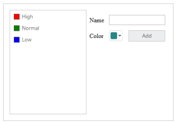
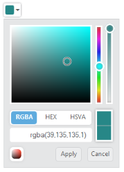
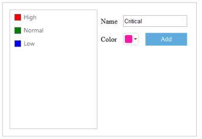
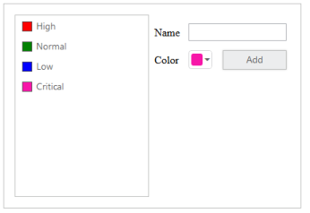

# Getting started

## Create your first ColorPicker in ASP.NET

The Essential ASP.NET WebForms ColorPicker control provides you support for selecting the colors in different sources such as palettes, picker or custom palettes. You can also rend the color value from control in three formats such as RGB, HSV and HEXCODE.

In this example, you can learn how to customize the ColorPicker control in a category Application.

In the following sections you can learn, How to:

* Create ColorPicker control
* Initialize the other widgets
* Add Value to ListBox Control

### Create ColorPicker Control

Use the following steps to create the ColorPicker control.

Create a WebFormsProject and add necessary Dll’s and scripts with the help of the given [WebForms-Getting Started](https://help.syncfusion.com/aspnet/getting-started) Documentation.

Create the ASPX page and add the following code to it for ColorPicker creation. 



<ej:ColorPicker runat="server" ID="CategoryColor" Value="#278787"> </ej:ColorPicker>



 Run this code to render the resultant output of the above steps.

### Initialize the other widgets

To add the priority value to the ListBox, the text value is obtained from the input element and color for each priority is received by the ColorPicker control. To add each new priority value to the ListBox control, click the Add button.

You can refer to the following link for more information on creation on the ListBox

<https://help.syncfusion.com/api/js/ejlistbox>

The following code example is used to create the Priority form by using ListBox control and ColorPicker control.



<div class="content-container-fluid">
        <div class="row">
            <div class="sample-area">
                <div class="frame">
                    <div id="control">
                        <ul id="ColorValues">
                            <li><span class="color high">High</li>
                            <li><span class="color normal">Normal</li>
                            <li><span class="color low">Low</li>
                        </ul>
                        <ej:ListBox ID="selectPriority" runat="server"TargetID="ColorValues"></ej:ListBox>
                    

                

            

            <div id="Properties">
                <table class="prop-grid">
                    <tr class="row">
                        <td class="column">Name
                        </td>
                        <td class="column">
                            <input type="text" id="categoryName" />
                        </td>
                    </tr>
                    <tr class="row">
                        <td class="column">Color
                        </td>
                        <td class="column">
                            <!--Colorpicker element-->
                            <ej:ColorPicker ID="CategoryColor" runat="server"Value="#278787"></ej:ColorPicker>                           
                        </td>
                        <td class="column">
                            <!--Add button for add the new category-->
                            <ej:Button ID="AddCategory" runat="server" Text="Add"Width="82px" Type="Button" Height="21px" ClientSideOnClick="addCategoryValue"> </ej:Button>                           
                        </td>
                    </tr>                   
                </table>
            

        

    



Add the following style section to align form fields. 



    .content-container-fluid > .row {
        width: 410px;
        border: 1px solid #bbbcbb;
        padding: 16px;
        height: 272px;
    }
    .color.high {
        background-color: red;
    }
    .color.normal {
        background-color: green;
    }
    .color.low {
        background-color: blue;
    }
    .sample-area {
        width: 205px;
    }
    .sample-area, #Properties {
        display: inline-block;
        float: left;
    }
    #Properties #categoryName {
        width: 140px;
        height: 20px;
    }
    #Properties .column {
        display: inline-block;
        width: 45px;
        margin: 10px 0 0;
    }
    #Properties .row {
        padding: 10px 0px 5px 0px;
    }
    .color {
        width: 13px;
        height: 13px;
        border: 1px solid;
        display: inline-block;
        margin-right: 6px;
        margin-bottom: -3px;
    }



Initialize the element in &lt;script&gt; tag. 



    var listBoxObj, colorObj;

    jQuery(function ($) {

        //initialize the listbox with object creation

        listBoxObj = $("#selectPriority").data('ejListBox');

        //initialize the colorpicker with object creation

        colorObj = $("#CategoryColor").data('ejColorPicker');       

    });



Run the above code to render the following output.

### Add value to ListBox Control

You can add the value to the ListBox with selected color by performing the button click event. The following script section define the click event for the button element.

Initialize the click event to button element in the &lt;script&gt; tag.



        jQuery(function ($) {

        function addCategoryValue() {

            if ($("#categoryName").val() !== "") {

                listBoxObj.addItem("" + $("#categoryName").val());

                $("#categoryName").val("");

            }

        }



The following screenshot illustrates the resultant output after you click Add button.

