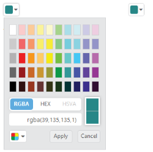
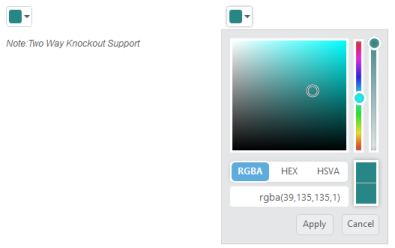

# Integration

## AngularJS Binding

The ColorPicker control is availed with two types of AngularJS support namely, 

* One-way binding
* Two-way binding 

One-way binding refers to the process of applying scope values to all the available properties of the ColorPicker control. The changes made in the ColorPicker control are not reflected or triggered in turn to the scope collection. This kind of binding is applied to all the properties of the ColorPicker control.

Two-way binding supports both the processes. It applies the scope values to the ColorPicker properties, as well as the changes made in the ColorPicker control are reflected back and triggered within the AngularJS scope change function.

Apply the plugin and property assigning to the ColorPicker control element through the directive that starts with “e-“.

To know more about the AngularJS binding, you can refer to the online documentation in the following link location,

<http://help.syncfusion.com/js/angularjs>

The following code example explains how to bind data to the ColorPicker control through AngularJS support.



    
    
    
    

        

            

                

                    

                        

                            <input id="picker" ej-colorpicker e-value="colorValue" e-modeltype="palette" />
                        

                        

                            <input id="custom" ej-colorpicker e-value="colorValue" e-modeltype="picker" />
                        

                        <h6>Note:Two Way AngularJS Support</h6>
                    

                

            

            
        

    

    



The following screenshot displays the output of the above code example.

## KnockoutJS Binding

KnockoutJS support allows you to bind the HTML elements against any of the available data models.

Two types of KnockoutJS binding is supported,

* One-way binding
* Two-way binding

One-way binding refers to the process of applying observable values to all the available properties of the ColorPicker control. The changes made in ColorPicker control are not reflected and triggered in turn to the observable collection. This kind of binding is applied to all the properties of the ColorPicker control.

Two-way binding supports both the processes. It applies the observable values to the ColorPicker control properties and also the changes made in the ColorPicker control are reflected back and triggered within the observable collections. 

For more information about KnockoutJS binding, you can refer to the online documentation in the following link location,

<http://help.syncfusion.com/js/knockoutjs>

The following code example explains how you can bind data to the ColorPicker control through KnockoutJS support that enables and populates data to a ColorPicker control based on the value set to the other ColorPicker control.



    
    
    
    

        

            

                

                    

                        <input id="colorpick" data-bind="ejColorPicker: { value: value, modelType: palette }" />
                        <h6>Note:Two Way Knockout Support</h6>
                    

                    

                        <input id="colorpick1" data-bind="ejColorPicker: { value: value, modelType: picker }" />
                    

                

            

        

    

    
    



The following screenshot displays the output of the above code.

