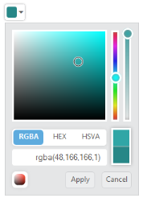

# Keyboard Interaction

You can use keyboard shortcut keys as an alternative to the mouse while using the ColorPicker control. The ColorPicker control allows you to perform all kinds of actions by using keyboard shortcuts.

## Keyboard shortcut keys

<table>
<tr>
<th>
{{ '**Shortcut Key**' | markdownify }}</th><th>
{{ '**Description**' | markdownify }}</th></tr>
<tr>
<td>
Alt + j               </td><td>
Focuses into the ColorPicker control</td></tr>
<tr>
<td>
Alt + Down</td><td>
Open / Close the Popup</td></tr>
<tr>
<td>
Up</td><td>
Increase the brightness value</td></tr>
<tr>
<td>
Down</td><td>
Decrease the brightness value</td></tr>
<tr>
<td>
Right</td><td>
Increase the saturation value</td></tr>
<tr>
<td>
Left</td><td>
Decrease the saturation value</td></tr>
<tr>
<td>
Enter</td><td>
Choose the current color</td></tr>
<tr>
<td>
Esc</td><td>
Closes the popup</td></tr>
<tr>
<td>
Tab</td><td>
Choose the next element</td></tr>
<tr>
<td>
Home</td><td>
Downwards to value 0</td></tr>
<tr>
<td>
End</td><td>
Upwards to value 100</td></tr>
</table>

## Configure Keyboard Interaction

The following steps explain how you can enable keyboard interaction for the ColorPicker textbox.

Add the following code example to the corresponding ASPX page to render the ColorPicker control and enable keyboard interaction by the access key property.



<ej:ColorPicker runat="server" ID="colorpicker" Value="#278787"></ej:ColorPicker>



Add the following code in the script section.



        jQuery(function ($)

        {

            $(document).on("keydown", function (e)

            {

                if (e.altKey && e.keyCode === 74)

                { // j- key code.

                    $("#<%=colorpicker.ClientID%>Wrapper").focus();

                }

            });

        });



The following screenshot displays the output of the above code snippet.

