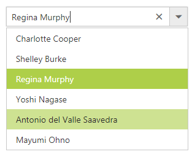

# Data Binding

The ComboBox loads the data either from local data sources or remote data services using the dataSource property. It supports the data type of array or DataManager.

The ComboBox also supports different kinds of data services such as OData, OData V4, and Web API, and data formats such as XML, JSON, and JSONP with the help of DataManager adaptors.

## Fields

The below listed fields are the data collection fields which maps fields for the data items of the ComboBox. 

| Fields | Type | Description |
|------|------|-------------|
| text |  `string` | Specifies the display text of each list item. |
| value |  `string` | Specifies the hidden data value mapped to each list item that should contain a unique value. |
| groupBy |  `string` | Specifies the category under which the list item has to be grouped. |
| iconCss |  `string` | Specifies the icon class of each list item. |

> When binding complex data to the ComboBox, fields should be mapped correctly. Otherwise, the selected item remains undefined.

## Binding Local Data

Define a List data and initialize the control with DataSource property. Specify the column names in the Fields property.  

N> The columns are bounded automatically when the fields are specified with the default names like id, text, etc...




	
	  <ej:ComboBox ID="empList" runat="server" DataTextField="text" Placeholder="Select a employee" Width="100%"></ej:ComboBox>


    


protected void Page_Load(object sender, EventArgs e)
{
	List<Employee> Data = new List<Employee>();
	Data.Add(new Employee
	{
		Text = "Erik Linden",
		Role = "Executive",
		Country = "England"
	});
	Data.Add(new Employee
	{
		Text = "John Linden",
		Role = "Representative",
		Country = "Norway"
	});
	Data.Add(new Employee
	{
		Text = "Louis",
		Role = "Representative",
		Country = "Australia"
	});
	Data.Add(new Employee
	{
		Text = "Lawrence",
		Role = "Executive",
		Country = "India"
	});
	empList.DataSource = Data;
}
public class Employee
{
	public string Text { get; set; }
	public string Role { get; set; }
	public string Country { get; set; }
}




## Binding Remote Data

The ComboBox supports retrieval of data from remote data services with the help of [DataManager](/aspnet/datamanager) component. The [Query](https://help.syncfusion.com/api/js/ejquery) property is used to fetch
data from the database and bind it to the ComboBox.

In the following sample, displayed first 6 contacts from the `customer` table of `Northwind` Data Service.




	
	<ej:ComboBox ID="searchCustomer" runat="server" Width="100%" DataTextField="ContactName" Placeholder="Search a customer">
		<DataManager URL="http://js.syncfusion.com/ejServices/wcf/NorthWind.svc/" CrossDomain="true"></DataManager>
	</ej:ComboBox>


    


protected void Page_Load(object sender, EventArgs e)
{
	this.searchCustomer.Query = "ej.Query().from('Suppliers').select('SupplierID', 'ContactName').take(6)";
}





