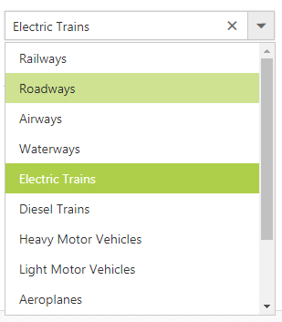

# Data Source in ASP.NET WebForm ComboBox

ASP.NET includes data source controls that allow you to work with different types of data sources such as a database, an XML file, or a middle-tier business object. Data source controls connect to and retrieve data from a data source and make it available for other controls (ComboBox, Grid, Schedule) to bind to, without requiring code. They can also support modifying data.

## SqlDataSource

SqlDataSource is designed to work with SQL Server databases. It uses internally, the SQL Server .NET data provider. SQL Server .NET data provider classes are defined in the System.Data.SqlClient namespace. 

The following step explains the details about the data binding from SQLDataSource. 

In the ASPX page, add ComboBox.



<asp:Content ID="Content1" ContentPlaceHolderID="ControlsSection" runat="server">
    

        

            <ej:ComboBox ID="transportList" runat="server" Width="100%"
                DataTextField="MenuText" DataValueField="ID"
                DataSourceID="SqlDataSource1" Placeholder="Search a transport">
            </ej:ComboBox>
        

    

    <asp:SqlDataSource ID="SqlDataSource1" runat="server" SelectCommand="SELECT * FROM [Transport]"
        ConnectionString='<%$ ConnectionStrings:Linq_To_SQLConnectionString %>'
        ProviderName='<%$ ConnectionStrings:Linq_To_SQLConnectionString.ProviderName %>'></asp:SqlDataSource>

</asp:Content>



Add connection string in the Web.config file.

N> Change the username with your system name in the following connection string.



<configuration>

    <connectionStrings>

        <add name="Linq_To_SQLConnectionString" connectionString="Data Source=(LocalDB)\MSSQLLocalDB;AttachDbFilename=|DataDirectory|\Linq_To_SQL.mdf;Integrated Security=True;User Instance=false;Connect Timeout=100;" providerName="System.Data.SqlClient" />

    </connectionStrings>

</configuration>



Output of the above steps.

## LinqDataSource

LinqDataSource is designed to work with DataContext. It uses internally, the data model (dbml) file. Data model contains list of tables from specific database. 

The following step explains the details about the data binding from LinqDataSource. 

In the ASPX page, add ComboBox.



<asp:Content ID="Content1" ContentPlaceHolderID="ControlsSection" runat="server">
    

        

            <ej:ComboBox ID="itemList" runat="server" Width="100%" DataTextField="Text" DataSourceID="LinqDataSource1" DataValueField="Id" Placeholder="Select an item" />
        

    

    <asp:LinqDataSource ID="LinqDataSource1" runat="server" ContextTypeName="WebSampleBrowser.database.Linq_Common_DataDataContext" EntityTypeName="" TableName="Databindings" Select="new(Id,ParentId,Text)">
    </asp:LinqDataSource>
</asp:Content>



Add connection String in the Web.config file.

N> Change the username with your system name in the following connection string.



<configuration>

    <connectionStrings>

        <add name="Linq_To_SQLConnectionString" connectionString="Data Source=(LocalDB)\MSSQLLocalDB;AttachDbFilename=|DataDirectory|\Linq_To_SQL.mdf;Integrated Security=True;User Instance=false;Connect Timeout=100;" providerName="System.Data.SqlClient" />

    </connectionStrings>

</configuration>



Output of the above steps

## ObjectDataSource

The ObjectDataSource control allows you to bind a specific data layer in a similar manner where other controls bind to the database.The ObjectDataSource control can bind to any method that returns a DataSet or an IEnumerable object. For example, a DataReader or a collection of Classes. The major advantage of binding via ObjectDataSource is only the records required in the current view are retrieved from the database, greatly optimizing the performance and runtime memory usage. 

The following steps explain the details about the data binding from ObjectDataSource.

In the ASPX page, add ComboBox.



 <asp:Content ID="Content1" ContentPlaceHolderID="ControlsSection" runat="server">
    

        

            <ej:ComboBox ID="transportList" runat="server" Width="100%" DataSourceID="ObjectDataSource1"
                DataTextField="Text" DataValueField="ID" Placeholder="Search a transport">
            </ej:ComboBox>
        

    

    <asp:ObjectDataSource ID="ObjectDataSource1" runat="server" TypeName="TabData"
        SelectMethod="GetTabItems"></asp:ObjectDataSource>
</asp:Content>



Create new CS file in App_Data folder and name as ‘Data.cs’ and add the following codes in the page. 



public class TabData
{

    public TabData(int _id, int parent, string _text)
    {
        this.ID = _id;
        this.ParentID = parent;
        this.Text = _text;
    }
    public TabData()
    {

    }

    [Browsable(true)]
    public int ID
    {
        get;
        set;
    }

    [Browsable(true)]
    public int ParentID
    {
        get;
        set;
    }

    [Browsable(true)]
    public string Text
    {
        get;
        set;
    }

    public List<TabData> GetTabItems()
    {
        List<TabData> data = new List<TabData>();
        data.Add(new TabData(1, 0, "Railways"));
        data.Add(new TabData(2, 0, "Roadways"));
        data.Add(new TabData(3, 0, "Airways"));
        data.Add(new TabData(4, 0, "Waterways"));
        data.Add(new TabData(5, 1, "Electric Trains"));
        data.Add(new TabData(6, 1, "Diesel Trains"));
        data.Add(new TabData(7, 2, "Heavy Motor Vehicles"));
        data.Add(new TabData(8, 2, "Light Motor Vehicles"));
        data.Add(new TabData(9, 3, "Aeroplanes"));
        data.Add(new TabData(10, 3, "Helicopters"));
        data.Add(new TabData(11, 4, "Ships"));
        data.Add(new TabData(12, 4, "Submarines"));

        return data;
    }
}



## XmlDataSource

XmlDataSource is used to work with XML documents. The following steps explain the details about the data binding from XmlDataSource.

In the ASPX page, add ComboBox. 



<asp:Content ID="Content1" ContentPlaceHolderID="ControlsSection" runat="server">
    

        

            <ej:ComboBox ID="itemList" runat="server" Width="100%" DataSourceID="XmlDataSource1" DataTextField="Text" DataMember="RootItem" Placeholder="Select an apple product">
            </ej:ComboBox>
        

    

    <asp:XmlDataSource ID="XmlDataSource1" runat="server" DataFile="~/App_Data/XMLData.xml"></asp:XmlDataSource>
</asp:Content>



Create new XML file in App_Data folder as ‘XMLData.xml’ and add the following codes in the page. 



<?xml version="1.0" encoding="utf-8" ?>
<Items>
  <RootItem Text="Apple Mac" Expanded="True" Url="#">
    <Item Text="Start Price : $590.00" Url="#"></Item>
    <Item Text="Maximum Price : $1995.00" Url="#"></Item>
  </RootItem>

  <RootItem Text="Apple iPad" Expanded="True" Url="#">
    <Item Text="Start Price : $95.00" Url="#"></Item>
    <Item Text="Maximum Price : $990.00" Url="#"></Item>
  </RootItem>

  <RootItem Text="Apple iPhone" Url="#">
    <Item Text="Start Price : $59.00" Url="#"></Item>
    <Item Text="Maximum Price : $995.00" Url="#"></Item>
  </RootItem>

  <RootItem Text="Apple Watch" Url="#">
    <Item Text="Start Price : $55.00" Url="#"></Item>
    <Item Text="Maximum Price : $99.00" Url="#"></Item>
  </RootItem> 
</Items>



## EntityDataSource

Bind data to the ComboBox through Entity Framework. Please follow the below steps.

1.	Create an entity data model

Please refer the [link](http://www.entityframeworktutorial.net/EntityFramework5/create-dbcontext-in-entity-framework5.aspx) for more information.

2.	Refer the entity data model to your project and bind the data to the ComboBox

In code behind, create an object for the Entity mode (NORTHWNDEntities) and fetch the data from the Employees class and stored it to the List.
Assign the data to the ComboBox's DataSource property. Specify the column names in the fields property.



    using EntityDataBinding.Models;
    using System.Data.Entity;
    
    protected void Page_Load(object sender, EventArgs e)
    {
        NORTHWNDEntities sample = new NORTHWNDEntities();
        var dataset = sample.Employees
                    .Select(x => new Employee
                    {
                        EmployeeID = x.EmployeeID,
                        FirstName = x.FirstName                     
                    }).ToList();
        empList.DataSource = dataset;
    }
    public class Employee
    {
        public int EmployeeID { get; set; }
        public string FirstName { get; set; }
    }
    




    <ej:ComboBox ID="empList" runat="server" Width="100%" DataTextField="FirstName" DataValueField="EmployeeID" Placeholder="Select an employee">
    </ej:ComboBox>



## AccessDataSource

The data can also be bound to the ComboBox using OLEDB database as depicted below



    <ej:ComboBox ID="empList" runat="server" Width="100%" DataTextField="Name" DataValueField="ID" Placeholder="Select an employee">
    </ej:ComboBox>



The server-side code to retrieve and bind the data to ComboBox are as follows. Also, define a class with all the required fields as depicted in the below code example.



    using System.Data.OleDb;
    protected void Page_Load(object sender, EventArgs e)
    {
        
        OleDbConnection conn = new OleDbConnection(@"Provider=Microsoft.Jet.OLEDB.4.0;Data Source=|DataDirectory|\Database.mdb");
        conn.Open();
        OleDbCommand cmd = new OleDbCommand(" SELECT * from [Employees]", conn);
        OleDbDataReader reader = null;
        List
 data = new List
();
        reader = cmd.ExecuteReader();
        while (reader.Read())
        {
            data.Add(new Details(reader["Name"].ToString(), reader["Designation"].ToString())); 
        }
        conn.Close();
        empList.DataSource = data;

    }
    public class Details
    {
        public string Name { get; set; }
        public string Designation { get; set; }
        public Details(string name, string deg)
        {
            this.Name = name;
            this.Designation = deg;

        }
    }


