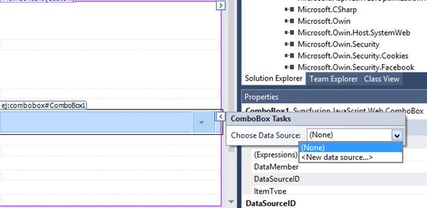

# Getting Started

## Creating your first ComboBox in ASP Web Forms

1. Create an ASP.NET Web Forms application and add ComboBox control to the Default.aspx page.

    

2. Once the control is dragged and dropped into the page the embedded resource will add dependent script and CSS files from Syncfusion.EJ.Web assembly and the assembly will be referred from GAC. This will add the following appSetting key in web.config file to load resource files.

    
        
        <appSettings>
                <add key="LoadEJResourcesFromAssembly" value="true"/>
                <add key="EJResources" value="jsrender:true;jqueryeasing:true;globalize:true;themes:true;"/>
        </appSettings>
            
    
    
N> Refer the [ASP.NET-Getting Started](http://help.syncfusion.com/aspnet/getting-started#manual-integration-of-syncfusion-aspnet-controls-into-the-newexisting-application) Documentation to know further details about necessary assemblies, Script and CSS files.

3. Configure the ComboBox control using smart tag, to add ComboBox items

    

## Binding data source

Populate the ComboBox with data using the dataSource property. Here, carList object is passed to the ComboBox component.	
	

	

	
<ej:ComboBox ID="carList" runat="server" Width="100%" DataTextField="text" Placeholder="Select a car">
</ej:ComboBox>>


    


protected void Page_Load(object sender, EventArgs e)
{
    this.carList.DataSource = CarsList.GetCarList();
}
public class CarsList
{
    public string text { get; set; }
    public static List<CarsList> GetCarList()
    {
        List<CarsList> car = new List<CarsList>();
        car.Add(new CarsList { text = "Audi S6" });
        car.Add(new CarsList { text = "Austin-Healey" });
        car.Add(new CarsList { text = "Alfa Romeo" });
        car.Add(new CarsList { text = "Aston Martin" });
        car.Add(new CarsList { text = "BMW 7" });
        car.Add(new CarsList { text = "Bentley Mulsanne" });
        car.Add(new CarsList { text = "Bugatti Veyron" });
        car.Add(new CarsList { text = "Chevrolet Camaro" });
        car.Add(new CarsList { text = "Cadillac" });
        car.Add(new CarsList { text = "Duesenberg J" });
        car.Add(new CarsList { text = "Dodge Sprinter" });
        car.Add(new CarsList { text = "Elantra" });
        return car;
    }
}





After completing the configuration required to render a basic ComboBox, run the above sample to display the output in your default browser.

## Setting and Getting Value

To assign a value initially to the ComboBox, you can use <b>Value</b> property.


	

        

    

        <ej:ComboBox ID="selectCar" Value="BMW 7" runat="server" Placeholder="Select a car" DataTextField="text" Width="100%">
        </ej:ComboBox>
            <asp:Label runat="server" ID="Label1"></asp:Label> 
        <ej:Button runat="server" ID="Button1" Onclick="" Type="Button" Text="Get value"></ej:Button>
    

            

    


public partial class DefaultFunctionalities : System.Web.UI.Page
{
    protected void Page_Load(object sender, EventArgs e)
    {
        this.selectCar.DataSource = CarsList.GetCarList();
    }
    protected void Button1_Click(object Sender, Syncfusion.JavaScript.Web.ButtonEventArgs e)
    {
        Label1.Text = "Selected item value is " + selectCar.Value;
    }
}
public class CarsList
{
    public string text { get; set; }
    public static List<CarsList> GetCarList()
    {
        List<CarsList> car = new List<CarsList>();
        car.Add(new CarsList { text = "Audi S6" });
        car.Add(new CarsList { text = "Austin-Healey" });
        car.Add(new CarsList { text = "Alfa Romeo" });
        car.Add(new CarsList { text = "Aston Martin" });
        car.Add(new CarsList { text = "BMW 7" });
        car.Add(new CarsList { text = "Bentley Mulsanne" });
        car.Add(new CarsList { text = "Bugatti Veyron" });
        car.Add(new CarsList { text = "Chevrolet Camaro" });
        car.Add(new CarsList { text = "Cadillac" });
        car.Add(new CarsList { text = "Duesenberg J" });
        car.Add(new CarsList { text = "Dodge Sprinter" });
        car.Add(new CarsList { text = "Elantra" });
        return car;
    }
}





## Custom values

The ComboBox allows the user to give input as custom value which is not required to present in predefined set of values. By default, this support is enabled by AllowCustom property. In this case, both text field and value field considered as same. The custom value will be sent to post back handler when a form is about to be submitted.


	

	
<ej:ComboBox ID="carList" runat="server" AllowCustom="true" Width="100%" DataTextField="text" Placeholder="Select a car">
</ej:ComboBox>>


    


protected void Page_Load(object sender, EventArgs e)
{
    this.carList.DataSource = CarsList.GetCarList();
}
public class CarsList
{
    public string text { get; set; }
    public static List<CarsList> GetCarList()
    {
        List<CarsList> car = new List<CarsList>();
        car.Add(new CarsList { text = "Audi S6" });
        car.Add(new CarsList { text = "Austin-Healey" });
        car.Add(new CarsList { text = "Alfa Romeo" });
        car.Add(new CarsList { text = "Aston Martin" });
        car.Add(new CarsList { text = "BMW 7" });
        car.Add(new CarsList { text = "Bentley Mulsanne" });
        car.Add(new CarsList { text = "Bugatti Veyron" });
        car.Add(new CarsList { text = "Chevrolet Camaro" });
        car.Add(new CarsList { text = "Cadillac" });
        car.Add(new CarsList { text = "Duesenberg J" });
        car.Add(new CarsList { text = "Dodge Sprinter" });
        car.Add(new CarsList { text = "Elantra" });
        return car;
    }
}





## Configure the popup list

By default, the width of the popup list automatically adjusts according to the ComboBox input element's width, and the height of the popup list has '300px'.

The height and width of the popup list can also be customized using the PopupHeight and PopupWidth properties respectively.

In the following sample, popup list's width and height are configured.


	
<ej:ComboBox ID="selectCar" Value="BMW 7" PopupHeight="500px" PopupWidth="500px" runat="server" Placeholder="Select a car" DataTextField="text" Width="100%">
</ej:ComboBox>



