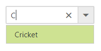
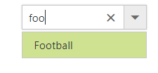
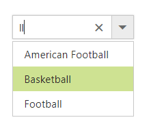
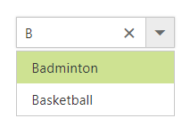

# Filtering

The ComboBox has built-in support to filter data items when `AllowFiltering` is enabled. The filter operation starts as soon as you start typing characters in the component.

To display filtered items in the popup, filter the required data and return it to the ComboBox via `updateData` method by using the [filtering](https://help.syncfusion.com/api/js/ejcombobox#events:filtering) event.

The following sample illustrates how to query the data source and pass the data to the ComboBox through the `updateData` method in `filtering` event.


	

	
<ej:combobox ID="selectCountry" runat="server" Width="100%" AllowFiltering="true" DataTextField="text" ClientSideOnFiltering="filtering" Query="new ej.Query().select(['text','category']).take(25)" DataValueField="category" Placeholder="Select a country">
                
</ej:combobox>


    


protected void Page_Load(object sender, EventArgs e)
{
	this.selectCountry.DataSource = Countries.GetCountries();
}





function filtering(e) {
    var query = new ej.Query().select(['text','category']);
    query = (e.text !== '') ? query.where('text', 'startswith', e.text, true) : query;
    e.updateData(e.model.dataSource, query);
}





## Limit the minimum filter character

When filtering the list items, you can set the limit for character count to raise remote request and fetch filtered data on the ComboBox. This can be done by manual validation within the filter event handler.

In the following example, the remote request does not fetch the search data until the search key contains three characters.


	

	
<ej:combobox ID="selectCountry" runat="server" Width="100%" AllowFiltering="true" DataTextField="text" ClientSideOnFiltering="filtering" Query="new ej.Query().select(['text','category']).take(25)" DataValueField="category" Placeholder="Select a country">
                
</ej:combobox>


    


protected void Page_Load(object sender, EventArgs e)
{
	this.selectCountry.DataSource = Countries.GetCountries();
}





function filtering(e) {
    // load overall data when search key empty.
    if(e.text == '') e.updateData(e.model.dataSource);
    else{
        // restrict the remote request until search key contains 3 characters.
        if (e.text.length < 3) { return; }
        var query = new ej.Query().select(['country', 'id']);

        query = (e.text !== '') ? query.where('country', 'startswith', e.text, true) : query;
        e.updateData(e.model.dataSource, query);
    }
}





## Change the filter type

While filtering, you can change the filter type to `contains`, `startsWith`, or `endsWith` for string type within the filter event handler.

In the following examples, data filtering is done with `endsWith` type.


	

	
<ej:combobox ID="selectCountry" runat="server" Width="100%" AllowFiltering="true" DataTextField="text" ClientSideOnFiltering="filtering" Query="new ej.Query().select(['text','category']).take(25)" DataValueField="category" Placeholder="Select a country">
                
</ej:combobox>


    


protected void Page_Load(object sender, EventArgs e)
{
	this.selectCountry.DataSource = Countries.GetCountries();
}





function filtering(e) {
    // load overall data when search key empty.
    if(e.text == '') e.updateData(e.model.dataSource);
    else{
        var query = new ej.Query().select(['country', 'id']);
        query = (e.text !== '') ? query.where('country', 'endsWith', e.text, true) : query;
        e.updateData(e.model.dataSource, query);
    }
}





## Case sensitive filtering

Data items can be filtered either with or without case sensitivity using the DataManager. This can be done by passing the fourth optional parameter of the [where](https://help.syncfusion.com/api/js/ejquery#methods:where) clause.

The following example shows how to perform case-sensitive filter.


	

	
<ej:combobox ID="selectCountry" runat="server" Width="100%" AllowFiltering="true" DataTextField="text" ClientSideOnFiltering="filtering" Query="new ej.Query().select(['text','category']).take(25)" DataValueField="category" Placeholder="Select a country">
                
</ej:combobox>


    


protected void Page_Load(object sender, EventArgs e)
{
	this.selectCountry.DataSource = Countries.GetCountries();
}





function filtering(e) {
    // load overall data when search key empty.
    if(e.text == '') e.updateData(e.model.dataSource);
    else{
        var query = new ej.Query().select(['country', 'id']);
        //enable the case sensitive filtering by passing false to 4th parameter.
        query = (e.text !== '') ? query.where('country', 'startswith', e.text, false) : query;
        e.updateData(e.model.dataSource, query);
    }
}





