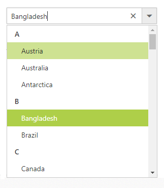

# Grouping

The ComboBox supports wrapping nested elements into a group based on different categories. The category of each list item can be mapped through the `DataGroupByField` field in
the data table. The group header is displayed both as inline and fixed headers. The fixed group header content is updated dynamically on scrolling the popup list with its category value.

In the following sample, countries are grouped according on its category using `DataGroupByField` field.


	

	
 <ej:ComboBox ID="groupingCountry" runat="server" DataTextField="text" DataGroupByField="category" Placeholder="Select a country" Width="100%"></ej:ComboBox>
		

    


protected void Page_Load(object sender, EventArgs e)
{
	this.groupingCountry.DataSource = Countries.GetCountries();
}





## Customization

The grouping header is also provided with customization option. This allows custom designing using the `GroupTemplate` property for both inline and fixed headers as referred here:
[Group Template support to ComboBox](https://help.syncfusion.com/aspnet/combobox/template#group-template).
