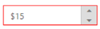
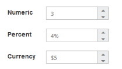
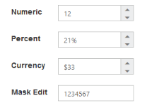

# Behavior Settings

## Decimal Places

The DecimalPlaces declares the decimal point to the value of the CurrencyTextbox control. The default value of the DecimalPlaces is 0 in the CurrencyTextbox control. To set the DecimalPlaces to “-1”, that allows the decimals without any limit in CurrencyTextBox control.

### Configure Decimal Places

Add the following code in your ASPX page to render the CurrencyTextbox control with DecimalPlaces.



<ej:CurrencyTextBox ID="currency" DecimalPlaces="5" Value="555" runat="server"></ej:CurrencyTextBox>



The following screenshot is the output of the above code.

 

## Persistence Support

The CurrencyTextbox control provides state maintenance support. You can maintain the previous changes made in the control after the page load while the EnablePersistence property is enabled. EnablePersistence accepts Boolean values. By default, the value is false.

### Configure Persistence Support 

Add the following code in your ASPX page to render the CurrencyTextbox control with state maintenance by using the EnablePersistence property.



<ej:CurrencyTextBox ID="currency"  Value="33" EnablePersistence="true" runat="server"> </ej:CurrencyTextBox>



The output for the CurrencyTextbox with EnablePersistence before the page load and after changing the value and page load are as follows.

 

## Strict Mode Support

The CurrencyTextbox control provides strict mode option by setting the EnableStrictMode property. You have to set the MinValue and MaxValue to the control to enable strict mode function. When the CurrencyTextbox value exceeds the MaxValue, it restricts the exceeded value and returns the MaxValue. Likewise, when the CurrencyTextbox value goes below the MinValue, it restricts the new value and returns the MinValue. When the EnableStrictMode property is enabled, it highlights the CurrencyTextbox in red color.

### Configure Strict Mode Support 

Add the following code in your ASPX page to render THE CurrencyTextbox control with strict mode by using the EnableStrictMode property.



        <ej:CurrencyTextBox ID="CurrencyTextBox1" MinValue="-1" MaxValue="8" EnableStrictMode="false" runat="server"></ej:CurrencyTextBox>

    

    

        <ej:CurrencyTextBox ID="currency" MinValue="-1" MaxValue="8" EnableStrictMode="true" runat="server"></ej:CurrencyTextBox>

    



The output for CurrencyTextbox with and without the EnableStrictMode.

 

## Enabled or Disabled

The CurrencyTextbox control has an option to enable or disable its elements. You can set the Enabled property to true to enable the CurrencyTextbox control. Enabled property accepts Boolean value. By default, the value of the Enabled is set to true.

Also you can enable/disable the **CurrencyTextBox** by using [enable](https://help.syncfusion.com/api/js/ejtextboxes#methods:enable) and [disable](https://help.syncfusion.com/api/js/ejtextboxes#methods:disable) methods.

### Configure Enabled or Disabled 

The following steps explain the implementation of Enabled in the CurrencyTextbox.

Add the following code to your ASPX page to render the CurrencyTextbox control.



<ej:CurrencyTextBox ID="currency"  Value="3" Enabled="false" runat="server"> </ej:CurrencyTextBox>



The output for CurrencyTextbox when Enabled is false and Enabled is true.

## Adjusting TextBox Size

The CurrencyTextbox size can be modified by using Height and Width properties. You can customize the size of the CurrencyTextbox by using these properties.

### Configure Height and Width 

Add the following code to your ASPX page to render the CurrencyTextbox control with customized dimension. 



<ej:CurrencyTextBox ID="currency"  Width="100" Height="20" runat="server"> </ej:CurrencyTextBox>



The output for Textbox after setting Height and Width.

## Increment Step

The IncrementStep property is used to increase or decrease the amount of value in the CurrencyTextbox control. 

### Configure Increment Step

Add the following code to your ASPX page to render the CurrencyTextbox control with incrementStep.



 <ej:CurrencyTextBox ID="currency"  IncrementStep="4" runat="server"> </ej:CurrencyTextBox>



The output for CurrencyTextbox with IncrementStep on initial load and after increasing one step.

## Define Name

When you have placed the CurrencyTextbox in a form, the Name property is used to send the field value at form submission. The default value of Name property is null.

### Configure Name

Add the following code to your ASPX page to render the CurrencyTextbox control with Name.



<ej:CurrencyTextBox ID="currency"  Name="currency" runat="server"> </ej:CurrencyTextBox>



The output for CurrencyTextbox with Name.

## Define Value

The value of the CurrencyTextbox can be assigned by using the Value property. The default value for Value property is null.
You can get the value of **CurrencyTextBox** by using [getValue](https://help.syncfusion.com/api/js/ejtextboxes#methods:getvalue) method.

### Configure Value

Add the following code to your ASPX page to render the CurrencyTextbox control with Value.



<ej:CurrencyTextBox ID="currency"  Value="33" runat="server"> </ej:CurrencyTextBox>



The output for CurrencyTextbox with Values.

## Basic Properties

The CurrencyTextbox contains basic behaviors like Name, Value, MaxValue, and MinValue.

### maxValue

The maximum value limit can be assigned to the CurrencyTextbox by using the MaxValue property. The default value of MaxValue property is 1.7976931348623157e+308. 

### minValue

The minimum value limit can be assigned to the CurrencyTextbox by using the MinValue property. The default value of MinValue property is -1.7976931348623157e+308.

### Configure Basic Properties

Add the following code to your ASPX page to render the CurrencyTextbox control with MaxValue and MinValue.



<ej:CurrencyTextBox ID="currency"  Value="3" MinValue="-3" MaxValue="2" runat="server"></ej:CurrencyTextBox>



 The output represents CurrencyTextbox with basic properties.

## Read Only Support

The CurrencyTextbox supports read only option. When enabling read only property to the control, the value cannot be changed or edited in the CurrencyTextbox. You can set the ReadOnly property to true to enable this option.

### Configure Read Only

Add the following code to your ASPX page to render the CurrencyTextbox control with ReadOnly mode.



<ej:CurrencyTextBox ID="currency"  Value="3" ReadOnly="true" runat="server"></ej:CurrencyTextBox>



The output when ReadOnly is set to true.The CurrencyTextbox values cannot be edited or changed.

