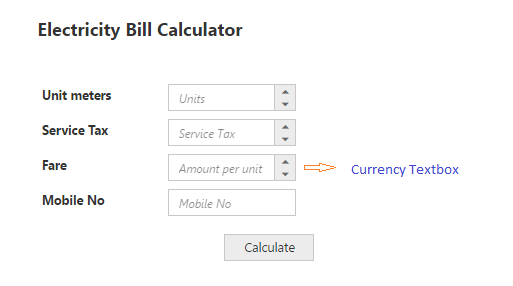
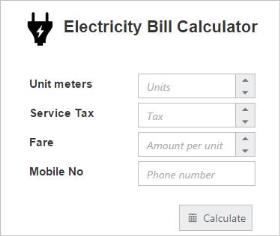
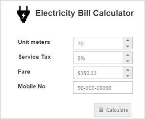

# Getting Started

## Create your first Editor in ASP.NET

The Essential ASP.NET Web Forms Editor control includes numeric, percentage, currency and maskedit TextBox controls. You can learn how to use ASP.NET Textbox control in the Electricity Bill Calculator Application from the following documentation. This guides you to use the wide range of Textbox functionalities to complete this application.

 

### Create TextBox Controls

You can create a Web Forms Project and add the necessary Dll and Scripts with the help of the given [WebForms-Getting Started](http://help.syncfusion.com/aspnetmvc/currencytextbox/getting-started) documentation.

Add the necessary Textbox control and initialize the control.



  <div class="editors">

        <div class="ele-icon">

        

        <div class="ele-txt" style="">Electricity Bill Calculator

        <br />

        <table class="editors">

            <tbody>

                <tr>

                    <td>

                        <label>Unit meters</label>

                    </td>

                    <td>

                        <ej:NumericTextBox ID="NumericTextBox" runat="server"WatermarkText="Units">

                        </ej:NumericTextBox>

                    </td>

                </tr>

                <tr>

                    <td>

                        <label>Service Tax</label>

                    </td>

                    <td>

                        <ej:PercentageTextBox ID="PercentageTextBox" runat="server"WatermarkText="Tax">

                        </ej:PercentageTextBox>

                    </td>

                </tr>

                <tr>

                    <td>

                        <label>Fare</label>

                    </td>

                    <td>

                        <ej:CurrencyTextBox ID="CurrencyTextBox" runat="server"WatermarkText="Amount perunit">

                        </ej:CurrencyTextBox>

                    </td>

                </tr>

                <tr>

                    <td>

                        <label>Mobile No</label>

                    </td>

                    <td>

                 <ej:MaskEdit ID="MaskEdit" runat="server" WatermarkText="Phone number">

                        </ej:MaskEdit>

                    </td>

                </tr>

            </tbody>

        </table>

        <div class="paybill">

           <ej:Button ID="Button" runat="server" Text="Calculate" Type="Button"Size="Small" ContentType="TextAndImage" PrefixIcon="e-calender">

            </ej:Button>

        

    



The following styles are added to arrange the Textboxes.  You can add the following location in the URL path for the background image: [http://js.syncfusion.com/UG/Web/Content/electricity.png](http://js.syncfusion.com/UG/Web/Content/electricity.png). 


        .ele-icon

        {

            display: inline-block;

            background-image:url(http://js.syncfusion.com/UG/Web/Content/electricity.png);

            background-repeat: no-repeat;

            background-size: contain;

            height: 50px;

            width: 50px;

            margin-left: 50px;

            margin-top: 15px;

        }

        .ele-txt

        {

            display: inline-block;

            font-size: 20px;

            font-weight: bolder;

            height: 50px;

            position: relative;

            text-align: center;

            top: -20px;

        }

        .editors

        {

            max-width: 400px;

            border: 2px solid #DDDDDD;

            margin:100px 0 0 100px;

        }

        .editors td

        {

            padding-bottom:5px;

        }

        .editors table

        {

            border: 0px;

            padding-left: 50px;

        }

        .paybill

        {

            margin: 18px 0px 10px 244px;

        }

        table.editors

        {

            margin:0 0 0 61px;

        }

        .editors label

        {

            display: block;

            width: 130px;

        }



Run the code to render a Textbox control as follows.

### Set the MinValue, MaxValue, and value in Textboxes

In the above mentioned use case scenario, you can set the MinValue, MaxValue, and Value in Numeric, percentage and Currency TextBoxes for maintaining the range in TextBox controls. You can also enter the values between the ranges that are set as default. You can get the phone number from the user in the Maskedit control by using the MaskFormat property. You can get the decimal values for CurrencyTextBox control by using DecimalPlaces property. The following code example illustrates how to achieve this.



   <div class="editors">

        <div class="ele-icon">

        

        <div class="ele-txt" style="">Electricity Bill Calculator

        <br />

        <table class="editors">

            <tbody>

                <tr>

                    <td>

                        <label>Unit meters</label>

                    </td>

                    <td>

                        <ej:NumericTextBox ID="NumericTextBox" runat="server"WatermarkText="Units" MinValue="1" MaxValue="10000" Value="70">

                        </ej:NumericTextBox>

                    </td>

                </tr>

                <tr><td><label>Service Tax</label>

                    </td>

                    <td>

                        <ej:PercentageTextBox ID="PercentageTextBox" runat="server"WatermarkText="Tax" MinValue="5" MaxValue="100" Value="3">

                        </ej:PercentageTextBox>

                    </td>

                </tr>

                <tr>

                    <td>

                        <label>Fare</label>

                    </td>

                    <td>

                        <ej:CurrencyTextBox ID="CurrencyTextBox" runat="server"WatermarkText="Amount per unit" DecimalPlaces="2" MinValue="0.00"MaxValue="100000.00" Value="350.00">

                        </ej:CurrencyTextBox>

                    </td>

                </tr>

                <tr>

                    <td>

                        <label>Mobile No</label>

                    </td>

                    <td>

                        <ej:MaskEdit ID="MaskEdit" runat="server"WatermarkText="Phone number" MaskFormat="99-999-99999" Value="9090909090">

                        </ej:MaskEdit>

                    </td>

                </tr>

            </tbody>

        </table>

        <div class="paybill">

            <ej:Button ID="Button" runat="server" Text="Calculate" Type="Button"Size="Small" ContentType="TextAndImage" PrefixIcon="e-calender">

            </ej:Button>

        

    



Run the code to render the resultant output of the above steps.

 

### Set the Strict Mode Option

You can set the EnableStrictMode option to restrict entering values defined outside the range. The following code example illustrates how to set strict mode option.



   <div class="editors">

        <div class="ele-icon">

        

        <div class="ele-txt" style="">Electricity Bill Calculator

        <br />

        <table class="editors">

            <tbody>

                <tr>

                    <td>

                        <label>Unit meters</label>

                    </td>

                    <td>

                        <ej:NumericTextBox ID="NumericTextBox" runat="server"WatermarkText="Units" MinValue="1" MaxValue="10000" Value="70"EnableStrictMode="true">

                        </ej:NumericTextBox>

                    </td>

                </tr>

                <tr>

                    <td>

                        <label>Service Tax</label>

                    </td>

                    <td>

                        <ej:PercentageTextBox ID="PercentageTextBox" runat="server"WatermarkText="Tax" MinValue="5" MaxValue="100" Value="3">

                        </ej:PercentageTextBox>

                    </td>

                </tr>

                <tr>

                    <td>

                        <label>Fare</label>

                    </td>

                    <td>

                        <ej:CurrencyTextBox ID="CurrencyTextBox" runat="server"WatermarkText="Amount per unit" DecimalPlaces="2" MinValue="0.00"MaxValue="100000.00" Value="350.00">

                        </ej:CurrencyTextBox>

                    </td>

                </tr>

                <tr>

                    <td>

                        <label>Mobile No</label>

                    </td>

                    <td>

                        <ej:MaskEdit ID="MaskEdit" runat="server"WatermarkText="Phone number" MaskFormat="99-999-99999" Value="9090909090">

                        </ej:MaskEdit>

                    </td>

                </tr>

            </tbody>

        </table>

        <div class="paybill">

            <ej:Button ID="Button" runat="server" Text="Calculate" Type="Button"Size="Small" ContentType="TextAndImage" PrefixIcon="e-calender">

            </ej:Button>

        

    



Run the above code example and you can see that it restricts entering a value exceeding the MinValue and MaxValue range mentioned in the numeric TextBox.

### Set Calculation process with Textboxes Controls

You can use events to calculate the total amount and display the value. This is achieved by using the Click event in the button control. The calculation steps are written in the call back function of the Click event button.

To customize the button, set the ContentType as TextAndImage to include the icon before the text. Add the PrefixIcon value as e-calender and add the ClientSideOnClick event.



  <div class="editors">

        // Please refer the table format for textboxes customization

  <div class="paybill">

            <ej:Button ID="Button" runat="server" Text="Calculate" Type="Button"Size="Small" ContentType="TextAndImage" PrefixIcon="e-calender"ClientSideOnClick="calculateBill">

            </ej:Button>

        

    





        function calculateBill() {

             // Declares Necessary variable creation.

        var kmcalc, servtax, amuntperkm;

        umcalc = $("#NumericTextBox").data("ejNumericTextbox");// Object of Numeric.

        servtax = $("#PercentageTextBox").data("ejPercentageTextbox");// Object of Percentage.

        amuntperkm = $("#CurrencyTextBox").data("ejCurrencyTextbox"); // Object of Currency.

        cusmob = $("#MaskEdit").data("ejMaskEdit"); // Object of MaskEdit       

         //Calculates the Net amount.

        var netamunt = umcalc.model.value * amuntperkm.model.value;

        // Calculates the service tax amount.

        var sTax = (netamunt * servtax.model.value) / 100;

        //Shows the calculated amount for the units.

        alert("The amount $" + (netamunt + sTax) + " has been sent as message to " + cusmob.model.value + ".");

    } 



Run the above code to render the TextBox control. Fill the required TextBox fields and click the Calculate button. The values are displayed and an alert message is shown. The following screenshot illustrates the final output of the Electricity Bill Calculator.

