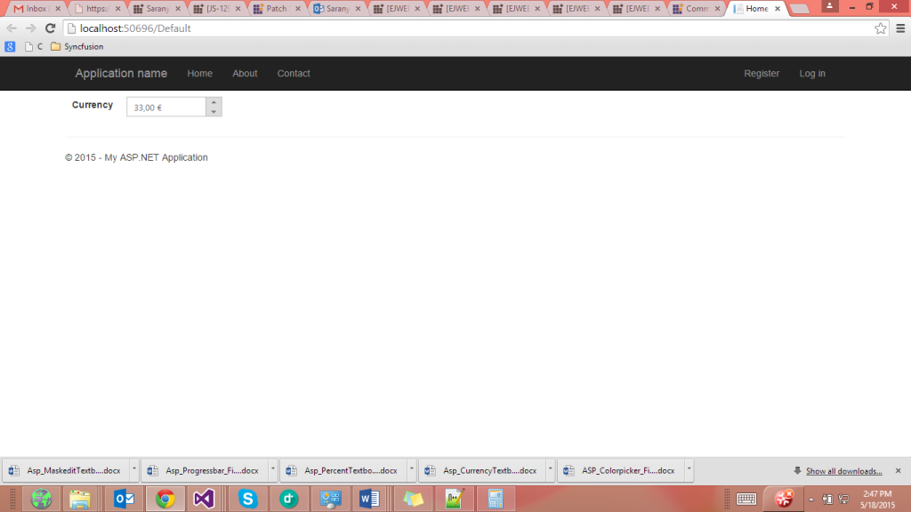
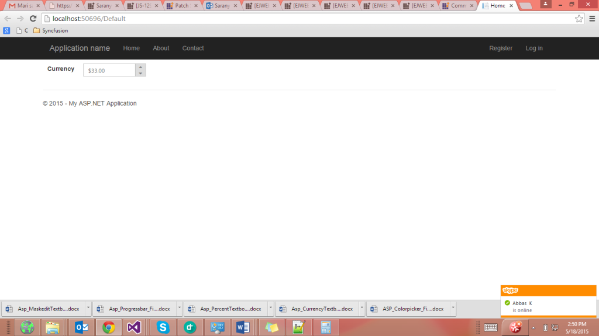

## Localization Support

Localization is the language support based on the culture. You can achieve the Localization by using the Locale property in the CurrencyTextbox.

The CurrencyTextbox control provides multi-language support by using globalization. You can customize the CurrencyTextbox in your own language by using this feature. You can change the localization by using the Locale property. The default value for Locale property is en-US.

In order to enable [localization](http://help.syncfusion.com/ug/js/default.htm) refer to the following scripts: globalize.cultures.js and globalize.js. The “globalize.cultures.js” includes different language support for JavaScript controls and the “globalize.js” is a simple JavaScript library that allows you to format the value based on the specified culture.

You can refer to the following online link reference for globalize.js:

[http://cdn.syncfusion.com/js/assets/external/jquery.globalize.min.js](http://cdn.syncfusion.com/js/assets/external/jquery.globalize.min.js)

You can refer to the following online link reference for globalize.culture.js:

[http://ajax.aspnetcdn.com/ajax/globalize/0.1.1/cultures/globalize.cultures.js](http://ajax.aspnetcdn.com/ajax/globalize/0.1.1/cultures/globalize.cultures.js)

You can get the script file of various cultures from the following path also:

"&lt;Installed Location&gt;\Syncfusion\Essential Studio\ {{site.releaseversion}} JavaScript\assets\external\cultures"

You can dynamically change the language based on their culture.

### Configuring Localization

Add the following code to your ASPX page to render the CurrencyTextbox control.



<ej:CurrencyTextBox ID="currency" Value="33" DecimalPlaces="2" Locale="es-ES"  runat="server"> </ej:CurrencyTextBox>



The screenshots of the CurrencyTextbox with es-ES locale and en-US locale.

{  | markdownify }
{:.image }

__{  | markdownify }
{:.image }
__

