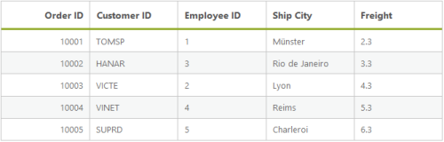

# Data Adaptors

DataManager uses adaptors to process data. There are three types of adaptors in DataManager. They are

* JSON Adaptor
* URL Adaptor
* OData Adaptor

## JSON Adaptor

JSONAdaptor is used to process JSON data. It contains methods to process the given JSON data based on the queries. The following code example illustrates on how to use JSONAdaptor.

**JSONAdaptor** has the following unique in-built methods, 

<table>
    <tr>
        <th> Properties  </th>
        <th> Parameters  </th>
        <th> Description   </th>
    </tr>
     <tr>
        <td> processQuery(ds, query) </td>
        <td> 
            <table>
                <tr>  <td> dm </td> <td> Object </td> <td> ej.DataManager object </td> </tr>
                <tr>  <td> query </td> <td> ej.Query </td> <td>  Sets the default query for the data source </td> </tr>
            </table>
        </td>
        <td> Used to prepare query string for the request data </td>
    </tr>
    <tr>
        <td> processResponse(data, ds, query, xhr) </td>
         <td> 
            <table>
                <tr>  <td> data </td> <td> Object </td> <td>  JSON data or JSON array </td> </tr>
                <tr>  <td> ds </td> <td> Object </td> <td> ej.DataManager object </td> </tr>
                <tr>  <td> query </td> <td> ej.Query </td> <td>  Sets the default query for the data source </td> </tr>
                <tr>  <td> xhr </td> <td> Object </td> <td> XMLHTTPRequest object </td> </tr>
            </table>
        </td>
        <td> Used to precess the response which is return from the Data Source </td>
    </tr>
    <tr>
        <td> insert(dm, data) </td>
        <td> 
            <table>
                <tr>  <td> data </td> <td> Object </td> <td>  JSON data or JSON array </td> </tr>
                <tr>  <td> dm </td> <td> Object </td> <td> ej.DataManager object </td> </tr>
            </table>
        </td>
        <td> Inserts a data item in the data table. </td>
    </tr>
    <tr>
        <td> remove(dm, keyField, value, tableName) </td>
        <td> 
            <table>
                <tr>  <td> dm </td> <td> Object </td> <td>  ej.DataManager object </td> </tr>
                <tr>  <td> keyField </td> <td> String </td> <td> KeyColumn to find the data </td> </tr>
                <tr>  <td> String </td> <td> Object </td> <td> Specified value for the keyField</td> </tr>
                <tr>  <td> tableName </td> <td> String </td> <td> Name of the source table </td> </tr>
            </table>
        </td>
        <td> It is used to remove the data from the dataSource </td>
    </tr>
    <tr>
        <td> update(dm, keyField, value, tableName) </td>
        <td> 
            <table>
                <tr>  <td> dm </td> <td> Object </td> <td>  ej.DataManager object </td> </tr>
                <tr>  <td> keyField </td> <td> String </td> <td> KeyColumn to find the data </td> </tr>
                <tr>  <td> String </td> <td> Object </td> <td> Specified value for the keyField</td> </tr>
                <tr>  <td> tableName </td> <td> String </td> <td> Name of the source table </td> </tr>
            </table>
        </td>
        <td> Updates existing record and saves the changes to the table.. </td>
    </tr>
</table>





<asp:Content runat="server" ID="Content1" ContentPlaceHolderID="MainContent">

    <ej:DataManager ID="FlatData" runat="server" Adaptor="JsonAdaptor"/>

    <ej:Grid ID="OrdersGrid" runat="server"  DataManagerID="FlatData" 
        Query ="new ej.Query().select(['OrderID', 'CustomerID', 'EmployeeID', 'ShipCity', 'Freight']).take(5)">
        <Columns>
            <ej:Column Field="OrderID" HeaderText="Order ID" IsPrimaryKey="True" TextAlign="Right" Width="75" />
            <ej:Column Field="CustomerID" HeaderText="Customer ID" Width="75" />
            <ej:Column Field="EmployeeID" HeaderText="Employee ID" Width="75" />
            <ej:Column Field="ShipCity" HeaderText="Ship City" Width="75" />
            <ej:Column Field="Freight" HeaderText="Freight" Width="75" />
        </Columns>
    </ej:Grid>

</asp:Content>





    public partial class DataManager : System.Web.UI.Page
    {
        List<Orders> order = new List<Orders>();
        protected void Page_Load(object sender, EventArgs e)
        {
            BindDataSource();
        }
        private void BindDataSource()
        {
            int code = 10000;
            for (int i = 1; i < 10; i++)
            {
                order.Add(new Orders(code + 1, "TOMSP", i + 0, 2.3 * i, "Münster"));
                order.Add(new Orders(code + 2, "HANAR", i + 2, 3.3 * i, "Rio de Janeiro"));
                order.Add(new Orders(code + 3, "VICTE", i + 1, 4.3 * i, "Lyon"));
                order.Add(new Orders(code + 4, "VINET", i + 3, 5.3 * i, "Reims"));
                order.Add(new Orders(code + 5, "SUPRD", i + 4, 6.3 * i, "Charleroi"));
                code += 5;
            }
            this.FlatData.Json = order;
            this.OrdersGrid.DataBind();
        }

        [Serializable]
        public class Orders
        {
            public Orders()
            {

            }
            public Orders(long OrderId, string CustomerId, int EmployeeId, double Freight, string ShipCity)
            {
                this.OrderID = OrderId;
                this.CustomerID = CustomerId;
                this.EmployeeID = EmployeeId;
                this.Freight = Freight;
                this.ShipCity = ShipCity;
            }
            public long OrderID { get; set; }
            public string CustomerID { get; set; }
            public int EmployeeID { get; set; }
            public double Freight { get; set; }
            public string ShipCity { get; set; }
        }

    }





The result of above code example is illustrated as follows.

## URL Adaptor

URL Adaptor of DataManager can be used when you want to use remote service to retrieve data. It interacts with server-side for all DataManager Queries and CRUD operations. Now, in the following code example the data is retrieved from MVC Controller. 

**UrlAdaptor** has the following unique in-built methods, 

<table>
    <tr>
        <th> Properties  </th>
        <th> Parameters  </th>
        <th> Description   </th>
    </tr>
     <tr>
        <td> processQuery(dm, query, hierarchyFilters) </td>
        <td> 
            <table>
                <tr>  <td> dm </td> <td> Object </td> <td> ej.DataManager object </td> </tr>
                <tr>  <td> query </td> <td> ej.Query </td> <td>  Sets the default query for the data source </td> </tr>
                <tr>  <td> hierarchyFilters </td> <td> ej.Query </td> <td> The hierarchical query can be provided by using the hierarchical function.  </td> </tr>
            </table>
        </td>
        <td> Used to prepare query string for the request data </td>
    </tr>
    <tr>
        <td> processResponse(data, ds, query, xhr, request, changes) </td>
         <td> 
            <table>
                <tr>  <td> data </td> <td> Object </td> <td>  JSON data or JSON array of Result</td> </tr>
                <tr>  <td> ds </td> <td> Object </td> <td> ej.DataManager object </td> </tr>
                <tr>  <td> query </td> <td> ej.Query </td> <td>  Sets the default query for the data source </td> </tr>
                <tr>  <td> xhr </td> <td> Object </td> <td> XMLHTTPRequest object </td> </tr>
                <tr>  <td> request </td> <td> Object </td> <td>  request object to the Data Source </td> </tr>
                <tr>  <td> changes </td> <td> Object </td> <td> Specified changes to the Data Source </td> </tr>
            </table>
        </td>
        <td> Used to precess the response which is return from the Data Source </td>
    </tr>
    <tr>
        <td> insert(dm, data, tableName, query) </td>
        <td> 
            <table>
                <tr>  <td> data </td> <td> Object </td> <td>  JSON data or JSON array </td> </tr>
                <tr>  <td> dm </td> <td> Object </td> <td> ej.DataManager object </td> </tr>
                <tr>  <td> tableName </td> <td> String </td> <td> Name of the source table </td> </tr>
                <tr>  <td> query </td> <td> ej.Query </td> <td>  Sets the default query for the data source </td> </tr>
            </table>
        </td>
        <td> Inserts a data item in the data table. </td>
    </tr>
    <tr>
        <td> remove(dm, keyField, value, tableName, query) </td>
        <td> 
            <table>
                <tr>  <td> dm </td> <td> Object </td> <td>  ej.DataManager object </td> </tr>
                <tr>  <td> keyField </td> <td> String </td> <td> KeyColumn to find the data </td> </tr>
                <tr>  <td> String </td> <td> Object </td> <td> Specified value for the keyField</td> </tr>
                <tr>  <td> tableName </td> <td> String </td> <td> Name of the source table </td> </tr>
                <tr>  <td> query </td> <td> ej.Query </td> <td>  Sets the default query for the data source </td> </tr>
            </table>
        </td>
        <td> It is used to remove the data from the dataSource </td>
    </tr>
    <tr>
        <td> update(dm, keyField, value, tableName, query) </td>
        <td> 
            <table>
                <tr>  <td> dm </td> <td> Object </td> <td>  ej.DataManager object </td> </tr>
                <tr>  <td> keyField </td> <td> String </td> <td> KeyColumn to find the data </td> </tr>
                <tr>  <td> String </td> <td> Object </td> <td> Specified value for the keyField</td> </tr>
                <tr>  <td> tableName </td> <td> String </td> <td> Name of the source table </td> </tr>
                <tr>  <td> query </td> <td> ej.Query </td> <td>  Sets the default query for the data source </td> </tr>
            </table>
        </td>
        <td> Updates existing record and saves the changes to the table.. </td>
    </tr>
</table>





    <asp:Content runat="server" ID="Content1" ContentPlaceHolderID="MainContent">

        <ej:DataManager runat="server" ID="FlatData" URL="Default.aspx/Data" Adaptor="UrlAdaptor"/>
        <ej:Grid ID="OrdersGrid" runat="server"  DataManagerID="FlatData" 
            Query ="new ej.Query().select(['OrderID', 'CustomerID', 'EmployeeID', 'ShipCity', 'Freight']).take(5)">
            <Columns>
                <ej:Column Field="OrderID" HeaderText="Order ID" IsPrimaryKey="True" TextAlign="Right" Width="75" />
                <ej:Column Field="CustomerID" HeaderText="Customer ID" Width="75" />
                <ej:Column Field="EmployeeID" HeaderText="Employee ID" Width="75" />
                <ej:Column Field="ShipCity" HeaderText="Ship City" Width="75" />
                <ej:Column Field="Freight" HeaderText="Freight" Width="75" />
            </Columns>
        </ej:Grid>

    </asp:Content>





    public partial class DataManager : System.Web.UI.Page
    {
        protected void Page_Load(object sender, EventArgs e)
        {

        }
        [WebMethod]
        [ScriptMethod(ResponseFormat = ResponseFormat.Json)]
        public static object Data(int skip, int take)
        {

            var DataSource = OrderRepository.GetAllRecords();
            DataResult ds = new DataResult();
            ds.result = DataSource.Skip(skip).Take(take);
            ds.count = ds.count = DataSource.Count();
            return ds;
        }
    }





The result of the above code example is illustrated as follows.

## WebMethod Adaptor

The WebMethod Adaptor is used to bind data source from remote services and code behind methods. It can be enabled in Grid using Adaptor property of DataManager as WebMethodAdaptor.

For every operations, an AJAX post will be send to the specified data service.

When using WebMethodAdaptor, grid actions such as Paging, Filtering and Sorting should be handled at the server side itself. We have DataOperation class to handle the server side operations. Refer to the kb link.

WebMethod Adaptor supports Model Binding, using DataManager class, for the Grid queries, such as sort, paging queries, etc.,

**WebMethodAdaptor** has the following unique in-built methods, 

<table>
    <tr>
        <th> Properties  </th>
        <th> Parameters  </th>
        <th> Description   </th>
    </tr>
     <tr>
        <td> processQuery(dm, query, hierarchyFilters) </td>
        <td> 
            <table>
                <tr>  <td> dm </td> <td> Object </td> <td> ej.DataManager object </td> </tr>
                <tr>  <td> query </td> <td> ej.Query </td> <td>  Sets the default query for the data source </td> </tr>
                <tr>  <td> hierarchyFilters </td> <td> ej.Query </td> <td> The hierarchical query can be provided by using the hierarchical function.  </td> </tr>
            </table>
        </td>
        <td> Used to prepare query string for the request data </td>
    </tr>
</table>



    <asp:Content runat="server" ID="Content1" ContentPlaceHolderID="MainContent">
    
        <ej:DataManager ID="FlatData" runat="server" URL="Default.aspx/DataSource" CrossDomain="true" Adaptor="WebMethodAdaptor"/>

        <ej:Grid ID="OrdersGrid" runat="server"  DataManagerID="FlatData" 
            Query ="new ej.Query().select(['OrderID', 'CustomerID', 'EmployeeID', 'ShipCity', 'Freight']).take(5)">
            <Columns>
                <ej:Column Field="OrderID" HeaderText="Order ID" IsPrimaryKey="True" TextAlign="Right" Width="75" />
                <ej:Column Field="CustomerID" HeaderText="Customer ID" Width="75" />
                <ej:Column Field="EmployeeID" HeaderText="Employee ID" Width="75" />
                <ej:Column Field="ShipCity" HeaderText="Ship City" Width="75" />
                <ej:Column Field="Freight" HeaderText="Freight" Width="75" />
            </Columns>
        </ej:Grid>

    </asp:Content>

    namespace EJGrid
    {
        public partial class _Default : Page
        {        
            [WebMethod]
            [ScriptMethod(ResponseFormat = ResponseFormat.Json)]
            public static object DataSource(DataManager value)
            {
                IEnumerable data = OrderRepository.GetAllRecords();
                var count = data.AsQueryable().Count();
                DataOperations ds = new DataOperations();
                data = ds.Execute(data, value);
                return new { result = data, count = count };
            }
        }
    }



N> The data parameter name must be “value”

## OData Adaptor

OData Adaptor that is extended from URL Adaptor, is used for consuming data through OData Service. You can use the following code example to use OData adaptor.

**ODataAdaptor** has the following unique in-built methods, 

<table>
    <tr>
        <th> Properties  </th>
        <th> Parameters  </th>
        <th> Description   </th>
    </tr>
    <tr>
        <td> processResponse(data, ds, query, xhr, request, changes) </td>
         <td> 
            <table>
                <tr>  <td> data </td> <td> Object </td> <td>  JSON data or JSON array </td> </tr>
                <tr>  <td> ds </td> <td> Object </td> <td> ej.DataManager object </td> </tr>
                <tr>  <td> query </td> <td> ej.Query </td> <td>  Sets the default query for the data source </td> </tr>
                <tr>  <td> xhr </td> <td> Object </td> <td> XMLHTTPRequest object </td> </tr>
                <tr>  <td> request </td> <td> Object </td> <td>  request object to the Data Source </td> </tr>
                <tr>  <td> changes </td> <td> Object </td> <td> Specified changes to the Data Source </td> </tr>
            </table>
        </td>
        <td> Used to precess the response which is return from the Data Source </td>
    </tr>
     <tr>
        <td> insert(dm, data, tableName) </td>
        <td> 
            <table>
                <tr>  <td> data </td> <td> Object </td> <td>  JSON data or JSON array </td> </tr>
                <tr>  <td> dm </td> <td> Object </td> <td> ej.DataManager object </td> </tr>
                <tr>  <td> tableName </td> <td> String </td> <td> Name of the source table </td> </tr>
            </table>
        </td>
        <td> Inserts a data item in the data table. </td>
    </tr>
    <tr>
        <td> remove(dm, keyField, value, tableName) </td>
        <td> 
            <table>
                <tr>  <td> dm </td> <td> Object </td> <td>  ej.DataManager object </td> </tr>
                <tr>  <td> keyField </td> <td> String </td> <td> KeyColumn to find the data </td> </tr>
                <tr>  <td> String </td> <td> Object </td> <td> Specified value for the keyField</td> </tr>
                <tr>  <td> tableName </td> <td> String </td> <td> Name of the source table </td> </tr>
            </table>
        </td>
        <td> It is used to remove the data from the dataSource </td>
    </tr>
    <tr>
        <td> update(dm, keyField, value, tableName) </td>
        <td> 
            <table>
                <tr>  <td> dm </td> <td> Object </td> <td>  ej.DataManager object </td> </tr>
                <tr>  <td> keyField </td> <td> String </td> <td> KeyColumn to find the data </td> </tr>
                <tr>  <td> String </td> <td> Object </td> <td> Specified value for the keyField</td> </tr>
                <tr>  <td> tableName </td> <td> String </td> <td> Name of the source table </td> </tr>
            </table>
        </td>
        <td> Updates existing record and saves the changes to the table.. </td>
    </tr>
</table>



    <asp:Content runat="server" ID="Content1" ContentPlaceHolderID="MainContent">

        <ej:DataManager ID="FlatData" runat="server" URL="http://mvc.syncfusion.com/Services/Northwnd.svc/Orders/" CrossDomain="true" Offline="true"/>

        <ej:Grid ID="OrdersGrid" runat="server"  DataManagerID="FlatData" 

            Query ="new ej.Query().select(['OrderID', 'CustomerID', 'EmployeeID', 'ShipCity', 'Freight']).take(5)">
            <Columns>
                <ej:Column Field="OrderID" HeaderText="Order ID" IsPrimaryKey="True" TextAlign="Right" Width="75" />
                <ej:Column Field="CustomerID" HeaderText="Customer ID" Width="75" />
                <ej:Column Field="EmployeeID" HeaderText="Employee ID" Width="75" />
                <ej:Column Field="ShipCity" HeaderText="Ship City" Width="75" />
                <ej:Column Field="Freight" HeaderText="Freight" Width="75" />
            </Columns>
        </ej:Grid>

    </asp:Content>



The result of the above code example is illustrated as follows.

## WebAPI Adaptor

WebApi Adaptor, extended from UrlAdaptor, of DataManager is used for retrieving data from WebApi service. Refer to the following code example.

**WebApiAdaptor** has the following unique in-built methods, 

<table>
    <tr>
        <th> Properties  </th>
        <th> Parameters  </th>
        <th> Description   </th>
    </tr>
    <tr>
        <td> processResponse(data, ds, query, xhr, request, changes) </td>
         <td> 
            <table>
                <tr>  <td> data </td> <td> Object </td> <td>  JSON data or JSON array </td> </tr>
                <tr>  <td> ds </td> <td> Object </td> <td> ej.DataManager object </td> </tr>
                <tr>  <td> query </td> <td> ej.Query </td> <td>  Sets the default query for the data source </td> </tr>
                <tr>  <td> xhr </td> <td> Object </td> <td> XMLHTTPRequest object </td> </tr>
                <tr>  <td> request </td> <td> Object </td> <td>  request object to the Data Source </td> </tr>
                <tr>  <td> changes </td> <td> Object </td> <td> Specified changes to the Data Source </td> </tr>
            </table>
        </td>
        <td> Used to precess the response which is return from the Data Source </td>
    </tr>
     <tr>
        <td> insert(dm, data, tableName) </td>
        <td> 
            <table>
                <tr>  <td> data </td> <td> Object </td> <td>  JSON data or JSON array </td> </tr>
                <tr>  <td> dm </td> <td> Object </td> <td> ej.DataManager object </td> </tr>
                <tr>  <td> tableName </td> <td> String </td> <td> Name of the source table </td> </tr>
            </table>
        </td>
        <td> Inserts a data item in the data table. </td>
    </tr>
    <tr>
        <td> remove(dm, keyField, value, tableName) </td>
        <td> 
            <table>
                <tr>  <td> dm </td> <td> Object </td> <td>  ej.DataManager object </td> </tr>
                <tr>  <td> keyField </td> <td> String </td> <td> KeyColumn to find the data </td> </tr>
                <tr>  <td> String </td> <td> Object </td> <td> Specified value for the keyField</td> </tr>
                <tr>  <td> tableName </td> <td> String </td> <td> Name of the source table </td> </tr>
            </table>
        </td>
        <td> It is used to remove the data from the dataSource </td>
    </tr>
    <tr>
        <td> update(dm, keyField, value, tableName) </td>
        <td> 
            <table>
                <tr>  <td> dm </td> <td> Object </td> <td>  ej.DataManager object </td> </tr>
                <tr>  <td> keyField </td> <td> String </td> <td> KeyColumn to find the data </td> </tr>
                <tr>  <td> String </td> <td> Object </td> <td> Specified value for the keyField</td> </tr>
                <tr>  <td> tableName </td> <td> String </td> <td> Name of the source table </td> </tr>
            </table>
        </td>
        <td> Updates existing record and saves the changes to the table.. </td>
    </tr>
</table>



    <asp:Content runat="server" ID="Content1" ContentPlaceHolderID="MainContent">
        <ej:DataManager ID="FlatData" runat="server" URL="http://mvc.syncfusion.com/UGService/api/Orders" CrossDomain="true" Adaptor="WebApiAdaptor"/>
        <ej:Grid ID="OrdersGrid" runat="server"  DataManagerID="FlatData" 
            Query ="new ej.Query().select(['OrderID', 'CustomerID', 'EmployeeID', 'ShipCity', 'Freight']).take(5)">
            <Columns>
                <ej:Column Field="OrderID" HeaderText="Order ID" IsPrimaryKey="True" TextAlign="Right" Width="75" />
                <ej:Column Field="CustomerID" HeaderText="Customer ID" Width="75" />
                <ej:Column Field="EmployeeID" HeaderText="Employee ID" Width="75" />
                <ej:Column Field="ShipCity" HeaderText="Ship City" Width="75" />
                <ej:Column Field="Freight" HeaderText="Freight" Width="75" />
            </Columns>
        </ej:Grid>

    </asp:Content>



Result of the above code example is illustrated as follows.

## RemoteSave Adaptor

RemoteSaveAdaptor, extended from JsonAdaptor of DataManager, is used for binding local data and performs all DataManager queries in client-side. It interacts with server-side only for CRUD operations to pass the modified records. Refer to the following code example.

**RemoteSaveAdaptor** has the following unique in-built methods, 

<table>
    <tr>
        <th> Properties  </th>
        <th> Parameters  </th>
        <th> Description   </th>
    </tr>
    <tr>
        <td> insert(dm, data, tableName, query) </td>
        <td> 
            <table>
                <tr>  <td> data </td> <td> Object </td> <td>  JSON data or JSON array </td> </tr>
                <tr>  <td> dm </td> <td> Object </td> <td> ej.DataManager object </td> </tr>
                <tr>  <td> tableName </td> <td> String </td> <td> Name of the source table </td> </tr>
                <tr>  <td> query </td> <td> ej.Query </td> <td>  Sets the default query for the data source </td> </tr>
            </table>
        </td>
        <td> Inserts a data item in the data table. </td>
    </tr>
    <tr>
        <td> remove(dm, keyField, value, tableName, query) </td>
        <td> 
            <table>
                <tr>  <td> dm </td> <td> Object </td> <td>  ej.DataManager object </td> </tr>
                <tr>  <td> keyField </td> <td> String </td> <td> KeyColumn to find the data </td> </tr>
                <tr>  <td> String </td> <td> Object </td> <td> Specified value for the keyField</td> </tr>
                <tr>  <td> tableName </td> <td> String </td> <td> Name of the source table </td> </tr>
                <tr>  <td> query </td> <td> ej.Query </td> <td>  Sets the default query for the data source </td> </tr>
            </table>
        </td>
        <td> It is used to remove the data from the dataSource </td>
    </tr>
    <tr>
        <td> update(dm, keyField, value, tableName, query) </td>
        <td> 
            <table>
                <tr>  <td> dm </td> <td> Object </td> <td>  ej.DataManager object </td> </tr>
                <tr>  <td> keyField </td> <td> String </td> <td> KeyColumn to find the data </td> </tr>
                <tr>  <td> String </td> <td> Object </td> <td> Specified value for the keyField</td> </tr>
                <tr>  <td> tableName </td> <td> String </td> <td> Name of the source table </td> </tr>
                <tr>  <td> query </td> <td> ej.Query </td> <td>  Sets the default query for the data source </td> </tr>
            </table>
        </td>
        <td> Updates existing record and saves the changes to the table.. </td>
    </tr>
</table>





    <asp:Content runat="server" ID="Content1" ContentPlaceHolderID="MainContent">

        <ej:DataManager ID="FlatData" runat="server" Adaptor="remoteSaveAdaptor"/>

        <ej:Grid ID="OrdersGrid" runat="server"  DataManagerID="FlatData" 
            Query ="new ej.Query().select(['OrderID', 'CustomerID', 'EmployeeID', 'ShipCity', 'Freight']).take(5)">
            <Columns>
                <ej:Column Field="OrderID" HeaderText="Order ID" IsPrimaryKey="True" TextAlign="Right" Width="75" />
                <ej:Column Field="CustomerID" HeaderText="Customer ID" Width="75" />
                <ej:Column Field="EmployeeID" HeaderText="Employee ID" Width="75" />
                <ej:Column Field="ShipCity" HeaderText="Ship City" Width="75" />
                <ej:Column Field="Freight" HeaderText="Freight" Width="75" />
            </Columns>
        </ej:Grid>

    </asp:Content>





    public partial class DataManager : System.Web.UI.Page
    {
        List<Orders> order = new List<Orders>();
        protected void Page_Load(object sender, EventArgs e)
        {
            BindDataSource();
        }
        private void BindDataSource()
        {
            int code = 10000;
            for (int i = 1; i < 10; i++)
            {
                order.Add(new Orders(code + 1, "TOMSP", i + 0, 2.3 * i, "Münster"));
                order.Add(new Orders(code + 2, "HANAR", i + 2, 3.3 * i, "Rio de Janeiro"));
                order.Add(new Orders(code + 3, "VICTE", i + 1, 4.3 * i, "Lyon"));
                order.Add(new Orders(code + 4, "VINET", i + 3, 5.3 * i, "Reims"));
                order.Add(new Orders(code + 5, "SUPRD", i + 4, 6.3 * i, "Charleroi"));
                code += 5;
            }
            this.FlatData.Json = order;
            this.OrdersGrid.DataBind();
        }
        [Serializable]
        public class Orders
        {
            public Orders()
            {

            }
            public Orders(long OrderId, string CustomerId, int EmployeeId, double Freight, string ShipCity)
            {
                this.OrderID = OrderId;
                this.CustomerID = CustomerId;
                this.EmployeeID = EmployeeId;
                this.Freight = Freight;
                this.ShipCity = ShipCity;
            }
            public long OrderID { get; set; }
            public string CustomerID { get; set; }
            public int EmployeeID { get; set; }
            public double Freight { get; set; }
            public string ShipCity { get; set; }
        }
    }





Result of the above code example is illustrated as follows.

## Custom Adaptor

Custom adaptor is a key technique to customize adaptors in DataManager. Normally ej.Adaptor is base class for all the adaptors. Therefore, first inherit ej.Adaptor to develop customized one and then you can override the functionality in custom adaptor with base class. Refer to the following code example.



    <asp:Content runat="server" ID="Content1" ContentPlaceHolderID="MainContent">

        <ej:DataManager ID="FlatData" runat="server"/>

        <ej:Grid ID="OrdersGrid" runat="server"  DataManagerID="FlatData"
            ClientSideEvents Load="OnLoad" />
            <Columns>
                <ej:Column Field="OrderID" HeaderText="Order ID" IsPrimaryKey="True" TextAlign="Right" Width="75" />
                <ej:Column Field="CustomerID" HeaderText="Customer ID" Width="75" />
                <ej:Column Field="EmployeeID" HeaderText="Employee ID" Width="75" />
                <ej:Column Field="ShipCity" HeaderText="Ship City" Width="75" />
                <ej:Column Field="Freight" HeaderText="Freight" Width="75" />
            </Columns>
        </ej:Grid>

    </asp:Content>
    <asp:Content ID="Content2" ContentPlaceHolderID="ScriptSection" runat="server">
        
    </asp:Content>



Using Custom Adaptor, you can override the existing method of Extended Adaptor, 

<table>
    <tr>
        <th> Properties  </th>
        <th> Description   </th>
    </tr>
    <tr>
        <td> beforeSend </td>
        <td> Custom headers can be set using pre-request callback beforeSend, by using the setRequestHeader method can be used to modify the XMLHTTPRequest </td>
    </tr>
     <tr>
        <td> processQuery </td>
        <td> Used to prepare query string for the request data </td>
    </tr>
    <tr>
        <td> processResponse </td>
        <td> Used to precess the response which is return from the Data Source </td>
    </tr>
    <tr>
        <td> insert </td>
        <td> The insert method of the data manager is used to add a new record to the table </td>
    </tr>
    <tr>
        <td> remove </td>
        <td> The remove action submits the data items that should be deleted </td>
    </tr>
    <tr>
        <td> update </td>
        <td> The update method is used to update the modified changes made to a record in the data source of the DataManager. </td>
    </tr>
</table>

Result of above code example is as follows.

## Cache Adaptor

Cache Adaptor is used to cache the data of the visited pages. It prevents new requests for the previously visited pages. It can be enabled by using the `enableCaching` property. You can configure cache page size and duration of caching by using `cachingPageSize` and `timeTillExpiration` properties of the [`ej.DataManager`](https://help.syncfusion.com/api/js/ejdatamanager# "DataManager"). 

**CacheAdaptor** has the following unique in-built methods, 

<table>
    <tr>
        <th> Properties  </th>
        <th> Parameters  </th>
        <th> Description   </th>
    </tr>
     <tr>
        <td> processQuery(dm, query, hierarchyFilters) </td>
        <td> 
            <table>
                <tr>  <td> dm </td> <td> Object </td> <td> ej.DataManager object </td> </tr>
                <tr>  <td> query </td> <td> ej.Query </td> <td>  Sets the default query for the data source </td> </tr>
                <tr>  <td> hierarchyFilters </td> <td> ej.Query </td> <td> The hierarchical query can be provided by using the hierarchical function.  </td> </tr>
            </table>
        </td>
        <td> Used to prepare query string for the request data </td>
    </tr>
    <tr>
        <td> processResponse(data, ds, query, xhr, request, changes) </td>
         <td> 
            <table>
                <tr>  <td> data </td> <td> Object </td> <td>  JSON data or JSON array </td> </tr>
                <tr>  <td> ds </td> <td> Object </td> <td> ej.DataManager object </td> </tr>
                <tr>  <td> query </td> <td> ej.Query </td> <td>  Sets the default query for the data source </td> </tr>
                <tr>  <td> xhr </td> <td> Object </td> <td> XMLHTTPRequest object </td> </tr>
                <tr>  <td> request </td> <td> Object </td> <td>  Sets the default query for the data source </td> </tr>
                <tr>  <td> changes </td> <td> Object </td> <td> XMLHTTPRequest object </td> </tr>
            </table>
        </td>
        <td> Used to precess the response which is return from the Data Source </td>
    </tr>
    <tr>
        <td> insert(dm, data, tableName) </td>
        <td> 
            <table>
                <tr>  <td> data </td> <td> Object </td> <td>  JSON data or JSON array </td> </tr>
                <tr>  <td> dm </td> <td> Object </td> <td> ej.DataManager object </td> </tr>
                <tr>  <td> tableName </td> <td> String </td> <td> Name of the source table </td> </tr>
            </table>
        </td>
        <td> Inserts a data item in the data table. </td>
    </tr>
    <tr>
        <td> remove(dm, keyField, value, tableName) </td>
        <td> 
            <table>
                <tr>  <td> dm </td> <td> Object </td> <td>  ej.DataManager object </td> </tr>
                <tr>  <td> keyField </td> <td> String </td> <td> KeyColumn to find the data </td> </tr>
                <tr>  <td> String </td> <td> Object </td> <td> Specified value for the keyField</td> </tr>
                <tr>  <td> tableName </td> <td> String </td> <td> Name of the source table </td> </tr>
            </table>
        </td>
        <td> It is used to remove the data from the dataSource </td>
    </tr>
    <tr>
        <td> update(dm, keyField, value, tableName) </td>
        <td> 
            <table>
                <tr>  <td> dm </td> <td> Object </td> <td>  ej.DataManager object </td> </tr>
                <tr>  <td> keyField </td> <td> String </td> <td> KeyColumn to find the data </td> </tr>
                <tr>  <td> String </td> <td> Object </td> <td> Specified value for the keyField</td> </tr>
                <tr>  <td> tableName </td> <td> String </td> <td> Name of the source table </td> </tr>
            </table>
        </td>
        <td> Updates existing record and saves the changes to the table.. </td>
    </tr>
</table>



     <asp:Content runat="server" ID="Content1" ContentPlaceHolderID="MainContent">

        <ej:DataManager runat="server" ID="FlatData" URL="Default.aspx/Data" Adaptor="CacheAdaptor"/>
        <ej:Grid ID="OrdersGrid" runat="server"  DataManagerID="FlatData" 
            Query ="new ej.Query().select(['OrderID', 'CustomerID', 'EmployeeID', 'ShipCity', 'Freight']).take(5)">
            <Columns>
                <ej:Column Field="OrderID" HeaderText="Order ID" IsPrimaryKey="True" TextAlign="Right" Width="75" />
                <ej:Column Field="CustomerID" HeaderText="Customer ID" Width="75" />
                <ej:Column Field="EmployeeID" HeaderText="Employee ID" Width="75" />
                <ej:Column Field="ShipCity" HeaderText="Ship City" Width="75" />
                <ej:Column Field="Freight" HeaderText="Freight" Width="75" />
            </Columns>
        </ej:Grid>

    </asp:Content>

    public partial class DataManager : System.Web.UI.Page
    {
        List<Orders> order = new List<Orders>();
        protected void Page_Load(object sender, EventArgs e)
        {
            BindDataSource();
        }
        private void BindDataSource()
        {
            int code = 10000;
            for (int i = 1; i < 10; i++)
            {
                order.Add(new Orders(code + 1, "TOMSP", i + 0, 2.3 * i, "Münster"));
                order.Add(new Orders(code + 2, "HANAR", i + 2, 3.3 * i, "Rio de Janeiro"));
                order.Add(new Orders(code + 3, "VICTE", i + 1, 4.3 * i, "Lyon"));
                order.Add(new Orders(code + 4, "VINET", i + 3, 5.3 * i, "Reims"));
                order.Add(new Orders(code + 5, "SUPRD", i + 4, 6.3 * i, "Charleroi"));
                code += 5;
            }
            this.FlatData.Json = order;
            this.OrdersGrid.DataBind();
        }

        [Serializable]
        public class Orders
        {
            public Orders()
            {

            }
            public Orders(long OrderId, string CustomerId, int EmployeeId, double Freight, string ShipCity)
            {
                this.OrderID = OrderId;
                this.CustomerID = CustomerId;
                this.EmployeeID = EmployeeId;
                this.Freight = Freight;
                this.ShipCity = ShipCity;
            }
            public long OrderID { get; set; }
            public string CustomerID { get; set; }
            public int EmployeeID { get; set; }
            public double Freight { get; set; }
            public string ShipCity { get; set; }
        }

    }



<table>
    <tr>
        <th> Properties  </th>
        <th> Description   </th>
    </tr>
    <tr>
        <td> TimeTillExpiration </td>
        <td> Specifies the duration of cached pages in milliseconds </td>
    </tr>
    <tr>
        <td> CachingPageSize </td>
        <td> A number of pages to be cached </td>
    </tr>
</table>