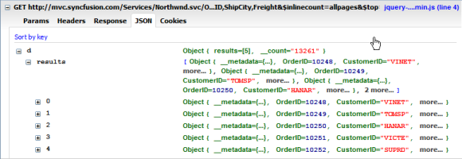
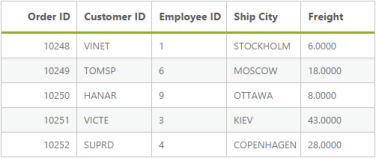

# Data Binding

## LOCAL

A data source can be bound to a Grid through DataManager control. The DataManager supports JSON array binding. It is useful to bind records in client side by using JSON data that is very helpful in Single Page Application (SPA) and in feature rich web application. To achieve this, you can refer to the following code example.





    <%--connection local reference--%>

    <ej:DataManager runat="server" ID="FlatData" URL="Default.aspx/Data"/>

    <ej:Grid ID="OrdersGrid" runat="server"  DataManagerID="FlatData" 
        Query ="new ej.Query().take(5)">
        <Columns>
            <ej:Column Field="OrderID" HeaderText="Order ID" IsPrimaryKey="True" TextAlign="Right" Width="75" />
            <ej:Column Field="CustomerID" HeaderText="Customer ID" Width="75" />
            <ej:Column Field="EmployeeID" HeaderText="Employee ID" Width="75" />
            <ej:Column Field="ShipCity" HeaderText="Ship City" Width="75" />
            <ej:Column Field="Freight" HeaderText="Freight" Width="75" />
        </Columns>
    </ej:Grid>





    public partial class DataManager : System.Web.UI.Page
    {
        protected void Page_Load(object sender, EventArgs e)
        {

        }
        [WebMethod]

        [ScriptMethod(ResponseFormat = ResponseFormat.Json)]
        public static object Data(int skip, int take)
        {

            var DataSource = OrderRepository.GetAllRecords();
            DataResult ds = new DataResult();
            ds.result = DataSource.Skip(skip).Take(take);
            ds.count = ds.count = DataSource.Count();
            return ds;
        }
    }





The result of the above code example is illustrated as follows.

## REST Services

### OData binding

OData is standardized protocol for creating and consuming data. You can retrieve data from OData service by using DataManager. You can refer to the following code example of remote Data binding by using OData service.



    <ej:DataManager ID="FlatData" runat="server" URL="http://mvc.syncfusion.com/Services/Northwnd.svc/Orders/" />

    <ej:Grid ID="OrdersGrid" runat="server"  DataManagerID="FlatData" 
        Query ="new ej.Query().select(['OrderID', 'CustomerID', 'EmployeeID', 'ShipCity', 'Freight']).take(5)">
        <Columns>
            <ej:Column Field="OrderID" HeaderText="Order ID" IsPrimaryKey="True" TextAlign="Right" Width="75" />
            <ej:Column Field="CustomerID" HeaderText="Customer ID" Width="75" />
            <ej:Column Field="EmployeeID" HeaderText="Employee ID" Width="75" />
            <ej:Column Field="ShipCity" HeaderText="Ship City" Width="75" />
            <ej:Column Field="Freight" HeaderText="Freight" Width="75" />
        </Columns>
    </ej:Grid>



The result of the above code example is illustrated as follows.

### OData V4

The OData v4 is an improved version of OData protocols and the DataManager can also retrieve and consume OData v4 services.  For more details on OData v4 Services, refer to the [OData documentation](http://www.odata.org/documentation/).

You can refer to the following code example for consuming OData v4 services and bind the result to the Grid. In the the following code, crossDomain is enabled to make cross domain request.



    <ej:DataManager ID="FlatData" runat="server" URL="http://services.odata.org/V4/Northwind/Northwind.svc/Orders/" CrossDomain="true" />

    <ej:Grid ID="OrdersGrid" runat="server"  DataManagerID="FlatData" 
        Query ="new ej.Query().select(['OrderID', 'CustomerID', 'EmployeeID', 'ShipCity', 'Freight']).take(5)">
        <Columns>
            <ej:Column Field="OrderID" HeaderText="Order ID" IsPrimaryKey="True" TextAlign="Right" Width="75" />
            <ej:Column Field="CustomerID" HeaderText="Customer ID" Width="75" />
            <ej:Column Field="EmployeeID" HeaderText="Employee ID" Width="75" />
            <ej:Column Field="ShipCity" HeaderText="Ship City" Width="75" />
            <ej:Column Field="Freight" HeaderText="Freight" Width="75" />
        </Columns>
    </ej:Grid>



The request and response to the service from the DataManager is illustrated as follows.

The result of the above code example is illustrated as follows.

## WebAPI binding

The Web API is a programmatic interface to define the request and response messages system that is mostly exposed in JSON or XML. The DataManager contains default adaptor to handle the Web API request and responses. The WebApiAdaptor is discussed briefly in the Adaptor section.

Refer to the following code example for consuming Web API data using DataManager.



    public class EmployeeController : ApiController
    {
        static readonly IEmployeeRepository repository = new EmployeeRepository();
        // GET API/<controller>
        [HttpGet]
        public object Get()
        {

            var queryString = HttpContext.Current.Request.QueryString;
            var data = repository.GetAll().ToList();
            return new { Items = data, Count = data.Count() };
        }
    }





    <ej:DataManager ID="FlatData" runat="server" URL="/api/Employee" Adaptor="WebApiAdaptor"/>

    <ej:Grid ID="OrdersGrid" runat="server"  DataManagerID="FlatData" 
        Query ="new ej.Query().select(['OrderID', 'CustomerID', 'EmployeeID', 'ShipCity', 'Freight']).take(5)">
        <Columns>
            <ej:Column Field="OrderID" HeaderText="Order ID" IsPrimaryKey="True" TextAlign="Right" Width="75" />
            <ej:Column Field="CustomerID" HeaderText="Customer ID" Width="75" />
            <ej:Column Field="EmployeeID" HeaderText="Employee ID" Width="75" />
            <ej:Column Field="ShipCity" HeaderText="Ship City" Width="75" />
            <ej:Column Field="Freight" HeaderText="Freight" Width="75" />
        </Columns>
    </ej:Grid>



The request to the Web API and response is illustrated as follows.

The result for the above code example is illustrated as follows.

## Other Web Services binding

The DataManager can also retrieve data from ASP.NET Web methods and ASP.NET MVC Controller`s action. You can achieve this by using the UrlAdaptor of DataManager. The UrlAdaptor is discussed briefly in the adaptor section.  By default, the URL Adaptor is used when accessing remote data. 

Refer to the following code example to know how the DataManager can be used to consume data from the web method.

Create a sample using ASP.NET Web Services



    public class WebService1 : System.Web.Services.WebService
    {
        static string cons = ConfigurationManager.ConnectionStrings["SQLConnectionString"].ConnectionString;
        static SqlConnection con = new SqlConnection(cons);

        [WebMethod]
        public DataTable Get()
        {
            SqlCommand getData = new SqlCommand();
            getData.CommandText = "USP_DEV_ChangeLog_Select"; // Stored procedure for retrieve data from suppliers table
            getData.CommandType = CommandType.StoredProcedure;
            getData.Connection = con;
            if (con.State != ConnectionState.Open)
                con.Open();
            DataTable sqlData = new DataTable();
            SqlDataAdapter sqlAdapter = new SqlDataAdapter(getData);
            sqlData.TableName = "Suppliers";
            sqlAdapter.Fill(sqlData);
            return sqlData;
        }
    }



In the above code snippet, we have created web services by using the ASP.NET web service and bound dataSource to Grid, in code behind GetDataSource method.



    [WebMethod]
    [ScriptMethod(ResponseFormat = ResponseFormat.Json)] // Return the JSON formatted result
    public static object GetDataSource()
    {
        CRUD_Service.WebService1 service = new CRUD_Service.WebService1();
        var sqlData = service.Get();   // Get data from web services
        DataResult result = new DataResult();
        List<EditableCustomer> data = (from ord in sqlData.AsEnumerable() // Perform skip take for on demand load paging
                                        select new EditableCustomer
                                        {
                                            OrderID = ord.ItemArray[0].ToString(),
                                            CustomerID = ord.ItemArray[1].ToString(),
                                            EmployeeID = ord.ItemArray[5].ToString(),
                                            Freight = ord.ItemArray[7].ToString(),
                                            ShipCity = ord.ItemArray[8].ToString()
                                        }).ToList();

        con.Close();
        return data;
    }





    <asp:Content runat="server" ID="Content1" ContentPlaceHolderID="MainContent">
        <ej:DataManager ID="FlatData" runat="server" URL="WebService1.asmx/GetDataSource"/>
        <ej:Grid ID="OrdersGrid" runat="server"  DataManagerID="FlatData" 
            Query ="new ej.Query().select(['OrderID', 'CustomerID', 'EmployeeID', 'ShipCity', 'Freight']).take(5)">
            <Columns>
                <ej:Column Field="OrderID" HeaderText="Order ID" IsPrimaryKey="True" TextAlign="Right" Width="75" />
                <ej:Column Field="CustomerID" HeaderText="Customer ID" Width="75" />
                <ej:Column Field="EmployeeID" HeaderText="Employee ID" Width="75" />
                <ej:Column Field="ShipCity" HeaderText="Ship City" Width="75" />
                <ej:Column Field="Freight" HeaderText="Freight" Width="75" />
            </Columns>
        </ej:Grid>

    </asp:Content>



## Complex Data Sorting

You can perform a data operation based on nested column data and bind to the data control. Here, if you want to perform the server side data operation for the nested dataSource like sorting, grouping, filtering, searching, take, or skip then we have to define the generic type of dataSource.



 <ej:Grid  runat="server"  ID="grid1" EnableViewState="false" AllowPaging="true" Load="OnLoad" >
         <DataManager  URL="Default.aspx/GetAllRecords"   Adaptor="WebMethodAdaptor"/> 
        <Columns>
 
            <ej:Column Field="OrderID" HeaderText="Order ID" IsPrimaryKey="True" TextAlign="Right" Width="75" />
            <ej:Column Field="CustomerID" HeaderText="Customer ID" Width="75" />
            <ej:Column Field="EmployeeID" HeaderText="Employee ID" Width="75" />
            
            <ej:Column Field="Freight" HeaderText="Freight" Width="75" />
            <ej:Column Field="ShipCountry" HeaderText="Ship Country" Width="75" />
            <ej:Column Field="ShipCity" HeaderText="Ship City" Width="75" />
            <ej:Column Field="customer.0.CustomerNumber" HeaderText="Customer Number0" Width="60" />
            <ej:Column Field="customer.0.OtherAddress" HeaderText="Customer Address2 0" Width="60" />
            <ej:Column Field="customer.1.CustomerNumber" HeaderText="Customer Number1" Width="60" />
            <ej:Column Field="customer.1.OtherAddress" HeaderText="Customer Address2 1" Width="60" />
        </Columns>
       <EditSettings AllowEditing="True" AllowAdding="True" AllowDeleting="True" ></EditSettings>
                    <ToolbarSettings ShowToolbar="True" ToolbarItems="add,edit,delete,update,cancel"></ToolbarSettings> 
    </ej:Grid>





        [WebMethod()]
        [ScriptMethod(ResponseFormat = ResponseFormat.Json)]
        public static object GetAllRecords()
        {
                int code = 10000;
                Customer[] cs = { new Customer { CustomerNumber = 4, OtherAddress = "Hello" }, new Customer { CustomerNumber = 986, OtherAddress = "bOther" } };
                Customer[] cos = { new Customer { OtherAddress = "a", CustomerNumber = 5 }, new Customer { CustomerNumber = 777, OtherAddress = "other" } };

                for (int i = 1; i < 10; i++)
                {

                    order.Add(new Orders(code + 1, "ALFKI", i + 0, 2.3 * i, "Chicago", "Berlin",cs));
                    order.Add(new Orders(code + 2, "ANATR", i + 2, 3.3 * i, "Sydney", "Madrid",cos));
                    order.Add(new Orders(code + 3, "ANTON", i + 1, 4.3 * i, "NY", "Cholchester",cs));
                    order.Add(new Orders(code + 4, "BLONP", i + 3, 5.3 * i, "LA", "Marseille",cos));
                    order.Add(new Orders(code + 5, "BOLID", i + 4, 6.3 * i, "Cochin", "Tsawassen",cs));
                   
                    code += 5;
                }
               
               
                IEnumerable<Orders> List = order;          
                Sort sortingObject = new Sort();           
                sortingObject.Name = "customer.0.OtherAddress";            
                sortingObject.Direction = "ascending";
                List <Sort> listToSort = new List<Sort>();
                listToSort.Add(sortingObject);
                Syncfusion.JavaScript.DataSources.DataOperations operation = new Syncfusion.JavaScript.DataSources.DataOperations();
                List= operation.PerformSorting(List, listToSort);
                return new { result =List, count = List.AsQueryable().Count() };
               
            }



