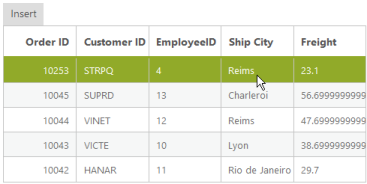

# Editing

Editing is a key feature in DataManager and it provides support to add a new record, edit an existing record and remove a record from the table. 

## Batch Edit

Batch Editing is a unique feature, where requests to add, remove and change are handled altogether at a time rather than passing the request separately for each operation.



<asp:Content runat="server" ID="Content1" ContentPlaceHolderID="MainContent">

        <ej:DataManager ID="FlatData" runat="server" Adaptor="JsonAdaptor" />

        <ej:Grid ID="OrdersGrid" runat="server"  DataManagerID="FlatData"

             Query = "ej.Query()

            .take(5)">

            <Columns>

                <ej:Column Field="EmployeeID" HeaderText="Employee ID" IsPrimaryKey="True" TextAlign="Right" Width="75" />

                <ej:Column Field="FirstName" HeaderText="First Name" Width="75" />

                <ej:Column Field="LastName" HeaderText="Last Name" Width="75" />

            </Columns>

        </ej:Grid>

    Employee ID

    <input id="EmployeeID" class="e-ejinputtext" type="text" value="" />

    First Name

    <input id="FirstName" class="e-ejinputtext" type="text" value="" />

    Last Name 

    <input id="LastName" class="e-ejinputtext" type="text" value="" />

    <ej:Button runat="server" Type="Button" Text="Add" ClientSideOnClick="Click" ID="button"></ej:Button>

    <ej:Button runat="server" Type="Button" Text="Change" ClientSideOnClick="Click" ID="button1"></ej:Button>

    <ej:Button runat="server" Type="Button" Text="Delete" ClientSideOnClick="Click" ID="button2"></ej:Button>

    <ej:Button runat="server" Type="Button" Text="save all" ClientSideOnClick="Click" ID="button3"></ej:Button>

 </asp:Content>

<asp:Content ID="Content2" ContentPlaceHolderID="ScriptSection" runat="server">

    

</asp:Content>



Result of the above code example is illustrated as follows.

## Insert

The insert method of the data manager is used to add a new record to the table. The JSON data passed as a parameter to the insert method that is inserted to the data source of the data manager.



<asp:Content runat="server" ID="Content1" ContentPlaceHolderID="MainContent">

        <ej:DataManager ID="FlatData" runat="server" Adaptor="JsonAdaptor"/>

        <ej:Button runat="server" Type="Button" Text="Insert" ClientSideOnClick="onClick" ID="submit"></ej:Button>

        <ej:Grid ID="OrdersGrid" runat="server"  DataManagerID="FlatData"

             Query = "ej.Query().select('OrderID', 'CustomerID', 'EmployeeID', 'Freight', 'ShipCity')

            .page(1,5)">

            <Columns>

                <ej:Column Field="OrderID" HeaderText="Order ID" IsPrimaryKey="True" TextAlign="Right" Width="75" />

                <ej:Column Field="CustomerID" HeaderText="Customer ID" Width="75" />

                <ej:Column Field="EmployeeID" HeaderText="EmployeeID" Width="75" />

                <ej:Column Field="ShipCity" HeaderText="Ship City" Width="75" />

                <ej:Column Field="Freight" HeaderText="Freight" Width="75" />

            </Columns>

        </ej:Grid>

</asp:Content>

<asp:Content ID="Content2" ContentPlaceHolderID="ScriptSection" runat="server">

    

</asp:Content>



Result of the above code example is illustrated as follows.

## Update

The update method is used to update the modified changes made to a record in the data source of the DataManager.



<asp:Content runat="server" ID="Content1" ContentPlaceHolderID="MainContent">

        <ej:DataManager ID="FlatData" runat="server" Adaptor="JsonAdaptor"/>

        <ej:Button runat="server" Type="Button" Text="Update" ClientSideOnClick="onClick" ID="submit"></ej:Button>

        <ej:Grid ID="OrdersGrid" runat="server"  DataManagerID="FlatData"

            Query = "ej.Query()

                    .select('OrderID', 'CustomerID', 'EmployeeID', 'Freight', 'ShipCity')

                     .page(1,5)">

            <Columns>

                <ej:Column Field="OrderID" HeaderText="Order ID" IsPrimaryKey="True" TextAlign="Right" Width="75" />

                <ej:Column Field="CustomerID" HeaderText="Customer ID" Width="75" />

                <ej:Column Field="EmployeeID" HeaderText="EmployeeID" Width="75" />

                <ej:Column Field="ShipCity" HeaderText="Ship City" Width="75" />

                <ej:Column Field="Freight" HeaderText="Freight" Width="75" />

            </Columns>

        </ej:Grid>

</asp:Content>

<asp:Content ID="Content2" ContentPlaceHolderID="ScriptSection" runat="server">

    

</asp:Content>





public partial class DataManager : System.Web.UI.Page

    {

        List<Orders> order = new List<Orders>();

        protected void Page_Load(object sender, EventArgs e)

        {

           BindDataSource();

        }

        private void BindDataSource()

        {

            int code = 10000;

            for (int i = 1; i < 10; i++)

            {

                order.Add(new Orders(code + 1, "TOMSP", i + 0, 2.3 * i, "Münster"));

                order.Add(new Orders(code + 2, "HANAR", i + 2, 3.3 * i, "Rio de Janeiro"));

                order.Add(new Orders(code + 3, "VICTE", i + 1, 4.3 * i, "Lyon"));

                order.Add(new Orders(code + 4, "VINET", i + 3, 5.3 * i, "Reims"));

                order.Add(new Orders(code + 5, "SUPRD", i + 4, 6.3 * i, "Charleroi"));

                code += 5;

            }

            this.FlatData.Json = order;

            this.OrdersGrid.DataBind();

        }

        [Serializable]

        public class Orders

        {

            public Orders()

            {

            }

            public Orders(long OrderId, string CustomerId, int EmployeeId, double Freight, string ShipCity)

            {

                this.OrderID = OrderId;

                this.CustomerID = CustomerId;

                this.EmployeeID = EmployeeId;

                this.Freight = Freight;

                this.ShipCity = ShipCity;

            }

            public long OrderID { get; set; }

            public string CustomerID { get; set; }

            public int EmployeeID { get; set; }

            public double Freight { get; set; }

            public string ShipCity { get; set; }

        }

    }



Result of the above code example is illustrated as follows.

## Remove

The “remove” method is used to delete a record from the data source of the DataManager.



<asp:Content runat="server" ID="Content1" ContentPlaceHolderID="MainContent">

        <ej:DataManager ID="FlatData" runat="server" Adaptor="JsonAdaptor"/>

        <ej:Button runat="server" Type="Button" Text="Update" ClientSideOnClick="onClick" ID="submit"></ej:Button>

        <ej:Grid ID="OrdersGrid" runat="server"  DataManagerID="FlatData"

            Query = "ej.Query()

                    .select('OrderID', 'CustomerID', 'EmployeeID', 'Freight', 'ShipCity')

                     .page(1,5)">

            <Columns>

                <ej:Column Field="OrderID" HeaderText="Order ID" IsPrimaryKey="True" TextAlign="Right" Width="75" />

                <ej:Column Field="CustomerID" HeaderText="Customer ID" Width="75" />

                <ej:Column Field="EmployeeID" HeaderText="EmployeeID" Width="75" />

                <ej:Column Field="ShipCity" HeaderText="Ship City" Width="75" />

                <ej:Column Field="Freight" HeaderText="Freight" Width="75" />

            </Columns>

        </ej:Grid>

</asp:Content>

<asp:Content ID="Content2" ContentPlaceHolderID="ScriptSection" runat="server">

    

</asp:Content>





public partial class DataManager : System.Web.UI.Page

    {

        List<Orders> order = new List<Orders>();

        protected void Page_Load(object sender, EventArgs e)

        {

           BindDataSource();

        }

        private void BindDataSource()

        {

            int code = 10000;

            for (int i = 1; i < 10; i++)

            {

                order.Add(new Orders(code + 1, "TOMSP", i + 0, 2.3 * i, "Münster"));

                order.Add(new Orders(code + 2, "HANAR", i + 2, 3.3 * i, "Rio de Janeiro"));

                order.Add(new Orders(code + 3, "VICTE", i + 1, 4.3 * i, "Lyon"));

                order.Add(new Orders(code + 4, "VINET", i + 3, 5.3 * i, "Reims"));

                order.Add(new Orders(code + 5, "SUPRD", i + 4, 6.3 * i, "Charleroi"));

                code += 5;

            }

            this.FlatData.Json = order;

            this.OrdersGrid.DataBind();

        }

        [Serializable]

        public class Orders

        {

            public Orders()

            {

            }

            public Orders(long OrderId, string CustomerId, int EmployeeId, double Freight, string ShipCity)

            {

                this.OrderID = OrderId;

                this.CustomerID = CustomerId;

                this.EmployeeID = EmployeeId;

                this.Freight = Freight;

                this.ShipCity = ShipCity;

            }

            public long OrderID { get; set; }

            public string CustomerID { get; set; }

            public int EmployeeID { get; set; }

            public double Freight { get; set; }

            public string ShipCity { get; set; }

        }

    }



Result of the above code example is illustrated as follows.

