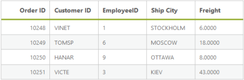
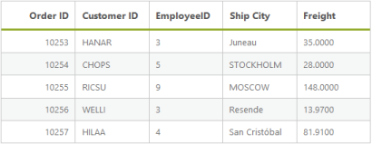
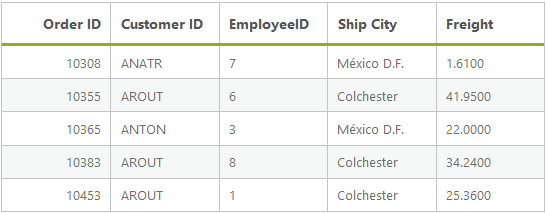
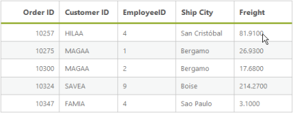
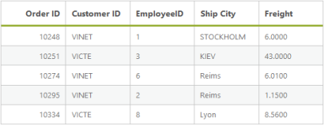

# Filtering

Filtering is a basic technique in DataManager query. The “where” query is used to filter some particular or related records from the data source to review details of records. 

## Filter Operators

Filter operators are used to specify the filter type. The various filter operators corresponding to the type of the column is listed in the following table.

<table>
<tr>
<td>
Column type</td><td>
Filter operators</td></tr>
<tr>
<td>
Number</td><td>
ej.FilterOperators.greaterThanej.FilterOperators.greaterThanOrEqualej.FilterOperators.lessThanej.FilterOperators.lessThanOrEqualej.FilterOperators.equal</td></tr>
<tr>
<td>
String</td><td>
ej.FilterOperators.startsWithej.FilterOperators.endsWithej.FilterOperators.containsej.FilterOperators.equalej.FilterOperators.notEqual</td></tr>
<tr>
<td>
Boolean</td><td>
ej.FilterOperators.equalej.FilterOperators.notEqual</td></tr>
<tr>
<td>
Date</td><td>
ej.FilterOperators.greaterThanej.FilterOperators.greaterThanOrEqualej.FilterOperators.lessThanej.FilterOperators.lessThanOrEqualej.FilterOperators.equal</td></tr>
</table>

## lessThan

This operator is used to get the records with values less than that of the filter value.



&lt;asp:Content runat="server" ID="Content1" ContentPlaceHolderID="MainContent"&gt;

        &lt;ej:DataManager ID="FlatData" runat="server" URL="http://mvc.syncfusion.com/Services/Northwnd.svc/Orders"/&gt;

        <ej:Grid ID="OrdersGrid" runat="server"  DataManagerID="FlatData"

             Query = "ej.Query().where('OrderID', 'lessThan', 10252, false)">

            &lt;Columns&gt;

                &lt;ej:Column Field="OrderID" HeaderText="Order ID" IsPrimaryKey="True" TextAlign="Right" Width="75" /&gt;

                &lt;ej:Column Field="CustomerID" HeaderText="Customer ID" Width="75" /&gt;

                &lt;ej:Column Field="EmployeeID" HeaderText="EmployeeID" Width="75" /&gt;

                &lt;ej:Column Field="ShipCity" HeaderText="Ship City" Width="75" /&gt;

                &lt;ej:Column Field="Freight" HeaderText="Freight" Width="75" /&gt;

            &lt;/Columns&gt;

        &lt;/ej:Grid&gt;

&lt;/asp:Content&gt;



Result of the above code example is illustrated as follows.

{:.image }

## greaterThan

This operator is used to get the records with values greater than that of the filter value.



&lt;asp:Content runat="server" ID="Content1" ContentPlaceHolderID="MainContent"&gt;

        &lt;ej:DataManager ID="FlatData" runat="server" URL="http://mvc.syncfusion.com/Services/Northwnd.svc/Orders"/&gt;

        <ej:Grid ID="OrdersGrid" runat="server"  DataManagerID="FlatData"

             Query = "ej.Query().where('OrderID', 'greaterThan', 10252, false).take(5)">

            &lt;Columns&gt;

                &lt;ej:Column Field="OrderID" HeaderText="Order ID" IsPrimaryKey="True" TextAlign="Right" Width="75" /&gt;

                &lt;ej:Column Field="CustomerID" HeaderText="Customer ID" Width="75" /&gt;

                &lt;ej:Column Field="EmployeeID" HeaderText="EmployeeID" Width="75" /&gt;

                &lt;ej:Column Field="ShipCity" HeaderText="Ship City" Width="75" /&gt;

                &lt;ej:Column Field="Freight" HeaderText="Freight" Width="75" /&gt;

            &lt;/Columns&gt;

        &lt;/ej:Grid&gt;

&lt;/asp:Content&gt;



Result of the above code example is illustrated as follows.

{:.image }

## lessThanOrEqual

This operator is used to get the records with values less than or equal to the filter value.



&lt;asp:Content runat="server" ID="Content1" ContentPlaceHolderID="MainContent"&gt;

        &lt;ej:DataManager ID="FlatData" runat="server" URL="http://mvc.syncfusion.com/Services/Northwnd.svc/Orders"/&gt;

        <ej:Grid ID="OrdersGrid" runat="server"  DataManagerID="FlatData"

             Query = "ej.Query().where('OrderID', 'lessThanOrEqual', 10252, false).take(5)">

            &lt;Columns&gt;

                &lt;ej:Column Field="OrderID" HeaderText="Order ID" IsPrimaryKey="True" TextAlign="Right" Width="75" /&gt;

                &lt;ej:Column Field="CustomerID" HeaderText="Customer ID" Width="75" /&gt;

                &lt;ej:Column Field="EmployeeID" HeaderText="EmployeeID" Width="75" /&gt;

                &lt;ej:Column Field="ShipCity" HeaderText="Ship City" Width="75" /&gt;

                &lt;ej:Column Field="Freight" HeaderText="Freight" Width="75" /&gt;

            &lt;/Columns&gt;

        &lt;/ej:Grid&gt;

&lt;/asp:Content&gt;



Result of the above code example is illustrated as follows.

{:.image }

## greaterThanOrEqual

This operator is used to get the records with values greater than or equal to the filter value.



&lt;asp:Content runat="server" ID="Content1" ContentPlaceHolderID="MainContent"&gt;

        &lt;ej:DataManager ID="FlatData" runat="server" URL="http://mvc.syncfusion.com/Services/Northwnd.svc/Orders"/&gt;

        <ej:Grid ID="OrdersGrid" runat="server"  DataManagerID="FlatData"

             Query = "ej.Query().where('OrderID', 'greaterThanOrEqual', 10252, false).take(5)">

            &lt;Columns&gt;

                &lt;ej:Column Field="OrderID" HeaderText="Order ID" IsPrimaryKey="True" TextAlign="Right" Width="75" /&gt;

                &lt;ej:Column Field="CustomerID" HeaderText="Customer ID" Width="75" /&gt;

                &lt;ej:Column Field="EmployeeID" HeaderText="EmployeeID" Width="75" /&gt;

                &lt;ej:Column Field="ShipCity" HeaderText="Ship City" Width="75" /&gt;

                &lt;ej:Column Field="Freight" HeaderText="Freight" Width="75" /&gt;

            &lt;/Columns&gt;

        &lt;/ej:Grid&gt;

&lt;/asp:Content&gt;



Result of the above code example is illustrated as follows.

{:.image }

## equal

This operator is used to get the records with values equal to that of the filter value.



&lt;asp:Content runat="server" ID="Content1" ContentPlaceHolderID="MainContent"&gt;

        &lt;ej:DataManager ID="FlatData" runat="server" URL="http://mvc.syncfusion.com/Services/Northwnd.svc/Orders"/&gt;

        <ej:Grid ID="OrdersGrid" runat="server"  DataManagerID="FlatData"

             Query = "ej.Query().where('EmployeeID', 'equal', 4, false).take(4)">

            &lt;Columns&gt;

                &lt;ej:Column Field="OrderID" HeaderText="Order ID" IsPrimaryKey="True" TextAlign="Right" Width="75" /&gt;

                &lt;ej:Column Field="CustomerID" HeaderText="Customer ID" Width="75" /&gt;

                &lt;ej:Column Field="EmployeeID" HeaderText="EmployeeID" Width="75" /&gt;

                &lt;ej:Column Field="ShipCity" HeaderText="Ship City" Width="75" /&gt;

                &lt;ej:Column Field="Freight" HeaderText="Freight" Width="75" /&gt;

            &lt;/Columns&gt;

        &lt;/ej:Grid&gt;

&lt;/asp:Content&gt;



Result of the above code example is illustrated as follows.

{:.image }

## notEqual

This operator is used to get the records with values not equal to that of the filter value specified.



&lt;asp:Content runat="server" ID="Content1" ContentPlaceHolderID="MainContent"&gt;

        &lt;ej:DataManager ID="FlatData" runat="server" URL="http://mvc.syncfusion.com/Services/Northwnd.svc/Orders"/&gt;

        <ej:Grid ID="OrdersGrid" runat="server"  DataManagerID="FlatData"

             Query = "ej.Query().where('EmployeeID', 'notEqual', 4, false).take(5)">

            &lt;Columns&gt;

                &lt;ej:Column Field="OrderID" HeaderText="Order ID" IsPrimaryKey="True" TextAlign="Right" Width="75" /&gt;

                &lt;ej:Column Field="CustomerID" HeaderText="Customer ID" Width="75" /&gt;

                &lt;ej:Column Field="EmployeeID" HeaderText="EmployeeID" Width="75" /&gt;

                &lt;ej:Column Field="ShipCity" HeaderText="Ship City" Width="75" /&gt;

                &lt;ej:Column Field="Freight" HeaderText="Freight" Width="75" /&gt;

            &lt;/Columns&gt;

        &lt;/ej:Grid&gt;

&lt;/asp:Content&gt;



Result of the above code example is illustrated as follows.

{:.image }

## contains

This operator is used to get the records that contains the filter value.



&lt;asp:Content runat="server" ID="Content1" ContentPlaceHolderID="MainContent"&gt;

        &lt;ej:DataManager ID="FlatData" runat="server" URL="http://mvc.syncfusion.com/Services/Northwnd.svc/Orders"/&gt;

        <ej:Grid ID="OrdersGrid" runat="server"  DataManagerID="FlatData"

             Query = "ej.Query().where('CustomerID', 'contains', 'A', false).take(5)">

            &lt;Columns&gt;

                &lt;ej:Column Field="OrderID" HeaderText="Order ID" IsPrimaryKey="True" TextAlign="Right" Width="75" /&gt;

                &lt;ej:Column Field="CustomerID" HeaderText="Customer ID" Width="75" /&gt;

                &lt;ej:Column Field="EmployeeID" HeaderText="EmployeeID" Width="75" /&gt;

                &lt;ej:Column Field="ShipCity" HeaderText="Ship City" Width="75" /&gt;

                &lt;ej:Column Field="Freight" HeaderText="Freight" Width="75" /&gt;

            &lt;/Columns&gt;

        &lt;/ej:Grid&gt;

&lt;/asp:Content&gt;



Result of the above code example is illustrated as follows.

{:.image }

## startswith

This operator is used to get the records that starts with the filter value specified.



&lt;asp:Content runat="server" ID="Content1" ContentPlaceHolderID="MainContent"&gt;

        &lt;ej:DataManager ID="FlatData" runat="server" URL="http://mvc.syncfusion.com/Services/Northwnd.svc/Orders"/&gt;

        <ej:Grid ID="OrdersGrid" runat="server"  DataManagerID="FlatData"

             Query = "ej.Query().where('CustomerID', 'startswith', 'A', false).take(5)">

            &lt;Columns&gt;

                &lt;ej:Column Field="OrderID" HeaderText="Order ID" IsPrimaryKey="True" TextAlign="Right" Width="75" /&gt;

                &lt;ej:Column Field="CustomerID" HeaderText="Customer ID" Width="75" /&gt;

                &lt;ej:Column Field="EmployeeID" HeaderText="EmployeeID" Width="75" /&gt;

                &lt;ej:Column Field="ShipCity" HeaderText="Ship City" Width="75" /&gt;

                &lt;ej:Column Field="Freight" HeaderText="Freight" Width="75" /&gt;

            &lt;/Columns&gt;

        &lt;/ej:Grid&gt;

&lt;/asp:Content&gt;



Result of the above code example is illustrated as follows.

{:.image }

## endswith

This operator is used to get the records that ends with the filter value specified.



&lt;asp:Content runat="server" ID="Content1" ContentPlaceHolderID="MainContent"&gt;

        &lt;ej:DataManager ID="FlatData" runat="server" URL="http://mvc.syncfusion.com/Services/Northwnd.svc/Orders"/&gt;

        <ej:Grid ID="OrdersGrid" runat="server"  DataManagerID="FlatData"

             Query = "ej.Query().where('CustomerID', 'endswith', 'A', false).take(5)">

            &lt;Columns&gt;

                &lt;ej:Column Field="OrderID" HeaderText="Order ID" IsPrimaryKey="True" TextAlign="Right" Width="75" /&gt;

                &lt;ej:Column Field="CustomerID" HeaderText="Customer ID" Width="75" /&gt;

                &lt;ej:Column Field="EmployeeID" HeaderText="EmployeeID" Width="75" /&gt;

                &lt;ej:Column Field="ShipCity" HeaderText="Ship City" Width="75" /&gt;

                &lt;ej:Column Field="Freight" HeaderText="Freight" Width="75" /&gt;

            &lt;/Columns&gt;

        &lt;/ej:Grid&gt;

&lt;/asp:Content&gt;



Result of the above code example is illustrated as follows.

{:.image }

## Predicate

### and predicate

The “and” predicate is used to add n-number of predicates with “and” condition and filter the data.



&lt;asp:Content runat="server" ID="Content1" ContentPlaceHolderID="MainContent"&gt;

        &lt;ej:DataManager ID="FlatData" runat="server" URL="http://mvc.syncfusion.com/Services/Northwnd.svc/Orders"/&gt;

        <ej:Grid ID="OrdersGrid" runat="server"  DataManagerID="FlatData"

             Query = "ej.Query()

            .where(ej.Predicate('OrderID', ej.FilterOperators.greaterThan, 10399, true).and('CustomerID', ej.FilterOperators.startsWith, 'V', true)).take(5)">

            &lt;Columns&gt;

                &lt;ej:Column Field="OrderID" HeaderText="Order ID" IsPrimaryKey="True" TextAlign="Right" Width="75" /&gt;

                &lt;ej:Column Field="CustomerID" HeaderText="Customer ID" Width="75" /&gt;

                &lt;ej:Column Field="EmployeeID" HeaderText="EmployeeID" Width="75" /&gt;

                &lt;ej:Column Field="ShipCity" HeaderText="Ship City" Width="75" /&gt;

                &lt;ej:Column Field="Freight" HeaderText="Freight" Width="75" /&gt;

            &lt;/Columns&gt;

        &lt;/ej:Grid&gt;

&lt;/asp:Content&gt;



Result of the above code example is illustrated as follows.

{:.image }

### or predicate

 By using this method you can add n-number of predicates with “or” condition and filter the data.

 
 
&lt;asp:Content runat="server" ID="Content1" ContentPlaceHolderID="MainContent"&gt;

        &lt;ej:DataManager ID="FlatData" runat="server" URL="http://mvc.syncfusion.com/Services/Northwnd.svc/Orders"/&gt;

        <ej:Grid ID="OrdersGrid" runat="server"  DataManagerID="FlatData"

             Query = "ej.Query()

            .where(ej.Predicate('OrderID', ej.FilterOperators.greaterThan, 10399, true).or('CustomerID', ej.FilterOperators.startsWith, 'V', true)).take(5)">

            &lt;Columns&gt;

                &lt;ej:Column Field="OrderID" HeaderText="Order ID" IsPrimaryKey="True" TextAlign="Right" Width="75" /&gt;

                &lt;ej:Column Field="CustomerID" HeaderText="Customer ID" Width="75" /&gt;

                &lt;ej:Column Field="EmployeeID" HeaderText="EmployeeID" Width="75" /&gt;

                &lt;ej:Column Field="ShipCity" HeaderText="Ship City" Width="75" /&gt;

                &lt;ej:Column Field="Freight" HeaderText="Freight" Width="75" /&gt;

            &lt;/Columns&gt;

        &lt;/ej:Grid&gt;

&lt;/asp:Content&gt;



Result of the above code example is illustrated as follows.

{:.image }

