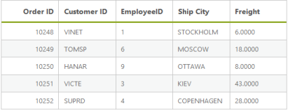
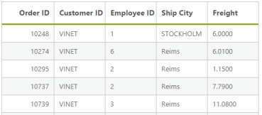
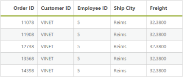
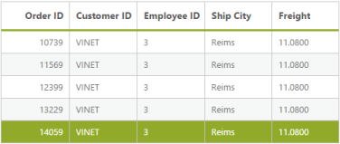

# Getting Started 

## Create your DataManager in ASP.NET

DataManager is used to manage relational data. It supports CRUD (Create, Read, Update, and Destroy) in individual requests and Batch. DataManager uses two different thinks, DataManager control for processing, and ej.Query for serving data. DataManager control communicates with data source and ej.Query generates data queries that are read by DataManager. 

Configure Demo Application

This section briefly describes how to make a connection to WCF “Northwind” OData service and generate a report with top five orders from customer HANAR with higher “Freight” charges.  In this application scenario, you can learn how to bind DataManager to the Grid control, to do paging, filtering and sorting by using ej.Query.

Create Connection

To define connection to data source, you can use DataManager control. The data source can be local or remote. Local data source is the local list items and remote data source is any web services. 

The local data is set as data source by using the following code example.

&lt;%--connection local reference--%&gt;

&lt;ej:DataManager runat="server" ID="FlatData" URL="Default.aspx/Data"/&gt;

[ASPX.CS]

public partial class DataManager : System.Web.UI.Page

    {

        protected void Page_Load(object sender, EventArgs e)

        {

        }

        [WebMethod]

        [ScriptMethod(ResponseFormat = ResponseFormat.Json)]

        public static object Data(int skip, int take)

        {

            var DataSource = OrderRepository.GetAllRecords();

            DataResult ds = new DataResult();

            ds.result = DataSource.Skip(skip).Take(take);

            ds.count = ds.count = DataSource.Count();

            return ds;

        }

    }

In this application, as you have web service for NorthWind database, you can assign the web service URL link to the URL property of DataManager, and you can enable crossDomain to retrieve data from another domain.

[ASPX]

&lt;ej:DataManager ID="FlatData" runat="server" URL="http://mvc.syncfusion.com/Services/Northwnd.svc/Orders/" CrossDomain="true" /&gt;

You can use ej.Query to generate the report from web service.

Binding with Grid Control

You can bind the DataManager with Grid by defining the ID of DataManager in the DataManagerID property of Grid control. 

&lt;ej:DataManager ID="FlatData" runat="server" URL="http://mvc.syncfusion.com/Services/Northwnd.svc/Orders/" CrossDomain="true" /&gt;

        &lt;%--DataManagerID = "Datamanager ID"--%&gt;

        <ej:Grid ID="OrdersGrid" runat="server"  DataManagerID="FlatData" 

            Query ="new ej.Query().take(5)">

            &lt;Columns&gt;

                &lt;ej:Column Field="OrderID" HeaderText="Order ID" IsPrimaryKey="True" TextAlign="Right" Width="75" /&gt;

                &lt;ej:Column Field="CustomerID" HeaderText="Customer ID" Width="75" /&gt;

                &lt;ej:Column Field="EmployeeID" HeaderText="Employee ID" Width="75" /&gt;

                &lt;ej:Column Field="ShipCity" HeaderText="Ship City" Width="75" /&gt;

                &lt;ej:Column Field="Freight" HeaderText="Freight" Width="75" /&gt;

            &lt;/Columns&gt;

        &lt;/ej:Grid&gt;

When you execute it, the following table is displayed.

{  | markdownify }
{:.image }

Filter

You can generate the Filter query to filter the CustomerID column based on VINET value and it is executed by using the DataManager.

The where function is used to filter the records based on the specified filter condition.

The select property of ejQuery is used to retrieve the specified columns from the data source.

&lt;ej:DataManager ID="FlatData" runat="server" URL="http://mvc.syncfusion.com/Services/Northwnd.svc/Orders/" CrossDomain="true" /&gt;

        <ej:Grid ID="OrdersGrid" runat="server"  DataManagerID="FlatData" 

            Query ="new ej.Query().select(['OrderID', 'CustomerID', 'EmployeeID', 'ShipCity', 'Freight']).where('CustomerID', 'equal', 'VINET').take(5)">

&lt;%--where(fieldName, operator, value, [ignoreCase])--%&gt;            

            &lt;Columns&gt;

                &lt;ej:Column Field="OrderID" HeaderText="Order ID" IsPrimaryKey="True" TextAlign="Right" Width="75" /&gt;

                &lt;ej:Column Field="CustomerID" HeaderText="Customer ID" Width="75" /&gt;

                &lt;ej:Column Field="EmployeeID" HeaderText="Employee ID" Width="75" /&gt;

                &lt;ej:Column Field="ShipCity" HeaderText="Ship City" Width="75" /&gt;

                &lt;ej:Column Field="Freight" HeaderText="Freight" Width="75" /&gt;

            &lt;/Columns&gt;

        &lt;/ej:Grid&gt;

When you execute the filter query and binding the result to the Grid, the following table is displayed.

{  | markdownify }
{:.image }

Sort

You can generate the Sort query to sort the Freight column in descending order and that is executed by using the DataManager. 

The sortBy property of ejQuery is used to sort the records based on the field and direction specified.

&lt;ej:DataManager ID="FlatData" runat="server" URL="http://mvc.syncfusion.com/Services/Northwnd.svc/Orders/" CrossDomain="true" /&gt;

&lt;ej:Grid ID="OrdersGrid" runat="server"  DataManagerID="FlatData" Query ="new ej.Query().select(['OrderID', 'CustomerID', 'EmployeeID', 'ShipCity', 'Freight']).where('CustomerID', 'equal', 'VINET').sortBy('Freight desc').take(5)"&gt;

&lt;%--sortBy(field direction)--%&gt;

            &lt;Columns&gt;

                &lt;ej:Column Field="OrderID" HeaderText="Order ID" IsPrimaryKey="True" TextAlign="Right" Width="75" /&gt;

                &lt;ej:Column Field="CustomerID" HeaderText="Customer ID" Width="75" /&gt;

                &lt;ej:Column Field="EmployeeID" HeaderText="Employee ID" Width="75" /&gt;

                &lt;ej:Column Field="ShipCity" HeaderText="Ship City" Width="75" /&gt;

                &lt;ej:Column Field="Freight" HeaderText="Freight" Width="75" /&gt;

            &lt;/Columns&gt;

        &lt;/ej:Grid&gt;

When you execute the sort query and binding the result to the table, the following table is displayed.{  | markdownify }
{:.image }

Page

You can generate the Paging query to get the top four orders and it is executed by using the DataManager.  

The Page property of ejQuery is used to retrieve the records based on the given pageIndex and pageSize.

&lt;ej:DataManager ID="FlatData" runat="server" URL="http://mvc.syncfusion.com/Services/Northwnd.svc/Orders/" CrossDomain="true" /&gt;

<ej:Grid ID="OrdersGrid" AllowPaging="false" runat="server"  DataManagerID="FlatData" 

            Query ="new ej.Query().select(['OrderID', 'CustomerID', 'EmployeeID', 'ShipCity', 'Freight']).where('CustomerID', 'equal', 'VINET').sortBy('Freight desc').page(3,7)">&lt;%--page(pageIndex,pageSize)--%&gt;

            &lt;Columns&gt;

                &lt;ej:Column Field="OrderID" HeaderText="Order ID" IsPrimaryKey="True" TextAlign="Right" Width="75" /&gt;

                &lt;ej:Column Field="CustomerID" HeaderText="Customer ID" Width="75" /&gt;

                &lt;ej:Column Field="EmployeeID" HeaderText="Employee ID" Width="75" /&gt;

                &lt;ej:Column Field="ShipCity" HeaderText="Ship City" Width="75" /&gt;

                &lt;ej:Column Field="Freight" HeaderText="Freight" Width="75" /&gt;

            &lt;/Columns&gt;

        &lt;/ej:Grid&gt;

When you execute the paging query and binding the result to the table, the following table is displayed.

{  | markdownify }
{:.image }

