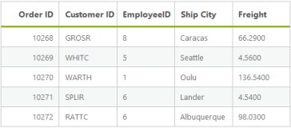
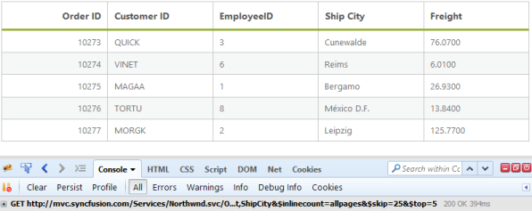

# Paging

Paging is a very important query in DataManager that is used to display only some records from the large data source. 

## Default

The paging index and the paging size parameters of the paging query determines the number of records to be retrieved from the data source of the DataManager.

Refer to the following code example for the paging options.



<asp:Content runat="server" ID="Content1" ContentPlaceHolderID="MainContent">

    <ej:DataManager ID="FlatData" runat="server" URL="http://mvc.syncfusion.com/Services/Northwnd.svc/Orders"/>
    <ej:Grid ID="OrdersGrid" runat="server"  DataManagerID="FlatData"
        Query = "ej.Query()
                .select('OrderID', 'CustomerID', 'EmployeeID', 'Freight', 'ShipCity')
                .page(5,5)">
        <Columns>
            <ej:Column Field="OrderID" HeaderText="Order ID" IsPrimaryKey="True" TextAlign="Right" Width="75" />
            <ej:Column Field="CustomerID" HeaderText="Customer ID" Width="75" />
            <ej:Column Field="EmployeeID" HeaderText="EmployeeID" Width="75" />
            <ej:Column Field="ShipCity" HeaderText="Ship City" Width="75" />
            <ej:Column Field="Freight" HeaderText="Freight" Width="75" />
        </Columns>
    </ej:Grid>

</asp:Content>



Result for the above code example is illustrated as follows.

## Dynamic Paging

The paging operation can be dynamically performed by using the DataManager. With the help of an external button click event, the required page records can be obtained and processed accordingly. The following code example illustrates the dynamic paging.



<asp:Content runat="server" ID="Content1" ContentPlaceHolderID="MainContent">

    <ej:DataManager ID="FlatData" runat="server" URL="http://mvc.syncfusion.com/Services/Northwnd.svc/Orders/" CrossDomain="true"/>
    <ej:Grid ID="OrdersGrid" runat="server"  DataManagerID="FlatData" 
        Query ="new ej.Query().select(['OrderID', 'CustomerID', 'EmployeeID', 'ShipCity', 'Freight']).page(1,3)">
        <Columns>
            <ej:Column Field="OrderID" HeaderText="Order ID" IsPrimaryKey="True" TextAlign="Right" Width="75" />
            <ej:Column Field="CustomerID" HeaderText="Customer ID" Width="75" />
            <ej:Column Field="EmployeeID" HeaderText="Employee ID" Width="75" />
            <ej:Column Field="ShipCity" HeaderText="Ship City" Width="75" />
            <ej:Column Field="Freight" HeaderText="Freight" Width="75" />
        </Columns>
    </ej:Grid>

    pageIndex: <input id="pageIndex" type="text" placeholder="page index" />

    pageSize:  <input id="pageSize" type="text" placeholder="page size" />

    <ej:Button runat="server" Type="Button" Text="Execute" ClientSideOnClick="onClick" ID="submit"></ej:Button>

</asp:Content>

<asp:Content ID="Content2" ContentPlaceHolderID="ScriptSection" runat="server">

 </asp:Content>



Result of above code example is illustrated as follows.

## Custom paging

In this section, you can learn how to use customized paging. The following code example illustrates the custom paging.



<asp:Content runat="server" ID="Content1" ContentPlaceHolderID="MainContent">

    <ej:DataManager ID="FlatData" runat="server" URL="http://mvc.syncfusion.com/Services/Northwnd.svc/Orders"/>

    <ej:Grid ID="OrdersGrid" runat="server"  DataManagerID="FlatData"
        Query = "ej.Query()
                .select('OrderID', 'CustomerID', 'EmployeeID', 'Freight', 'ShipCity')
                .addParams('PageNumber',5)
                .addParams('PageSize',3)
                .where('CustomerID', 'contains', 'A', false)">
        <Columns>
            <ej:Column Field="OrderID" HeaderText="Order ID" IsPrimaryKey="True" TextAlign="Right" Width="75" />
            <ej:Column Field="CustomerID" HeaderText="Customer ID" Width="75" />
            <ej:Column Field="EmployeeID" HeaderText="EmployeeID" Width="75" />
            <ej:Column Field="ShipCity" HeaderText="Ship City" Width="75" />
            <ej:Column Field="Freight" HeaderText="Freight" Width="75" />
        </Columns>
    </ej:Grid>

</asp:Content>



Result of above code example is illustrated as follows.

## Skip

The skip query is used to skip some number of records.



<asp:Content runat="server" ID="Content1" ContentPlaceHolderID="MainContent">

    <ej:DataManager ID="FlatData" runat="server" URL="http://mvc.syncfusion.com/Services/Northwnd.svc/Orders"/>

    <ej:Grid ID="OrdersGrid" runat="server"  DataManagerID="FlatData"
        Query = "ej.Query()
                .select('OrderID', 'CustomerID', 'EmployeeID', 'Freight', 'ShipCity')
                .skip(100)
                .take(5)">
        <Columns>
            <ej:Column Field="OrderID" HeaderText="Order ID" IsPrimaryKey="True" TextAlign="Right" Width="75" />
            <ej:Column Field="CustomerID" HeaderText="Customer ID" Width="75" />
            <ej:Column Field="EmployeeID" HeaderText="EmployeeID" Width="75" />
            <ej:Column Field="ShipCity" HeaderText="Ship City" Width="75" />
            <ej:Column Field="Freight" HeaderText="Freight" Width="75" />
        </Columns>
    </ej:Grid>

</asp:Content>



Result of the above code example is illustrated as follows.

## Take

The take query is used to get some certain number of records from the data source of the DataManager.



<asp:Content runat="server" ID="Content1" ContentPlaceHolderID="MainContent">

    <ej:DataManager ID="FlatData" runat="server" URL="http://mvc.syncfusion.com/Services/Northwnd.svc/Orders"/>
    <ej:Grid ID="OrdersGrid" runat="server"  DataManagerID="FlatData"
        Query = "ej.Query()
                .select('OrderID', 'CustomerID', 'EmployeeID', 'Freight', 'ShipCity')
                .take(3)">
        <Columns>
            <ej:Column Field="OrderID" HeaderText="Order ID" IsPrimaryKey="True" TextAlign="Right" Width="75" />
            <ej:Column Field="CustomerID" HeaderText="Customer ID" Width="75" />
            <ej:Column Field="EmployeeID" HeaderText="EmployeeID" Width="75" />
            <ej:Column Field="ShipCity" HeaderText="Ship City" Width="75" />
            <ej:Column Field="Freight" HeaderText="Freight" Width="75" />
        </Columns>
    </ej:Grid>

</asp:Content>



Result of the above code example is illustrated as follows.

## RequiresCount

The requiresCount query is used to get the count of the total number of records in the data source of the DataManager.



<asp:Content runat="server" ID="Content1" ContentPlaceHolderID="MainContent">

    <ej:DataManager ID="FlatData" runat="server" URL="http://mvc.syncfusion.com/Services/Northwnd.svc/Orders"/>

    <ej:Grid ID="OrdersGrid" runat="server"  DataManagerID="FlatData"
        Query = "ej.Query()
                .select('OrderID', 'CustomerID', 'EmployeeID', 'Freight', 'ShipCity')
                .page(1,3)
                .requiresCount()">
        <Columns>
            <ej:Column Field="OrderID" HeaderText="Order ID" IsPrimaryKey="True" TextAlign="Right" Width="75" />
            <ej:Column Field="CustomerID" HeaderText="Customer ID" Width="75" />
            <ej:Column Field="EmployeeID" HeaderText="EmployeeID" Width="75" />
            <ej:Column Field="ShipCity" HeaderText="Ship City" Width="75" />
            <ej:Column Field="Freight" HeaderText="Freight" Width="75" />
        </Columns>
    </ej:Grid>

</asp:Content>



Result of the above code example is illustrated as follows.

## Range

The range query is used to get some particular range of records from the data source of the DataManager.



<asp:Content runat="server" ID="Content1" ContentPlaceHolderID="MainContent">

    <ej:DataManager ID="FlatData" runat="server" URL="http://mvc.syncfusion.com/Services/Northwnd.svc/Orders"/>

    <ej:Grid ID="OrdersGrid" runat="server"  DataManagerID="FlatData"
        Query = "ej.Query()
                .select('OrderID', 'CustomerID', 'EmployeeID', 'Freight', 'ShipCity')
                .range(25,30)">
        <Columns>
            <ej:Column Field="OrderID" HeaderText="Order ID" IsPrimaryKey="True" TextAlign="Right" Width="75" />
            <ej:Column Field="CustomerID" HeaderText="Customer ID" Width="75" />
            <ej:Column Field="EmployeeID" HeaderText="EmployeeID" Width="75" />
            <ej:Column Field="ShipCity" HeaderText="Ship City" Width="75" />
            <ej:Column Field="Freight" HeaderText="Freight" Width="75" />
        </Columns>
    </ej:Grid>

</asp:Content>



Result of the above code example is illustrated as follows.

