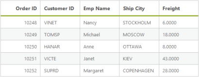

# Query

DataManager provides support for multiple queries to perform various operations like filtering, sorting, cloning, expanding, searching, grouping etc., in the data source. Here, you can learn the query options in detail.

## Select

The “select” query of the data manager is used to select only some particular fields or columns from the data source. The following code example illustrates on how to select only particular fields using the select query.



<asp:Content runat="server" ID="Content1" ContentPlaceHolderID="MainContent">

    <ej:DataManager ID="FlatData" runat="server" URL="http://mvc.syncfusion.com/Services/Northwnd.svc/Orders"/>

    <ej:Grid ID="OrdersGrid" runat="server"  DataManagerID="FlatData" Query ="new ej.Query().select(['OrderID', 'CustomerID', 'EmployeeID', 'ShipCity', 'Freight']).take(5)">
        <%--<ClientSideEvents Load="OnLoad" />--%>
        <Columns>
            <ej:Column Field="OrderID" HeaderText="Order ID" IsPrimaryKey="True" TextAlign="Right" Width="75" />
            <ej:Column Field="CustomerID" HeaderText="Customer ID" Width="75" />
            <ej:Column Field="EmployeeID" HeaderText="Employee ID" Width="75" />
            <ej:Column Field="ShipCity" HeaderText="Ship City" Width="75" />
            <ej:Column Field="Freight" HeaderText="Freight" Width="75" />
        </Columns>
    </ej:Grid>

</asp:Content>



Result of the above code example is illustrated as follows.

## From

The “from” query of the data manager is used to select the table from where the data is retrieved and bound to the table. The following code example illustrates on how to use the “from” query.



<asp:Content runat="server" ID="Content1" ContentPlaceHolderID="MainContent">

    <ej:DataManager ID="FlatData" runat="server" URL="http://mvc.syncfusion.com/Services/Northwnd.svc"/>

    <ej:Grid ID="OrdersGrid" runat="server"  DataManagerID="FlatData" Query ="new ej.Query().from('Orders').select(['OrderID', 'CustomerID', 'EmployeeID', 'ShipCity', 'Freight']).take(5)">
        <Columns>
            <ej:Column Field="OrderID" HeaderText="Order ID" IsPrimaryKey="True" TextAlign="Right" Width="75" />
            <ej:Column Field="CustomerID" HeaderText="Customer ID" Width="75" />
            <ej:Column Field="EmployeeID" HeaderText="Employee ID" Width="75" />
            <ej:Column Field="ShipCity" HeaderText="Ship City" Width="75" />
            <ej:Column Field="Freight" HeaderText="Freight" Width="75" />
        </Columns>
    </ej:Grid>

</asp:Content>



Result of the above code example is illustrated as follows.

## Clone

The “clone” query of the data manager is used to duplicate the query. The following code example illustrates on how to clone a query.



<asp:Content runat="server" ID="Content1" ContentPlaceHolderID="MainContent">

    <ej:DataManager ID="FlatData" runat="server" URL="http://mvc.syncfusion.com/Services/Northwnd.svc/Orders"/>

    <ej:Grid ID="OrdersGrid" runat="server"  DataManagerID="FlatData" Query = "new ej.Query().select(['OrderID', 'CustomerID', 'EmployeeID', 'ShipCity', 'Freight']).take(10)"
        ClientSideOnActionComplete="OnComplete">
        <Columns>
            <ej:Column Field="OrderID" HeaderText="Order ID" IsPrimaryKey="True" TextAlign="Right" Width="75" />
            <ej:Column Field="CustomerID" HeaderText="Customer ID" Width="75" />
            <ej:Column Field="EmployeeID" HeaderText="Employee ID" Width="75" />
            <ej:Column Field="ShipCity" HeaderText="Ship City" Width="75" />
            <ej:Column Field="Freight" HeaderText="Freight" Width="75" />
        </Columns>
    </ej:Grid>

</asp:Content>

<asp:Content ID="Content2" ContentPlaceHolderID="ScriptSection" runat="server">

    

</asp:Content>



Result of the above code example is illustrated as follows.

## Expand

The “expand” query of the data manager is used to perform complex data binding.



<asp:Content runat="server" ID="Content1" ContentPlaceHolderID="MainContent">

    <ej:DataManager ID="FlatData" runat="server" URL="http://mvc.syncfusion.com/Services/Northwnd.svc"/>

    <ej:Grid ID="OrdersGrid" runat="server"  DataManagerID="FlatData"
            Query = "ej.Query().from('Orders').
            select(['OrderID', 'CustomerID', 'Employee.FirstName', 'ShipCity', 'Freight']).take(5).expand('Employee')">
        <Columns>
            <ej:Column Field="OrderID" HeaderText="Order ID" IsPrimaryKey="True" TextAlign="Right" Width="75" />
            <ej:Column Field="CustomerID" HeaderText="Customer ID" Width="75" />
            <ej:Column Field="Employee.FirstName" HeaderText="Emp Name" Width="75" />
            <ej:Column Field="ShipCity" HeaderText="Ship City" Width="75" />
            <ej:Column Field="Freight" HeaderText="Freight" Width="75" />
        </Columns>
    </ej:Grid>

</asp:Content>



Result of the above code example is illustrated as follows.

