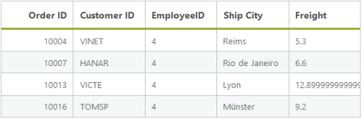

# Searching

Searching is a basic query technique in data manager. It is used to filter the records from the entire data source based on the search key parameter.



<asp:Content runat="server" ID="Content1" ContentPlaceHolderID="MainContent">

    <ej:DataManager ID="FlatData" runat="server" URL="http://mvc.syncfusion.com/Services/Northwnd.svc/Orders"/>
    <ej:Grid ID="OrdersGrid" runat="server"  DataManagerID="FlatData"
            Query = "ej.Query().search(4, 'EmployeeID').take(5)">
        <Columns>
            <ej:Column Field="OrderID" HeaderText="Order ID" IsPrimaryKey="True" TextAlign="Right" Width="75" />
            <ej:Column Field="CustomerID" HeaderText="Customer ID" Width="75" />
            <ej:Column Field="EmployeeID" HeaderText="EmployeeID" Width="75" />
            <ej:Column Field="ShipCity" HeaderText="Ship City" Width="75" />
            <ej:Column Field="Freight" HeaderText="Freight" Width="75" />
        </Columns>
    </ej:Grid>

</asp:Content>



Result of above code example is illustrated as follows.

