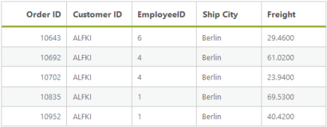
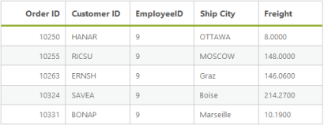
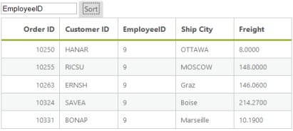
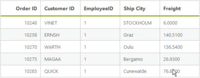

# Sorting

## Default 

Sorting is basic query in DataManager. It enables you to view the items or records in ascending or descending order based on particular field and sorting direction specified. The query parameter of DataManager enables you to retrieve the data in the sorted fashion and thus utilizing the resultant data obtained.



<asp:Content runat="server" ID="Content1" ContentPlaceHolderID="MainContent">

    <ej:DataManager ID="FlatData" runat="server" URL="http://mvc.syncfusion.com/Services/Northwnd.svc/Orders"/>
    <ej:Grid ID="OrdersGrid" runat="server"  DataManagerID="FlatData"
            Query = "ej.Query().sortBy('CustomerID', ej.sortOrder.Ascending, false).take(5)">
        <Columns>
            <ej:Column Field="OrderID" HeaderText="Order ID" IsPrimaryKey="True" TextAlign="Right" Width="75" />
            <ej:Column Field="CustomerID" HeaderText="Customer ID" Width="75" />
            <ej:Column Field="EmployeeID" HeaderText="EmployeeID" Width="75" />
            <ej:Column Field="ShipCity" HeaderText="Ship City" Width="75" />
            <ej:Column Field="Freight" HeaderText="Freight" Width="75" />
        </Columns>
    </ej:Grid>

</asp:Content>



Result of the above code example is illustrated as follows.

## SortByDesc

The sortByDesc query of the data manager is used to sort the specified field in descending order by default. You can use the following code example for sortByDesc query.



<asp:Content runat="server" ID="Content1" ContentPlaceHolderID="MainContent">

    <ej:DataManager ID="FlatData" runat="server" URL="http://mvc.syncfusion.com/Services/Northwnd.svc/Orders"/>

    <ej:Grid ID="OrdersGrid" runat="server"  DataManagerID="FlatData"
            Query = "ej.Query().sortByDesc('EmployeeID').take(5)">
        <Columns>
            <ej:Column Field="OrderID" HeaderText="Order ID" IsPrimaryKey="True" TextAlign="Right" Width="75" />
            <ej:Column Field="CustomerID" HeaderText="Customer ID" Width="75" />
            <ej:Column Field="EmployeeID" HeaderText="EmployeeID" Width="75" />
            <ej:Column Field="ShipCity" HeaderText="Ship City" Width="75" />
            <ej:Column Field="Freight" HeaderText="Freight" Width="75" />
        </Columns>
    </ej:Grid>

</asp:Content>



Result of the above code example is illustrated as follows.

## Dynamic sorting

The table can be dynamically sorted by using an external button click event. You can sort the value of the column by using the sortBy query and thus the sorted data is retrieved and bounded to the table. The following code example illustrates you to dynamically sort the data source.



<asp:Content runat="server" ID="Content1" ContentPlaceHolderID="MainContent">

    <ej:DataManager ID="FlatData" runat="server" URL="http://mvc.syncfusion.com/Services/Northwnd.svc/Orders"/>

    <ej:Grid ID="OrdersGrid" runat="server"  DataManagerID="FlatData"
            Query = "ej.Query().sortByDesc('EmployeeID').take(10)">
        <Columns>
            <ej:Column Field="OrderID" HeaderText="Order ID" IsPrimaryKey="True" TextAlign="Right" Width="75" />
            <ej:Column Field="CustomerID" HeaderText="Customer ID" Width="75" />
            <ej:Column Field="EmployeeID" HeaderText="EmployeeID" Width="75" />
            <ej:Column Field="ShipCity" HeaderText="Ship City" Width="75" />
            <ej:Column Field="Freight" HeaderText="Freight" Width="75" />
        </Columns>
    </ej:Grid>

    <input id="field" type="text" placeholder="fieldName" />

    <ej:Button runat="server" Type="Button" Text="Sort" ClientSideOnClick="onClick" ID="submit"></ej:Button>

</asp:Content>

<asp:Content ID="Content2" ContentPlaceHolderID="ScriptSection" runat="server">

    

</asp:Content>



Result of above code example is illustrated as follows.

## Multi sorting

Multi sorting is a special technique, where you can sort multiple fields by adding multiple sorting queries to DataManager.



<asp:Content runat="server" ID="Content1" ContentPlaceHolderID="MainContent">

    <ej:DataManager ID="FlatData" runat="server" URL="http://mvc.syncfusion.com/Services/Northwnd.svc/Orders"/>
    <ej:Grid ID="OrdersGrid" runat="server"  DataManagerID="FlatData"
            Query = "ej.Query().sortByDesc('EmployeeID').sortBy('EmployeeID', 'ascending').take(5)">
        <Columns>
            <ej:Column Field="OrderID" HeaderText="Order ID" IsPrimaryKey="True" TextAlign="Right" Width="75" />
            <ej:Column Field="CustomerID" HeaderText="Customer ID" Width="75" />
            <ej:Column Field="EmployeeID" HeaderText="EmployeeID" Width="75" />
            <ej:Column Field="ShipCity" HeaderText="Ship City" Width="75" />
            <ej:Column Field="Freight" HeaderText="Freight" Width="75" />
        </Columns>
    </ej:Grid> 

</asp:Content>



Result of above code example is illustrated as follows.

