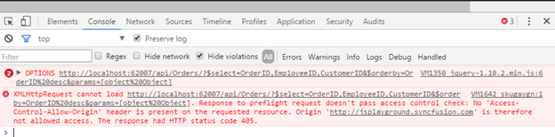

# CORS Data Fetching

The Cross-Origin Resource Sharing (CORS) mechanism enable secure cross-domain data transfers. 

## SAME-ORIGIN POLICY

This policy defined the rule for, “how a web page can be accessed by an external resource”. Browsers wont permits a request to access the resources who origin is differ than the current page. To overcome the restriction of same-origin policy, we can use a technique called Cross-origin resource sharing.

 

## Access-Control-Allow-Origin

Cross-domain requests require common procedure between the Web page and the server. Initiate a cross-domain request in a web page and opening a connection to the mentioned domain. The browser will request the service (i.e data) from the domain's server by sending an Origin header with the value of the origin. It will only complete the connection if the server responds with an Access-Control-Allow-Origin header of either * or the exact URL of the requesting page.
When you set, Access-Control-Allow-Origin value as “Testing1.com”.

With this rule, only scripts that originate from http://“Testing1.com are allowed to load resources. Any other domain trying to use AJAX to load resources will be given the security error message. 

By using this rule, the domain owners can restrict which domains are allowed to use the resource.

Alternatively, the owners can grant wide-open access with the always ready to party asterisk: __Access-Control-Allow-Origin: *__.



    <system.webServer>
        <httpProtocol>
            <customHeaders>
                <add name="Access-Control-Allow-Origin" value="*" />
            </customHeaders>
        </httpProtocol>
    </system.webServer>



Now, any website that wants to load a resource using AJAX can do so without getting the security error. 

## Access-Control-Request-Method

This method is used when issuing a preflight request to let the server know what kind of HTTP method will be used when the request is made.



    <httpProtocol>
        <customHeaders>
            <add name="Access-Control-Allow-Methods" value="GET, POST, PUT, DELETE, OPTIONS" />
        </customHeaders>
    </httpProtocol>



N> 
Preflightedrequests:  
Setting custom headers to XHR triggers a preflight request. With simple words this mean that preflight request first sends an HTTP request by the OPTIONS method to the resource on the remote domain, to make sure that the request is safe to send. According W3C for non-same origin requests using the HTTP GET method a preflight request is made when headers other than Accept and Accept-Language are set.

## Access-Control-Request-Headers

This header is used when issuing a preflight request to let the server know what kind of HTTP headers will be used when the request is made.



    <httpProtocol>
        <customHeaders>
            <add name="Access-Control-Allow-Headers" value="*" />
        </customHeaders>
    </httpProtocol>



[For more details, please refer to this link:](https://developer.mozilla.org/en-US/docs/Web/HTTP/Access_control_CORS#Access-Control-Allow-Headers)