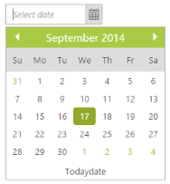
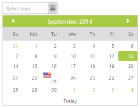
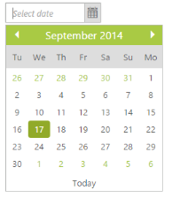
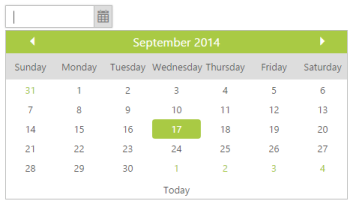
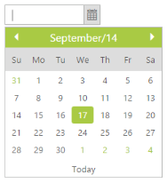

# Behavior Settings

## Button Text

Set the display text for the Button in the DatePicker popup. By default, ButtonText is set Today (String). Change this default value by using the ButtonText property to the Button Text.

In the ASPX page, include the following DatePicker control code example to configure the Button Text.



 <ej:DatePicker ID="datepicker" runat="server" ButtonText="Todaydate"></ej:DatePicker>



The following screenshot displays the output for the above code.

 

## Display Default Date

You can display the default date value in input textbox. By default, DisplayDefaultDate property is set to true in the DatePicker Control. 

In the ASPX page, include the following DatePicker control code example to turnoff the date while rendering the DatePicker.



<ej:DatePicker ID="datepicker" runat="server" DisplayDefaultDate="false" Value="5/8/2014"></ej:DatePicker>    



## Enabled

You can Enable or Disable the DatePicker control. By default, Enabled property is set to true in the DatePicker control. You can disable the DatePicker control by setting Enabled property to false.

In the ASPX page, include the following DatePicker control code example to disable it.



   <ej:DatePicker ID="datepicker" runat="server" Enabled="false"></ej:DatePicker>



The following screenshot displays the output for the above code.

 

## Enable strict mode

When EnableStrictMode is set to true, DatePicker does not allow the value out of the range. By default, EnableStrictMode property is set to false in the DatePicker.

In the ASPX page, include the following DatePicker control code example to enable the StrictMode.



<ej:DatePicker ID="datepicker" runat="server" EnableStrictMode="true"></ej:DatePicker>



## Fields

You can specify the fields mapping in the DatePicker. You can also provide the support to add image, image styles, sprite css class, query, and HTML attributes.

The DatePicker control provides support to customize the particular date. You can customize the date with image and tooltip options. The following table specifies the special date fields and its configuration.

<table>
<tr>
<th>
Name</th><th>
Description</th><th>
Default value</th><th>
Data type</th></tr>
<tr>
<td>
Date</td><td>
The date that needs to be customized. </td><td>
Null </td><td>
String </td></tr>
<tr>
<td>
Tooltip</td><td>
Shows the tooltip to mention date while mouse hovering. </td><td>
Null </td><td>
String </td></tr>
<tr>
<td>
Icon </td><td>
you can set the customized css with this property.

'_Note: You need to set the image as background url and its styles within this class</td><td>
Null </td><td>
String</td></tr>
</table>

The  steps explain you how to specify the fields mapping in the DatePicker control.

In the ASPX page, include the following DatePicker control code example.



  <ej:DatePicker ID="datepicker" runat="server"></ej:DatePicker>





    protected void Page_Load(object sender, EventArgs e)

           {

           List< Syncfusion.JavaScript.Models.SpecialDates> data = new List< Syncfusion.JavaScript.Models.SpecialDates>();

               data.Add(new Syncfusion.JavaScript.Models.SpecialDates { Date = "9/23/2014", Tooltip = "America", Icon = "flag-am" });

            this.datepicker.SpecialDates= data;

        }



Add the following styles to specify the fields mapping in DatePicker control.

_Note: Images for this example are available in ‘installed location /Content/images’ and you need to define images in the mentioned CSS. Henceforth, the images are displayed._



    .flag .e-image {

        background: url("../Content/flags.png") no-repeat scroll -50px -75px rgba(0, 0, 0, 0);

        float: left;

        height: 15px;

        margin-left: 5px;

        margin-top: 3px;

        width: 20px;

    }

    .e-datepicker.e-calendar {

        width: 350px;

    }



The following screenshot displays the output for the above code.

 

## Define start day of the week

It specifies the start day of the week in the DatePicker calendar. By default, Value is set to 0 (Sunday). 

In the ASPX page, include the following DatePicker control code example to specify the start day of the week.



<ej:DatePicker ID="datepicker" runat="server"  StartDay="2"></ej:DatePicker>



The following screenshot displays the output for the above code.

 

## Step months

It specifies the number of months to navigate at one click in next and previous buttons achieved by StepMonths property. You can change the Step months on changing the default value by using the StepMonths property. 

In the ASPX page, include the following DatePicker control code example to specify the number of months to navigate.



   <ej:DatePicker ID="datepicker" runat="server" StepMonths="2"></ej:DatePicker>



## Define value

It specifies the selected date value. You can specify the selected date value by using the Value property.

In the ASPX page, include the following DatePicker control code example to specify the value.



  <ej:DatePicker ID="datepicker" runat="server" Value="5/8/2014"></ej:DatePicker>  



 The following screenshot displays the output for the above code.

 

## Watermark Text

It specifies the Watermark Text to display the input text in the DatePicker. By default, WatermarkText property is set as “select date” in the DatePicker. 

In the ASPX page, include the following DatePicker control code example to specify the Watermark.



<ej:DatePicker ID="datepicker" runat="server" WatermarkText="Enter Date"></ej:DatePicker>    



The following screenshot displays the output for the above code.

 

## Display Format

### Date format

Date format defines a format or structure of the displayed date in the textbox. You can change the date format by using DateFormat property.

The standard formats are listed as follows,

<table>
<tr>
<th>
Format Name</th><th>
   Formats</th></tr>
<tr>
<td>
Default</td><td>
MM/dd/yyyy</td></tr>
<tr>
<td>
Short</td><td>
 d M, y</td></tr>
<tr>
<td>
Medium</td><td>
d MM, y</td></tr>
<tr>
<td>
Full</td><td>
dddd,d MMMM,yy</td></tr>
<tr>
<td>
UTC</td><td>
yyyy-MM-dd</td></tr>
</table>

You can display the date value depending on culture by using the above specified DateFormat.

In the ASPX page, include the following DatePicker control code example to set the date format as "d MM, y".



<ej:DatePicker ID="datepicker" runat="server" DateFormat="d MM, y"></ej:DatePicker>



The following screenshot displays the output for the above code.

 

### Day header format

It specifies the header format of days in short, long or min types. You can set the DatePicker day header format by using the DayHeaderFormat property. By default, DayHeaderFormat property is set as ShowHeaderMin in the DatePicker control. 

Enum for DatePicker startLevel and depthLevel.

<table>
<tr>
<th>
Day header</th><th>
Description</th></tr>
<tr>
<td>
ShowHeaderShort</td><td>
It shows the day header format in short.</td></tr>
<tr>
<td>
ShowHeaderMin</td><td>
It shows the header format in min.</td></tr>
<tr>
<td>
ShowHeaderLong</td><td>
It shows the day header format in long.</td></tr>
<tr>
<td>
ShowHeaderNone</td><td>
Removes the day header.</td></tr>
</table>

In the ASPX page, include the following DatePicker control code example to set the DayHeaderFormat.



<ej:DatePicker ID="datepicker" runat="server" DayHeaderFormat="ShowHeaderLong"> </ej:DatePicker>   



The following screenshot displays the output for the above code.

 

### Header format

It specifies the Header format to be displayed in the pop up of the DatePicker. The header in the DatePicker popup is displayed in the specified format. By default HeaderFormat property is set as “MMMM/yyyy” in the DatePicker control. 

In the ASPX page, include the following DatePicker control code example to specify the header format.



<ej:DatePicker ID="datepicker" runat="server"  HeaderFormat="MMMM/yy"> </ej:DatePicker>



The following screenshot displays the output for the above code.

 

