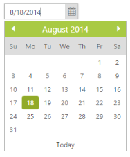

# Dates in Other Month

Dates from the previous and next month are showed in the DatePicker calendar. 

You can set the other month date in the DatePicker by using the ShowOtherMonths property. By default, ShowOtherMonths (Boolean) is set to true that enables the other month date.

The Current month date alone is displayed by setting Boolean to false.

In the ASPX page, include the following DatePicker control code example to access the current month date alone.



<ej:DatePicker ID="datepicker" runat="server"  ShowOtherMonths="false"> </ej:DatePicker>



The following screenshot displays the output for the above code.

 

