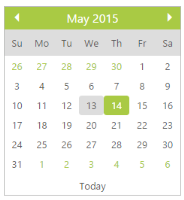

## Display Inline

Display Inline allows you to make the DatePicker control similar to a Calendar date. Also associate DatePicker with &lt;div&gt; element instead of input. Default value for the DisplayInline property is set to false. 

In the ASPX page, include the following DatePicker control code example to show the Datepicker like Calender view.



<ej:DatePicker ID="datepicker" runat="server"  TagName="div" DisplayInline="true"></ej:DatePicker>



The following screenshot displays the output for the above code.

{  | markdownify }
{:.image }

