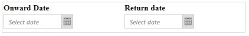
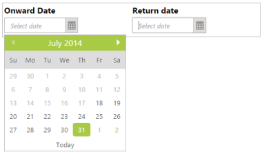
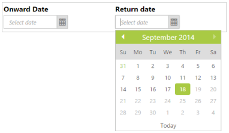
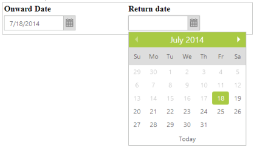
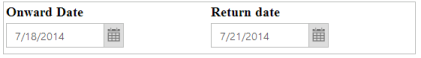

# Getting Started

This section explains briefly how to create a DatePicker in your application with ASP.NET.

## Create your first DatePicker in ASP.NET

The ASP.NET DatePicker provides you support to display a calendar within your web page and allows you to pick a date from the calendar. In this example, you can learn how to customize two DatePickers in a real-time ticket booking application. The example illustrates you how to use the DatePicker control to book a ticket within a limited number of days. 

The following screenshot illustrates the functionality of a DatePicker with date range of maximum 60 days. You can select a date for Onward and Return journeys ranging for a period of 60 days from the current day. This avoids selecting a journey date prior to the current date.

{  | markdownify }
{:.image }

Create a DatePicker 

ASP.NET DatePicker control basically renders with built-in features such as keyboard navigation, months navigation with animations and flexible API’s. You can easily create the DatePicker control by using simple input textbox element as follows.

You can create an ASP.NET project and add necessary Dll and script with the help of the given [ASP-Getting Started Documentation.](http://help.syncfusion.com/ug/js/Documents/gettingstartedwithmv.htm)

You can add the following code example to the corresponding ASPX page to render the DatePicker.



    

        <table>

            <tr>

                <td class="tdclass">

                    Onward Date

                </td>

                <td class="tdclass">

                    Return date

                </td>

            </tr>

            <tr>

                <td class="tdclass">

                    

                        <ej:DatePicker ID="StartDate" runat="server">

                        </ej:DatePicker>

                    

                </td>

                <td class="tdclass">

                    

                        <ej:DatePicker ID="EndDate" runat="server">

                        </ej:DatePicker>

                    

                </td>

            </tr>

        </table>

    



Apply the following styles to show the DatePicker control in the Horizontal order.



        .tdclass

        {

            width: 300px;

            font-weight: bold;

        }

        .innerdp

        {

            display: inline-block;

        }

        table

        {

            border: 1px solid #bbbcbb;

            width: 500px;

        }



The following screenshot displays the DatePicker control.

{  | markdownify }
{:.image }

Set the Min and Max Date

In a real-time ticket booking scenario, the booking is open only for a limited number of days. You have to select a date from the given range. This can be achieved by using the properties MinDate and MaxDate. In this way, only those dates ranging between the MinDate and MaxDate are enabled in the DatePicker.



<tr>

                <td class="tdclass">

                    

                        <ej:DatePicker ID="StartDate" runat="server" MinDate="7/18/2014" MaxDate="9/18/2014">

                        </ej:DatePicker>

                    

                </td>

                <td class="tdclass">

                    

                        <ej:DatePicker ID="EndDate" runat="server" MinDate="7/18/2014" MaxDate="9/18/2014">

                        </ej:DatePicker>

                    

                </td>

            </tr>



The following screenshot displays the output of the above code example.

{  | markdownify }
{:.image }

{  | markdownify }
{:.image }

Set Event to Process the Min and Max Date Validations

You can select the “Onward journey date” in the first DatePicker and then the “Return journey date” in the second DatePicker. The validation process is done after the selection of “Onward Journey date” and the changes are reflected in the “Return Date” selection DatePicker. You can manipulate this process in the “ClientSideOnSelect” Event of Onward Date Selection DatePicker. 

Add the following code in your ASPX page.



            <tr>

                <td class="tdclass">

                    

                        <ej:DatePicker ID="StartDate" runat="server" ClientSideOnSelect="selectedStartDate" MinDate="7/18/2014" MaxDate="9/18/2014">

                        </ej:DatePicker>

                    

                </td>

                <td class="tdclass">

                    

                        <ej:DatePicker ID="EndDate" runat="server" ClientSideOnSelect="selectedEndDate" MinDate="7/18/2014" MaxDate="9/18/2014">

                        </ej:DatePicker>

                    

                </td>

            </tr>





            var minDatepicker, maxDatepicker;

            var curdate = "7/18/2014" // mentions the current date.

            // Sets the return date to 60 days from the current date.

            var rangeDate = "9/18/2014";

            function selectedStartDate(sender) {

                var selDate = new Date(sender.value); // mentions the selected date.

                minDatepicker = $("#<%=EndDate.ClientID%>").data("ejDatePicker"); // Creates the DatePicker object

                minDatepicker.setModel({ "minDate": selDate }); // Sets minDate property through setModel of the DatePicker object.

            }

            function selectedEndDate(sender) {

                var selDate = new Date(sender.value);

                maxDatepicker = $("#<%=StartDate.ClientID%>").data("ejDatePicker"); // Creates the DatePicker object

                maxDatepicker.setModel({ "maxDate": selDate }); // Sets maxDate property through setModel of the DatePicker object.

            }



You can run the above code and achieve the desired result. By selecting the onward journey date in the first DatePicker, you can select the Return Journey date within the given range. This restricts you from selecting the false date. This scenario is illustrated in the following screenshot.

{  | markdownify }
{:.image }

By using the min/max date range property, you can select a date within a given range as follows.

{  | markdownify }
{:.image }

You can also add additional functionalities such as localization and date formats to the DatePicker. 

