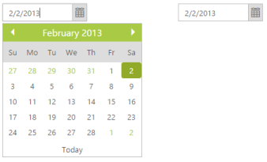
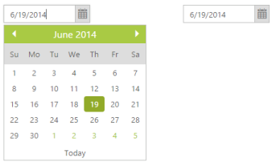

# Integration

## Angular Binding

DatePicker control is availed with two types of Angular JS supports namely, 

* One way binding
* Two way binding 

One-way binding refers to the process of applying scope values to all the available properties of the DatePicker control. But the changes made in the DatePicker control are not reflected or triggered in turn to the scope collection. This kind of binding is applied to all the properties of the DatePicker control.

Two-way binding supports both the processes – it applies the scope values to the DatePicker properties as well as the changes made in the DatePicker control are also reflected back and triggered within the angular scope change function.

To know more detail about the Angular binding, you can refer to the following link location,

[http://help.syncfusion.com/ug/js/documents/angularjs.htm](http://help.syncfusion.com/ug/js/documents/angularjs.htm)

_Note: Add the following script files along with the given code to access the Angular binding. They have JS library for Angular binding._

* angular-min.js
* ej.widget.angular.min.js

The following example depicts the way to bind data to the DatePicker control through Angular support.



    

    

        <table>

            <th>

                

                    <input id="datepicker" ej-datepicker e-value="dateValue" e-enablestrictmode="true" />

                

            </th>

            <th>

                

                    <input id="datepicker1" ej-datepicker e-value="dateValue" e-enablestrictmode="true" />

                

            </th>

        </table>





                    angular.module('syncApp', ['ejangular'])

                .controller('DatePickerCtrl', function ($scope) {

                    $scope.dateValue = "17/3/2013";

                });





        #binding {

            margin-left: 150px;

        }



 

## Knockout Binding

Knockout support allows you to bind the HTML elements against any of the available data model.

Two types of Knockout binding are supported,

* One-way binding
* Two-way binding

One way binding refers to the process of applying observable values to all the available properties of the DatePicker control. But the changes made in DatePicker control are not reflected and triggered in turn to the observable collection. This kind of binding is applied to all the properties of the DatePicker control.

Two-way binding supports both the processes – it applies the observable values to the DatePicker control properties as well as the changes made in the DatePicker control are also reflected back and triggered within the observable collections. 

For more information about the Knockout binding, you can refer to the following online documentation in the following link location,

[http://help.syncfusion.com/ug/js/documents/knockoutjs.htm](http://help.syncfusion.com/ug/js/documents/knockoutjs.htm)

_Note: Add the following script files along with the given code to access Knockout binding. They have JS library for Knockout binding._

* knockout-min.js
* ej.widget.ko.min.js

The link for those script files are as follows:

[http://cdn.syncfusion.com/js/assets/external/knockout.min.js](http://cdn.syncfusion.com/js/assets/external/knockout.min.js)

[http://cdn.syncfusion.com/{{site.releaseversion}}/js/web/ej.widget.ko.min.js](http://cdn.syncfusion.com/%7b%7bsite.releaseversion%7d%7d/js/web/ej.widget.ko.min.js)

The following example depicts the way to bind data to the DatePicker control through the Knockout support that enables and populates data to a DatePicker control based on the value set to the other DatePicker control.



    <table>

        <tr>

            <th>

                

                    <input id="datepicker1" data-bind="ejDatePicker: { value: value, enableStrictMode: true }" />

                

            </th>

            <th>

                

                    <input id="datepicker2" data-bind="ejDatePicker: { value: value, enableStrictMode: true }" />

                

            </th>

        </tr>

    </table>





    window.viewModel = {

            value: ko.observable(new Date(2014, 05, 15))

        };

        $(function () {

            // declaration

            ko.applyBindings(viewModel);

        });





 #control1 {

            margin-left: 150px;

        }



 

