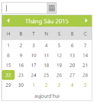

# Localization

Localization is a language support based on the culture in the DatePicker. You can achieve the Localization by using Locale property in the DatePicker.

In order to enable [localization](http://help.syncfusion.com/js/localization), refer to the following scripts: globalize.cultures.js and globalize.js. The “globalize.cultures.js” includes different language support for JavaScript controls and the “globalize.js” is a simple JavaScript library that allows you to format dates based on the specified culture.

You can refer to the following online link reference for globalize.js,

[http://cdn.syncfusion.com/js/assets/external/jquery.globalize.min.js](http://cdn.syncfusion.com/js/assets/external/jquery.globalize.min.js)

You can refer to the following online link reference for globalize.culture.js,

[http://ajax.aspnetcdn.com/ajax/globalize/0.1.1/cultures/globalize.cultures.js](http://ajax.aspnetcdn.com/ajax/globalize/0.1.1/cultures/globalize.cultures.js)

You can dynamically change the language based on their culture.

The following steps explain you how to get the Localization.

In the ASPX page, include the following DatePicker control code example.



<ej:Datepicker ID="datepicker" runat="server" Locale="vi-VN" ButtonText="aujourd'hui"></ej:Datepicker>



The following screenshot displays the output for the above code.

