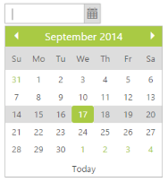
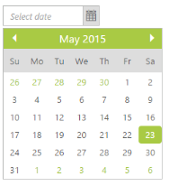
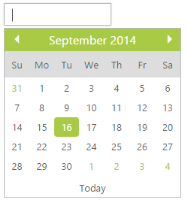
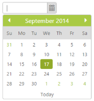
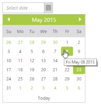

# Miscellaneous

## Define height

It specifies the Height of the DatePicker input text. The Height property allows you to set the maximum Height of the DatePicker. The value set to this property should be string or Numer type.

In the ASPX page, include the following DatePicker control code example to configure the height.



  <ej:DatePicker ID="datepicker" runat="server" Height="22"></ej:DatePicker>



## Define width

It specifies the Width of the DatePicker input text. The Width property allows you to set the maximum Width of the DatePicker. The value set to this property should be string or Numer type

In the ASPX page, include the following DatePicker control code example to configure the width.



<ej:DatePicker ID="datepicker" runat="server"  Width="200"></ej:DatePicker>



## Highlight Section

Highlight section highlights the current month, current week, current workdays. You can highlight a week, month, and work days by using HighlightSection property.

<table>
<tr>
<th>
Name</th><th>
Description</th></tr>
<tr>
<td>
Month</td><td>
Highlights the Current Month.</td></tr>
<tr>
<td>
Week</td><td>
Highlights the Current Week.</td></tr>
<tr>
<td>
WorkDays</td><td>
Highlights the Current Workdays.</td></tr>
<tr>
<td>
None</td><td>
Does not Highlight anything.</td></tr>
</table>

In the ASPX page, include the following DatePicker control code example to highlight the current week.

<ej:DatePicker ID="datepicker" runat="server" HighlightSection="Week"></ej:DatePicker>

The following screenshot displays the output for the above code.   

 

## ReadOnly

Readonly property indicates that the DatePicker value can only be read. You cannot edit the value in DatePicker and also the DatePicker calendar popup is not shown. By default, ReadOnly Boolean value is set to false.

In the ASPX page, include the following DatePicker control code example to enable the read only mode.



<ej:DatePicker ID="datepicker" runat="server" ReadOnly="true"></ej:DatePicker>



## Show Footer

It allows to Show Footer in the DatePicker calendar to select today date. By default, ShowFooter property is set to true in the DatePicker control. You can hide footer in the DatePicker when this property is set to false.

In the ASPX page, include the following DatePicker control code example to hide the footer



   <ej:DatePicker ID="datepicker" runat="server" ShowFooter="false"></ej:DatePicker>



 

## Show popup button

It shows the date icon button at right side of the textbox and the DatePicker popup by clicking on it. This can be achieved by using the ShowPopupButton property. By default, ShowPopupButton property is set to true in the DatePicker control. 

In the ASPX page, include the following DatePicker control code example to hide the popup button.



   <ej:DatePicker ID="datepicker" runat="server" ShowPopupButton="false"> </ej:DatePicker>



The following screenshot displays the output for the above code.

## Show rounded corner

DatePicker input is displayed in a rounded corner style, when this property is set to true. By default, ShowRoundedCorner property is set to false in the DatePicker control.

In the ASPX page, include the following DatePicker control code example to enable the rounded corner effect.



<ej:DatePicker ID="datepicker" runat="server" ShowRoundedCorner="true"> </ej:DatePicker>



The following screenshot displays the output for the above code.

 

## Show ToolTip

DatePicker Tooltip is displayed while you hover the date. By default, ShowTooltip property is set to true in the DatePicker control.

In the ASPX page, include the following DatePicker control code example to show/hide the tooltip.



<ej:DatePicker ID="datepicker" runat="server" ShowTooltip="true"></ej:DatePicker>



The following screenshot displays the output for the above code.

