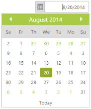

# RTL Support

Right-to-left starts from the right of the page and continues to the left. By default, this option is set to false in the DatePicker control. 

The EnableRTL option allows the DatePicker control to display it in the right to left direction.

In the ASPX page, include the following DatePicker control code example to enable the RTL.



<ej:DatePicker ID="datepicker" runat="server"  EnableRTL="true"></ej:DatePicker>



The following screenshot displays the output for the above code.

 
{:.image }

