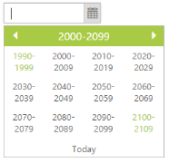

# Start and Depth navigation

## Start Level

It specifies the Start Level view in the DatePicker calendar. By default, StartLevel property is set to Month.

<table>
<tr>
<th>
Name</th><th>
Description</th></tr>
<tr>
<td>
Month</td><td>
Starts from month level view.</td></tr>
<tr>
<td>
Year</td><td>
Starts from year level view.</td></tr>
<tr>
<td>
Decade</td><td>
Starts from decade level view.</td></tr>
<tr>
<td>
Century</td><td>
Starts from century level view.</td></tr>
</table>

In the ASPX page, include the following DatePicker control code example to specify the Start Level view.



<ej:DatePicker ID="datepicker" runat="server"  StartLevel="Century"></ej:DatePicker>



The following screenshot displays the output for the above code.

 

## Depth Level

It specifies the drill down level of the DatePicker. You can restrict the drill down Depth Level by using the DepthLevel property. 

It accepts the following values. 

<table>
<tr>
<th>
Value</th><th>
Description</th></tr>
<tr>
<td>
Month</td><td>
Starts from month level view.</td></tr>
<tr>
<td>
Year</td><td>
Starts from year level view.</td></tr>
<tr>
<td>
Decade</td><td>
Starts from year decade level view.</td></tr>
<tr>
<td>
Century</td><td>
Starts from century level view. </td></tr>
</table>

In the ASPX page, include the following DatePicker control code example to specify the depth level.



<ej:DatePicker ID="datepicker" runat="server"  StartLevel="Century" DepthLevel="Year"></ej:DatePicker>



The following screenshot displays the output for the above code.

