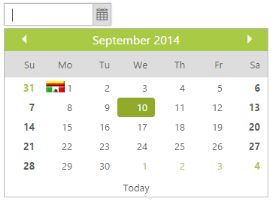

# Week end and Special dates highlight

Week end and special dates are highlighted in the DatePicker control for identification based on your requirement.

You can highlight the week end by using highlightWeekend property and special dates are highlighted by using specialDates property.

You can find the sprite images in the following location when you have installed essential studio otherwise you can use your own image.

[Installed Drive]:\Users\[username]\AppData\Local\Syncfusion\EssentialStudio\{{site.releaseversion}} \JavaScript\samples\web\images\autocomplete\flags.png

In the ASPX page, include the following DatePicker control code example to specify the highlighted week & special dates.



  <ej:DatePicker ID="datepicker" runat="server" HighlightWeekend="true"></ej:DatePicker>





protected void Page_Load(object sender, EventArgs e)

           {

               List< Syncfusion.JavaScript.Models.SpecialDates> data = new List< Syncfusion.JavaScript.Models.SpecialDates>();

               data.Add(new Syncfusion.JavaScript.Models.SpecialDates { Date = "9/23/2014", Tooltip = "America", Icon = "flag-am" });

            this.datepicker.SpecialDates= data;

        }



Add the following styles to get the special dates highlighted.



    .flag .e-image {

        background: url(/images/flags.png) no-repeat left center;

        width: 25px;

        height: 15px;

    }

    .e-datepicker.e-calendar {

        width: 350px;

    }



The following screenshot displays the output for the above code.

