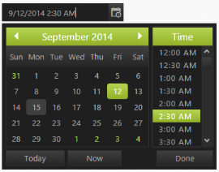
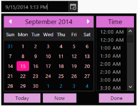

# Appearance and Styling

## Theme

DateTimePicker control support rich appearance. This control consist of six flat themes and six gradient themes. To use these twelve themes, refer to the themes files in ASPX file. 

In order to apply styles to the Rating control, refer to 2 files namely, ej.widgets.core.min.css and ej.theme.min.css. When the file ej.widgets.all.min.css is referred, then it is not necessary to include the files, ej.widgets.core.min.css and ej.theme.min.css in your project, as ej.widgets.all.min.css is the combination of these both.

The core style sheet applies styles related to positioning and size, but are not related to the color scheme and always require the control to look correct and function properly. The theme style sheet applies theme-specific styles like colors and backgrounds.

The following 13 themes are supported by the DateTimePicker:

* default-theme
* flat-azure-dark
* flat-lime
* flat-lime-dark
* flat-saffron
* flat-saffron-dark
* gradient-azure
* gradient-azure-dark
* gradient-lime
* gradient-lime-dark
* gradient-saffron
* gradient-saffron-dark
* bootstrap-theme

 

## CSS Class

DateTimePicker control also allows you to customize its appearance by using user-defined CSS and custom skin options such as colors and backgrounds. To apply custom themes, you have a property **CssClass**. CssClass property sets the root class for DateTimePicker theme.

By using this CssClass, you can override the existing styles under the theme style sheet. The theme style sheet applies theme-specific styles like colors and backgrounds. In the following example, the value of CssClass property is set as Purple-dark. Purple-dark is added as root class to DateTimePicker control at the runtime. From this root class, you can customize the DateTimePicker control theme.

Add the following code in your ASPX page to render the DateTimePicker.



<ej:DateTimePicker ID="DateTime" CssClass="Purple-dark" runat="server"> </ej:DateTimePicker>



Add the following code in your style section. In the following CSS style, exiting theme style over-rides by using root class Purple-dark. 



    .Purple-dark .e-week-header {
        color: #EBADD6;
    }
    .Purple-dark .e-text {
        color: black;
    }
    .Purple-dark .e-state-default {
        color: pink;
    }
    .Purple-dark .e-active {
        background-color: #FF1975;
    }
    .Purple-dark .e-state-default:hover {
        color: #EBADD6;
    }
    .Purple-dark .e-dt-button {
        color: black;
        background-color: #E085C2;
    }
    .Purple-dark .e-header {
        background-color: #E085C2;
        color: black;
    }
    .Purple-dark .e-timecontainer .e-header {
        background-color: #E085C2;
        color: black;
    }



 

