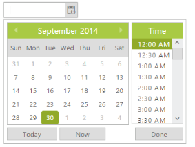

# Date Range

Date Range between two dates is achieved by **MinDateTime, MaxDateTime property** of DateTimePicker.

In DateTimePicker, a property called EnableStrictMode is available. When this property is set to false, it does not allow wrong values and corrects the entered value automatically. When it is true, then DateTimePicker allows values with error class to indicate the selected date is wrong.

**MinDateTime** - Sets the minimum value to the DateTimePicker. Based on the EnableStrictMode value behind the minimum value, an error class is added to the wrapper element or it is corrected automatically to the nearest correct date value.

**MaxDateTime** - Sets the maximum value to the DateTimePicker. Based on the EnableStrictMode value beyond the maximum value, an error class is added to the wrapper element or it is corrected automatically to the nearest correct date value.

Sometimes, you can give restrictions on selecting the date before or after the particular date. Consider you are going to make a project for hotel reservation system. The “In DateTime” has to be lesser than the “Out DateTime” and vice versa. So you have to set **“In DateTime”** as minimum DateTime and **“Out DateTime”** as maximum DateTime for selection in DateTimePicker control. 

The dates before min date and after the max date are considered as invalid dates and it is disabled for selection. 

In the following example September 10, 2014 2.00 PM is set as MinDateTime and September 21, 2014 2.00 PM set as MaxDateTime. 

In the ASPX page, include the following DateTimePicker control code example.



<ej:DateTimePicker ID="DateTime" MinDateTime="9/7/2014 2:00 PM" MaxDateTime="9/30/2014 2:00 PM" runat="server"></ej:DateTimePicker>



 

