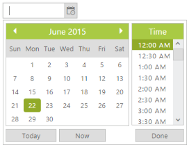

# Date in other months

DateTimePicker calendar can display the dates in other months at the start or end of the current month. To enable or disable the display of other month dates in the current month, you can use the property **ShowOtherMonths**. By setting this property value to true, you can display the dates in other months at the start or end of the current month. By default, the value of this property is true. 

Consider you are going to calculate the monthly report of your company’s employee attendance. To avoid the mistake of selecting other month dates while calculating current month report, you can disable showing other month dates in the current month. You can achieve this requirement by setting ShowOtherMonths value as false.

In the ASPX page, include the following DateTimePicker control code example.



<ej:DateTimePicker ID="DateTime" ShowOtherMonths="false" runat="server"> </ej:DateTimePicker>



 

