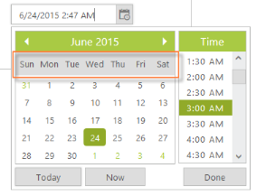

# Display format

## DateTime format

**DateTimePicker** allows you to define the text representation of a date and time value to be displayed in the DateTimePicker control. The format specified is achieved by the **DateTimeFormat property**. Default value of this property is M/d/yyyy h: mm tt. To change the Time Popup display format, TimeDisplayFormat is used here. The default value of this property is h:mm t. 

When your company’s website is used all over the world, following the UTC time is better. Main benefit of UTC Time is that the time is always guaranteed to be consistent. In other words, whenever the time zone of customer is changed, you don't have to go back or forth in time from the logging time of the customer to your time zone.

<table>
<tr>
<th>
Format</th><th>
Display in DateTimePicker</th></tr>
<tr>
<td>
Short Date and Time– d/M/yy h:mm tt</td><td>
9/12/2014 2:04 PM</td></tr>
<tr>
<td>
Medium Date-d MMM yy h:mm tt</td><td>
12 Sep 14 2:04: PM</td></tr>
<tr>
<td>
Full Date and short time - dddd, MMMM dd, yyyy HH:mm tt</td><td>
Friday, September 12,2014 2:04 PM</td></tr>
<tr>
<td>
Full Date and Long Time - dddd, MMMM dd, yyyy HH:mm:ss tt</td><td>
Friday, September 12,2014 2:04:00 PM</td></tr>
<tr>
<td>
UTC - yyyy-MM-dThh:mm:ssz</td><td>
2014-09-12T2:04:00+5</td></tr>
</table>

You can also customize the format. Refer to the following list to create your custom format for the DateTimePicker.

* d - Day of the month.
* ddd - Short name for a day of the week.
* dddd - Full name for a day of the week.
* M – The month, from 1 through 12.
* MMM- Short name of the Month.
* MMMM- Long name of the Month.
* yy - Last two digits of the year.
* yyyy - Full Year.
* hh – Hour.
* mm – Minutes.
* ss – Seconds.
* tt - The AM/PM designator.

In the following example, set DateTimeFormat to full datetime format.

In the ASPX page, include the following DateTimePicker control code example.



<ej:DateTimePicker ID="DateTime" TimePopupWidth="150" TimeDisplayFormat="hh:mm:ss tt" Width="280px" DateTimeFormat="dddd, MMMM dd, yyyy hh:mm:ss tt" runat="server"></ej:DateTimePicker>



 

## Day Header format

You can change the format for the days of the week by using the **Day Header format property**. By default, in our DateTimePicker, day of the week format is in the ShowHeaderMin format. For example, Sun for Sunday. To know the different types of day format refer to the following table.

<table>
<tr>
<th>
Header Format types</th><th>
Description</th></tr>
<tr>
<td>
ShowHeaderNone</td><td>
Removes the day header.</td></tr>
<tr>
<td>
ShowHeaderShort</td><td>
Shows the day header format in min like Su, Mo, Tu …</td></tr>
<tr>
<td>
ShowHeaderMin</td><td>
Shows the short day header format like Sun, Mon, Tue …</td></tr>
<tr>
<td>
ShowHeaderLong</td><td>
Shows the long day header format like Sunday, Monday, Tuesday …</td></tr>
</table>
You can also customize the format according to your requirements. This is achieved by changing the day names information in the culture script file. This is explained later under the Localization section of this document. In the following sample, the short name for the day of the week, by setting day header format as ShowHeaderShort is displayed.

In the ASPX page, include the following DateTimePicker control code example.



<ej:DateTimePicker ID="DateTime" DayHeaderFormat="ShowHeaderMin" runat="server"></ej:DateTimePicker>



 

