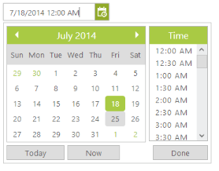
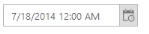
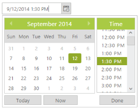

# Getting Started

This section explains briefly how to create a **DateTimePicker** in your application with the ASP.NET.

## Create your first DateTimePicker in ASP.NET	

ASP.NET DateTimePicker provides support to display a calendar within a web page and allows you to pick a date and time from the calendar. In this example, you can learn how to customize the DateTimePicker in a real-time application for an appointment and to choose current time for one week. 

The following screenshot illustrates the functionality of a DateTimePicker with date range of maximum one week.

### Create DateTimePicker 

You can create an ASP.NET Project and add necessary assemblies and scripts with the help of the given [ASP-Getting Started](https://help.syncfusion.com/aspnet/getting-started) Documentation.

You can add the following code example to the corresponding ASPX page to render the DateTimePicker.



        

            

                

                    

                        <ej:DateTimePicker ID="DateTimePicker1" runat="server" Value="7/18/2014" Width="180px">

                        </ej:DateTimePicker>

                    

                

            

        

    



Add the following styles to show the DateTimePicker control in a horizontal order.



        .control
        {
            margin: 0 auto;
            width: 210px;
        }



The following screenshot displays a DateTimePicker control.

 

### Set the Min and Max Date with Time Interval

In a real-time appointment scenario, the appointment is open only for a limited number of days. You have to select a date and time within the given range. This can be achieved by using the properties **MinDateTime** and **MaxDateTime** that enable the specified date range in the DateTimePicker control.



    <ej:DateTimePicker ID="DateTimePicker1" runat="server" Width="180px" Value="9/12/2014 1:30 PM" MinDateTime="9/7/2014 2:00 PM" MaxDateTime="9/30/2014 2:00 PM" Interval="30">

    </ej:DateTimePicker>



The following screenshot shows the output for the above code example.

 

