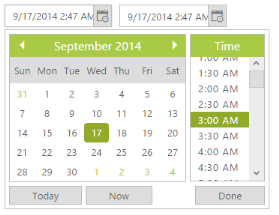

# Integration

## AngularJS Support

AngularJS is an open-source web application Framework. AngularJS extends HTML with new attributes. AngularJS is a JavaScript Framework. It can be added to an ASPX page with a <script> tag. AngularJS extends HTML attributes with Directives, and binds data to HTML with Expressions. The support is achieved by an integration JS library file. You can know more about the AngularJS support in our documentation. You can find the online documentation in the following link location. 

<http://help.syncfusion.com/js/angularjs>

Sometimes you need to use DateTimePicker value for sorting and retrieving the information from database. Consider you are going to sort the number of users registered in your site. Whenever you select the date and time from the DateTimePicker popup window, the result of sorting should be changed based on date and timings. To achieve this, date and time values have to bind to the model while you change the values of date and time in the DateTimePicker control. You can achieve data binding with lesser code by integrating the AngularJS concept with your control.  

In the following example, the DateTimePicker value is bounded with simple textbox. The textbox values are updated while updating the values in the DateTimePicker control. Also, changing the date and time informations from textbox is reflected in the DateTimePicker control.

In the ASPX page, include the following DateTimePicker control code example.





    

            <input type="text" id="dateTime" ej-datetimepicker e-value="value" e-open='isOpen' e-close='isClose' e-change='isChange' />    

     

          <input type="text" id="dateTime1" ej-datetimepicker e-value="value" />        





   angular.module('DateTimeCtrl', ['ejangular'])

       .controller('DateTimePickerCtrl', function ($scope) {

           $scope.value = "9/17/2014 2:47 AM";

       });





 

## KnockoutJS Support

KnockoutJS is a MVVM library that allows the separation of concerns. Essential JavaScript has full support for KnockoutJS. KnockoutJS support is achieved by an integrated JS library file. Add the following code for KnockoutJS Binding menu rendering.

When you use KO with your applications, you can get following benefits:

* You can connect UI elements with data model anytime. 
* Easily create complex dynamic data model.  
* Automatically update UI when data model is changed. When UI is changed, data model changes automatically. 

In the ASPX page, include the following DateTimePicker control code example.





  

        <table>

            <tr>

                <td>Select Show Date Time </td>

                <td><label>Select Show Date Time </label></td>

            </tr>

            <tr>

                <td><input type="text" id="dateTime" data-bind="ejDateTimePicker: { value: value, width: '160px' }" /></td>

                <td><input type="text" id="Text1" data-bind="ejDateTimePicker: { value: value, width: '160px' }" /></td>

            </tr>

        </table>

    





        window.viewModel = {

            value: ko.observable("3/18/2014 2:47 AM")

        };

        $(function () {

            ko.applyBindings(viewModel);

        });





 

