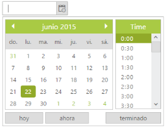

# Localization

EJWEB DateTimePicker has been provided with built-in localization support, so that it can adapt based on culture specific locale defined for it. 

More than 350 culture specific files are available to localize the datetime. To know more about EJ globalize support, please refer the below link      
 [http://help.syncfusion.com/js/localization](http://help.syncfusion.com/js/localization) 

N> Seven culture-specific script files are available in the below specified location. For all other culture files, please download from the [GitHub](https://github.com/syncfusion/ej-global/tree/master/i18n) location.

<table>
<tr>
<td>

    (installed location)\Syncfusion\Essential Studio\{{ site.releaseversion }}\JavaScript\assets\scripts\i18n

    For example, If you have installed the Essential Studio package within C:\Program Files (x86), then navigate to the below location, 
    C:\Program Files (x86)\Syncfusion\Essential Studio\{{ site.releaseversion }}\JavaScript\assets\scripts\i18n

</td></tr>
</table>
To translate our control content from default English to any of the culture, say For example - Spanish language, then you need to refer the ej.culture.es-ES.min.js file in your application,

The **en-US** locale is currently being used as default culture in DateTimePicker. You can set any other culture to DateTimePicker using **Locale** property. Below code example shows Spanish cultured DateTimePicker.

Refer the below Spanish culture file in head section of HTML page after the reference of **ej.web.all.min.js** file.

 
   
           
                
 

The following code example is used to set DateTimePicker in Spanish language.

In the ASPX page, include the following DateTimePicker control code example.





<ej:DateTimePicker ID="DateTime" Locale="es-ES" runat="server"> </ej:DateTimePicker>





protected void Page_Load(object sender, EventArgs e)

    {

        DateTime.DateTimePickerButtonText = new ButtonText() { Today = "hoy", Now = "ahora", Done = "terminado" };

    }





 

