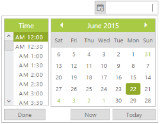

# Right to Left

RTL control supports right-to-left functionality and features for languages that work right-to-left for selecting and editing date and time. You can change your popup and textbox display to read right-to-left. Arabic and Hebrew are written from right to left. The customer who has right to left writing style can use this feature. You can achieve this in your DateTimePicker by using **EnableRTL property**. Setting this property to true allows you to write in the right to left format. Position of the toolbars are also changed to right to left.

In the ASPX page, include the following DateTimePicker control code example.



<ej:DateTimePicker ID="DateTime" EnableRTL="true" runat="server"> </ej:DateTimePicker>



 

