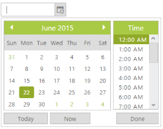

# Time Interval

You can set time interval between two adjacent time values in the time popup manually by using the **Interval property**. By default, the value of the Interval property is 30 minutes. Setting this value as 60 is considered as 1 hour. Sometimes, you need to update for every hour work log reports. In that case, to select time from time popup window with 1 hour interval and to update the every 1 hour report, you can use interval option by setting time interval value as 60 minutes.

In the ASPX page, include the following DateTimePicker control code example.



<ej:DateTimePicker ID="DateTime" Interval="60" runat="server"> </ej:DateTimePicker>



 

