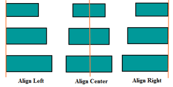
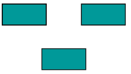
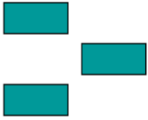
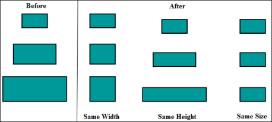
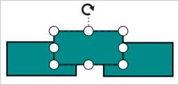
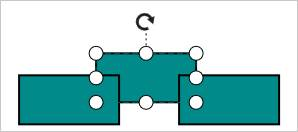
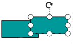
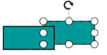

# Commands

There are several commands available in the Diagram as follows.

* Alignment commands
* Spacing commands
* Sizing commands
* Clipboard commands
* Grouping commands
* Z-order commands
* Zoom commands
* Nudge commands
* FitToPage commands
* Undo/Redo commands

## Align

Alignment commands enable you to align the selected objects such as nodes and connectors with respect to the selection boundary.

| Command | Parameter | Description |
|---|---|---|
| align | direction (string) | Align all the nodes/connectors in the selection list with respect to specified direction of the selection boundary. |

The accepted values of the argument "direction" are as follows.

* "left" - Align all the selected objects at the left of the selection boundary.
* "right" - Align all the selected objects at the right of the selection boundary.
* "center" - Align all the selected objects at the center of the selection boundary.
* "top" - Align all the selected objects at the top of the selection boundary.
* "bottom" - Align all the selected objects at the bottom of the selection boundary.
* "middle" - Align all the selected objects at the middle of the selection boundary.

The following code example illustrates how to align all the selected objects at the left side of selection boundary.



var diagram = $("#DiagramContent").ejDiagram("instance");
//Sets direction as left
diagram.align("left");



## Space

Spacing commands enable you to place the selected objects on the page at equal intervals from each other. The selected objects are equally spaced within the selection boundary.

The following code example illustrates how to execute the space commands.



var diagram = $("#DiagramContent").ejDiagram("instance");

//Equally spaces the selected nodes horizontally
diagram.spaceAcross();

//Equally spaces the selected nodes vertically
diagram.spaceDown();



## Sizing

Sizing commands enable to equally size the selected nodes with respect to the first selected object.

The following code example illustrates how to execute the size commands.



var diagram = $("#DiagramContent").ejDiagram("instance");

//Scales the selected items to the size of first selected object
diagram.sameSize();

//Vertically scales the selected items to the height of first selected object
diagram.sameHeight();

//Horizontally scales the selected items to the width of first selected object
diagram.sameWidth();



## Clipboard

Clipboard commands are used to cut, copy or paste the selected elements.

The following code illustrates how to execute the clipboard commands.



//Cuts the selected elements from the Diagram to the Diagram’s clipboard
diagram.cut();

//Copies the selected elements from the Diagram to the Diagram’s clipboard.
diagram.copy();

//Pastes the Diagram’s clipboard data (nodes/connectors) into the Diagram.
diagram.paste();



## Grouping

**Grouping commands** are used to group/ungroup the selected elements on the Diagram.

The following code illustrates how to execute the Grouping commands.



//Groups the selected elements.
diagram.group();

//Ungroups the selected group.
diagram.ungroup();



## Z-Order Command

**Z-Order commands** enable you to visually arrange the selected objects such as nodes and connectors on the page.

### bringToFront Command

The `bringToFront` command visually brings the selected element to front over all the other overlapped elements. The following code illustrates how to execute the bringToFront command.



//Brings to front
diagram.bringToFront();



### sendToBack Command

The `sendToBack` command visually moves the selected element behind all the other overlapped elements. The following code illustrates how to execute the sendToBack command.



//Sends to back
diagram.sendToBack();



### moveForward Command

The `moveForward` command visually moves the selected element over the nearest overlapping element. The following code illustrates how to execute the moveForward Command.



//Moves forward
diagram.moveForward();



### sendBackward Command

The `sendBackward` command visually moves the selected element behind the underlying element. The following code illustrates how to execute the sendBackward command.



//Sends backward
diagram.sendBackward();



## Zoom

**zoomTo** command is used to zoom-in and zoom-out the Diagram view.

The following code illustrates how to zoom-in/zoom out the Diagram.



function Zoom() {
	var diagram = $("#diagram").ejDiagram("instance");
	var zoom = {
		// Sets the zoomFactor
		zoomFactor: 0.2,
		// Sets the zoomCommand as zoomIn to zoom-in the Diagram
		zoomCommand: ej.datavisualization.Diagram.ZoomCommand.ZoomIn,
		// for zoomOut
		//zoomCommand: ej.datavisualization.Diagram.ZoomCommand.ZoomOut
	
		//Defines the focusPoint to zoom the Diagram with respect to any point
		//When you do not set focus point, zooming is performed with reference to the center of current Diagram view.
		focusPoint: {
			x: 100,
			y: 100
		}
	};
	diagram.zoomTo(zoom);
}



## Nudge Command

**nudge** commands move the selected elements towards up, down, left or right by 1 pixel.

| Command | Parameter | Description |
|---|---|---|
| nudge | direction (string),
delta(integer) | Nudge command moves the selected elements towards the specified direction by the number of pixels specified by the parameter delta. When delta is not specified, it is considered as 1 pixel, by default. |

The accepted values of the argument "direction" are as follows.

* "up" - moves the selected elements towards up by the the specified delta value.
* "down" - moves the selected elements towards down by the specified delta value.
* "left" - moves the selected elements towards left by the specified delta value.
* "right" - moves the selected elements towards right by the specified delta value.

The following code illustrates how to execute Nudge command.



var diagram = $("#diagramContent").ejDiagram("instance");
//Nudges up
diagram.nudge("up", 5);



**Nudge by using Arrow Keys**

The corresponding arrow keys are used to move the selected elements towards up, down, left, or right direction by 1 pixel.

Nudge commands are particularly useful for accurate placement of elements.

For more information, refer to [Keyboard Interaction](/js/Diagram/Interaction#keyboard "Keyboard Interaction").

## BringIntoView

`bringIntoView` command brings the specified rectangular region into the view port of the Diagram

The following code illustrates how to execute the bringIntoView command.



var diagram = $("#DiagramContent").ejDiagram("instance");
//Brings the specified rectangular region of the Diagram content to the viewport of the page.
diagram.bringIntoView({
	x: 700,
	y: 500,
	width: 100,
	height: 100
});



## BringToCenter

`bringToCenter` command brings the specified rectangular region of the Diagram content to the center of the view port.

The following code illustrates how to execute the bringToCenter command.



var diagram = $("#DiagramContent").ejDiagram("instance");
//Brings the specified rectangular region of the Diagram content to the center of the viewport.
diagram.bringToCenter({
	x: 700,
	y: 500,
	width: 100,
	height: 100
});



## FitToPage command

`fitToPage` command helps to fit the Diagram content into the view with respect to either width, height, or at the whole.

<table>
<tr>
<th>
Command</th><th>
Parameter</th><th>
Description</th></tr>
<tr>
<td>
           fitToPage </td><td>
<b>mode</b> (string) Value accepted: ej.datavisualization.Diagram.FitMode    <b>region</b> (string) Value accepted-ej.datavisualization.Diagram.Region   <b>margin</b> (object) </td><td>
<b>FitToPage</b> command fits the <b>Diagram</b> into the view. The area/bounds to be fit into view is specified through the parameters.
<b>mode</b> – [FitToMode](#fittomode).
<b>region</b> – [Region](#region).
<b>margin</b> – Space that is to be left in between the content and viewport. </td></tr>
</table>

The following code illustrates how to execute FitToPage command.



//Fits to page – fit Diagram based on elements
diagram.fitToPage("page", "content", {
	left: 25,
	top: 25,
	right: 25,
	bottom: 25
});


### FitToMode

Mode specifies whether the Diagram content has to be fit into view with respect to width, height, or entire bounds of the Diagram. To explore the mode, refer to [FitToMode](/js/api/global#fitmode "FitToMode").

### Region

Region specifies the region/bounds of the Diagram content that is to be fit into the view. For more information about Region, refer to [Region](/js/api/global#region "Region").

## Command Manager

Diagram provides support to map/bind command execution with desired combination of key gestures. Diagram provides some built-in commands. For more information about built-in commands, refer to [Keyboard Interaction](/js/Diagram/Interaction#keyboard "Keyboard Interaction").
Command Manager provides support to define custom commands. The custom commands are executed, when the specified key gesture is recognized.

### Custom command

To define a custom command, you need to specify following properties.
* `execute`: a method to be execute.
* `canExecute`: a method to define whether the command can be executed at the moment. 
* `gesture`: the combination of key gestures.

To explore the properties of custom commands, refer to [Commands](/js/api/ejDiagram#commandmanager:commands "Commands")

The following code example illustrates how to define a custom command.



<ej:Diagram ClientIDMode="Static" ID="Diagram" runat="server" Height="600px" Width="100%">
</ej:Diagram>




protected void Page_Load(object sender, EventArgs e)
{
	if (!IsPostBack)
	{
		//Commands to clone the selected item
		Command clone = new Command() {
			Execute = "executeClone", CanExecute = "canExecuteClone",
			//Defines that the clone command has to be executed on the recognition of Shift+C key press.
			Gesture = new Gesture() { Key = Keys.C, KeyModifiers = KeyModifiers.Shift }
		};
		Diagram.CommandManager.Commands.Add("clone", clone);	
	}
}



### Modify the existing command

When any one of the default commands is not desired, they can be disabled. To change the functionality of a specific command, the command can be completely modified.

The following code example illustrates how to disable a command and how to modify the built-in commands.



<ej:Diagram ClientIDMode="Static" ID="Diagram" runat="server" Height="600px" Width="100%">
</ej:Diagram>




protected void Page_Load(object sender, EventArgs e)
{
	if (!IsPostBack)
	{
		Command nudgeLeft = new Command() { Execute = "executeNudgeLeft", CanExecute = "canExecuteNudgeLeft", Gesture = new Gesture() { Key = Keys.Left } };
		
		//Assigns null value to an existing command and disables its execution
		Diagram.CommandManager.Commands.Add("nudgeUp", new Command());
		Diagram.CommandManager.Commands.Add("nudgeDown", new Command());
		Diagram.CommandManager.Commands.Add("nudgeRight", new Command());
		
		//Modifies the existing command - nudgeLeft
		Diagram.CommandManager.Commands.Add("nudgeLeft", nudgeLeft);
	}
}


