# Connector

Connectors are objects used to create link between two points, nodes or ports to represent the relationships between them.

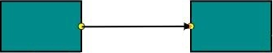

## Create Connector

Connector can be created by defining the start and end points. The path to be drawn can be defined with a collection of segments.
To explore the properties of a `Connector`, refer to [Connector Properties](http://help.syncfusion.com/CR/aspnet/Syncfusion.JavaScript.DataVisualization.Models.Diagram.Connector.html "Connector Properties").

### Add connectors through connectors collection

The `SourcePoint` and `TargetPoint` properties of connector allow you to define the end points of a `Connector`. The following code example illustrates how to add a connector through connector collection.


<ej:Diagram ClientIDMode="Static" ID="Diagram" runat="server" Height="600px" Width="100%" >
	<%--Create Connectors--%>
	<Connectors>
		<ej:DiagramConnector Name="Connector1">
			<%--Sets source and target points--%>
			<sourcepoint x="100" y="100"></sourcepoint>
			<targetPoint x="200" y="200"></targetPoint>
		</ej:DiagramConnector>
	</Connectors>
</ej:Diagram>


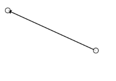

### Add connector at run time

Connectors can be added at runtime with the client side method, `add`. The following code example illustrates how to add connector at runtime.



// Defines JSON
var connector = {
	name: "connector",
	sourcePoint: {
		x: 100,
		y: 100
	},
	targetPoint: {
		x: 200,
		y: 200
	}
};
var diagram = $("#DiagramContent").ejDiagram("instance");
// Adds to the Diagram
diagram.add(connector);



### Connectors from palette

Connectors can be predefined and added to the symbol palette. You can drop those connectors into the Diagram, when required.

For more information about adding connectors from symbol palette, refer to [Symbol Palette](/aspnet/Diagram/Symbol-Palette "Symbol Palette").

### Connectors through data source

Connectors are automatically generated based on the relationships defined through the data source.
The default properties for these connectors are fetched from default settings.

For more information about data source, refer to [Data Binding](/aspnet/Diagram/Data-Binding "Data Binding").

### Draw connectors

Connectors can be interactively drawn by clicking and dragging on the Diagram surface by using **DrawingTool**. For more information about drawing connectors, refer to [Draw Connectors](/aspnet/Diagram/Tools#drawing-tools:connectors "Draw Connectors").

## Update Connector at runtime

The client side method, `updateConnector` is used to update the connectors at run time. The following code example illustrates how to update a connector at runtime.



var diagram = $("#DiagramContent").ejDiagram("instance");
diagram.updateConnector("connectorName", {
	lineColor: "#1BA0E2",
	lineWidth: 5,
	lineDashArray: "5,5"
});



## Connect nodes

The `SourceNode` and `TargetNode` properties allow to define the nodes to be connected. The following code example illustrates how to connect two nodes.



<ej:Diagram ClientIDMode="Static" ID="Diagram" runat="server" Height="600px" Width="100%" >
	<%--Create Nodes--%>
	<Nodes>
		<ej:BasicShape Name="task1" OffsetX="200" OffsetY="200" Width ="100" Height ="50">
			<Labels>
				<ej:DiagramLabel Text="Task 1"></ej:DiagramLabel>
			</Labels>
		</ej:BasicShape>
		<ej:BasicShape Name="task2" OffsetX="400" OffsetY="200" Width ="100" Height ="50">
			<Labels>
				<ej:DiagramLabel Text="Task 2"></ej:DiagramLabel>
			</Labels>
		</ej:BasicShape>
	</Nodes>
	
	<%--Create Connectors--%>
	<Connectors>
		<ej:DiagramConnector Name="Connector1" SourceNode="task1" TargetNode="task2">
		</ej:DiagramConnector>
	</Connectors>
</ej:Diagram>



protected void Page_Load(object sender, EventArgs e)
{
	if (!IsPostBack)
	{
		//Defines the properties that carry the common values
		Diagram.Model.DefaultSettings.Node = new FlowShape() {
			FillColor = "darkCyan",
			BorderColor = "black",
			Shape = FlowShapes.Process
		};
		Diagram.Model.DefaultSettings.Node.Labels.Add(new Label() { FontColor = "white" });
	}
}



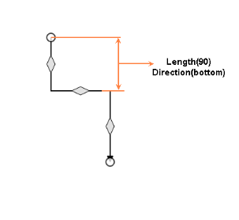

N> By default, connections are created at the intersecting point of segments and node bounds. The connection between any specific point of source and target nodes can be achieved with connection ports.

### Connections with ports

The `SourcePort` and `TargetPort` properties allow to create connections between some specific points of source/target nodes. The following code example illustrates how to create port to port connections.



<ej:Diagram ClientIDMode="Static" ID="Diagram" runat="server" Height="600px" Width="100%" >
	<%--Create Nodes--%>
	<Nodes>
		<ej:BasicShape Name="task1" OffsetX="350" OffsetY="300" Width ="100" Height ="50">
			<Labels>
				<ej:DiagramLabel Text="Task 1"></ej:DiagramLabel>
			</Labels>
		</ej:BasicShape>
		<ej:BasicShape Name="task2" OffsetX="200" OffsetY="250" Width ="100" Height ="50">
			<Labels>
				<ej:DiagramLabel Text="Task 2"></ej:DiagramLabel>
			</Labels>
			<%--Defines ports for task2--%>
			<Ports>
				<ej:DiagramPort Name="in" Shape="Circle" Visibility="Visible" FillColor="black">
					<offset x="1" y="0.65"></offset>
				</ej:DiagramPort>
				<ej:DiagramPort Name="out" Shape="Circle" Visibility="Visible" FillColor="black">
					<offset x="1" y="0.35"></offset>
				</ej:DiagramPort>
			</Ports>
		</ej:BasicShape>
		<ej:BasicShape Name="task3" OffsetX="350" OffsetY="200" Width ="100" Height ="50">
			<Labels>
				<ej:DiagramLabel Text="Task 3"></ej:DiagramLabel>
			</Labels>
		</ej:BasicShape>
	</Nodes>
	<%--Create Connectors--%>
	<Connectors>
		<%--Name of the target port defined in the target node--%>
		<ej:DiagramConnector Name="flow1" SourceNode="task1" TargetNode="task2" TargetPort="in">
		</ej:DiagramConnector>
		<%--Name of the source port defined in the source node--%>
		<ej:DiagramConnector Name="flow1" SourceNode="task2" TargetNode="task3" SourcePort="out">
		</ej:DiagramConnector>
	</Connectors>
</ej:Diagram>



protected void Page_Load(object sender, EventArgs e)
{
	if (!IsPostBack)
	{
		//Defines the common values for the nodes
		Diagram.Model.DefaultSettings.Node = new FlowShape() { 
			FillColor = "darkCyan",
			BorderColor = "black",
			Shape = FlowShapes.Process
		};
		Diagram.Model.DefaultSettings.Node.Labels.Add(new Label() { FontColor = "white" });
		//Defines common values for connectors
		Diagram.Model.DefaultSettings.Connector = new Connector();
		Diagram.Model.DefaultSettings.Connector.Segments.Add(new Segment() { Type = Segments.Orthogonal });
	}
}



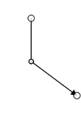

## Segments

The path of the connector is defined with a collection of segments. There are three types of segments.

### Straight

Straight segment allows to create a straight line.
To create a straight line, you should specify the `Type` of the segment as "straight" and add a straight segment to `Segments` collection. The following code example illustrates how to create a default straight segment.


<ej:Diagram ClientIDMode="Static" ID="Diagram" runat="server" Height="600px" Width="100%" >
	<%--Create Connectors--%>
	<Connectors>
		<ej:DiagramConnector Name="connector1">
			<%--Sets source and target points--%>
			<sourcepoint x="100" y="100"></sourcepoint>
			<targetPoint x="200" y="200"></targetPoint>
			<%--Defines segment collection
			When there is no previous segment, line starts from source point
			When the end point is not specified, line ends at target point
			Defines the type of the segment--%>
			<Segments>
				<ej:DiagramSegment Type="Straight"></ej:DiagramSegment>
			</Segments>
		</ej:DiagramConnector>
	</Connectors>
</ej:Diagram>


The `Point` property of straight segment allows you to define the end point of it. The following code example illustrates how to define the end point of a straight segment.


<ej:Diagram ClientIDMode="Static" ID="Diagram" runat="server" Height="600px" Width="100%" >
	<%--Create Connectors--%>
	<Connectors>
		<ej:DiagramConnector Name="connector1">
			<%--Sets source and target points--%>
			<sourcepoint x="100" y="100"></sourcepoint>
			<targetPoint x="200" y="200"></targetPoint>
			
			<%--Defines segment collection--%>
			<%--Defines the type of the segment--%>
			<Segments>
				<ej:DiagramSegment Type="Straight">
					<%--Defines the end point of the segment--%>
					<%--Additional straight line will be drawn from this end point to the target point--%>
					<Point x="100" y="200"></Point>
				</ej:DiagramSegment>
			</Segments>
		</ej:DiagramConnector>
	</Connectors>
</ej:Diagram>


### Orthogonal

Orthogonal segments are used to create segments that are perpendicular to each other.

Set the segment `Type` as "Orthogonal" to create a default orthogonal segment. The following code example illustrates how to create a default orthogonal segment.


<ej:Diagram ClientIDMode="Static" ID="Diagram" runat="server" Height="600px" Width="100%" >
	<%--Create Connectors--%>
	<Connectors>
		<ej:DiagramConnector Name="connector1">
			<%--Sets source and target points--%>
			<sourcepoint x="100" y="100"></sourcepoint>
			<targetPoint x="200" y="200"></targetPoint>
			
			<%--Defines segment collection
			Defines the type of the segment--%>
			<Segments>
				<ej:DiagramSegment Type="Orthogonal"></ej:DiagramSegment>
			</Segments>
		</ej:DiagramConnector>
	</Connectors>
</ej:Diagram>


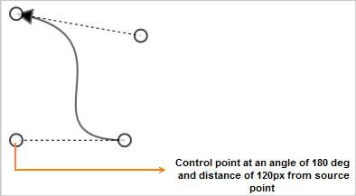

The `Length` and `Direction` properties allow to define the flow and length of segment. The following code example illustrates how to create customized orthogonal segments.


<ej:Diagram ClientIDMode="Static" ID="Diagram" runat="server" Height="600px" Width="100%" >
	<%--Create Connectors--%>
	<Connectors>
		<ej:DiagramConnector Name="connector1">
			<%--Sets source and target points--%>
			<sourcepoint x="100" y="100"></sourcepoint>
			<targetPoint x="200" y="200"></targetPoint>
			
			<%--Defines segment collection--%>
			<%--Defines the type of the segment--%>
			<Segments>
				<%--Orthogonal segment of 50px length to the bottom--%>
				<%--Additional orthogonal segments will be added from the end of the last segment to the target point--%>
				<ej:DiagramSegment Type="Orthogonal" Length="50" Direction="bottom"></ej:DiagramSegment>
			</Segments>
		</ej:DiagramConnector>
	</Connectors>
</ej:Diagram>


#### Avoid overlapping

Orthogonal segments are automatically re-routed, in order to avoid overlapping with the source and target nodes. The following images illustrate how orthogonal segments are re-routed.

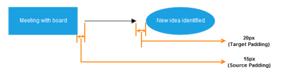

N> Overlapping with source and target nodes are only avoided. Other nodes are not considered as obstacles.

### Bezier

Bezier segments are used to create curve segments and the curves are configurable either with the control points or with vectors.

To create a bezier segment, the `Segment.Type` is set as `Bezier`. The following code example illustrates how to create a default Bezier segment.


<ej:Diagram ClientIDMode="Static" ID="Diagram" runat="server" Height="600px" Width="100%" >
	<%--Create Connectors--%>
	<Connectors>
		<ej:DiagramConnector Name="connector1">
			<%--Sets source and target points--%>
			<sourcepoint x="100" y="100"></sourcepoint>
			<targetPoint x="200" y="200"></targetPoint>
			
			<%--Defines segment collection--%>
			<%--Defines the type of the segment--%>
			<Segments>
				<ej:DiagramSegment Type="Bezier"></ej:DiagramSegment>
			</Segments>
		</ej:DiagramConnector>
	</Connectors>
</ej:Diagram>


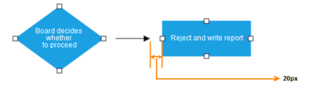

The `Point1` and `Point2` properties of bezier segment enable you to set the control points. The following code example illustrates how to configure the Bezier segments with control points.


<ej:Diagram ClientIDMode="Static" ID="Diagram" runat="server" Height="600px" Width="100%" >
	<%--Create Connectors--%>
	<Connectors>
		<ej:DiagramConnector Name="connector1">
			<%--Sets source and target points--%>
			<sourcepoint x="100" y="100"></sourcepoint>
			<targetPoint x="200" y="200"></targetPoint>
			<%--Defines segment collection--%>
			<Segments>
				<%--Defines the type of the segment--%>
				<ej:DiagramSegment Type="Bezier">
					<%--First control point: an absolute position from the page origin--%>
					<Point1 x="125" y="75"></Point1>
					<%--Second control point: an absolute position from the page origin--%>
					<Point2 x="225" y="75"></Point2>
				</ej:DiagramSegment>
			</Segments>
		</ej:DiagramConnector>
	</Connectors>
</ej:Diagram>


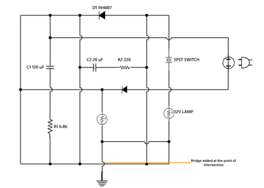

The `Vector1` and `Vector2` properties of bezier segment enable you to define the vectors. The following code illustrates how to configure a bezier curve with vectors.


//Defines JSON
var connector = {
	name: "connector",
	sourcePoint: { x: 100, y: 200 },
	targetPoint: { x: 250, y: 200 },
	//Defines segment collection
	segments: [
	{
		// Defines the type of the segment
		type: "bezier",
		// Length and angle between the source point and the first control point
		vector1: { angle: 270, distance: 75 },
		// Length and angle between the target point and the second control point
		vector2: { angle: 270, distance: 75 }
	}]
};
connectors.push(connector);


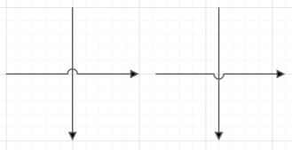

### Complex segments

Multiple segments can be defined one after another. To create a connector with multiple segments, define and add the segments to `Connector.Segments` collection. The Following code example illustrates how to create a connector with multiple segments.


<ej:Diagram ClientIDMode="Static" ID="Diagram" runat="server" Height="600px" Width="100%" >
	<%--Create Connectors--%>
	<Connectors>
		<ej:DiagramConnector Name="connector1">
			<%--Sets source and target points--%>
			<sourcepoint x="100" y="200"></sourcepoint>
			<targetPoint x="250" y="300"></targetPoint>
			<%--Defines segment collection--%>
			<Segments>
				<%--Segment of length 100px to the bottom--%>
				<ej:DiagramSegment Type="Orthogonal" Length="100" Direction="bottom"></ej:DiagramSegment>
				<%--Segment of length 150px to the bottom--%>
				<ej:DiagramSegment Type="Orthogonal" Length="150" Direction="right"></ej:DiagramSegment>
				<%--Additional orthogonal segments will be added from the end of the last segment to the target point--%>
			</Segments>
		</ej:DiagramConnector>
	</Connectors>
</ej:Diagram>


## Decorator

Start and end points of a connector can be decorated with some customizable shapes like arrows, circles, diamond or path. You can decorate the connection end points with the `SourceDecorator` and `TargetDecorator` properties of connector.
To explore the properties of decorators, refer to [Decorator Properties](http://help.syncfusion.com/CR/aspnet/Syncfusion.JavaScript.DataVisualization.Models.Diagram.Decorator.html "Decorator Properties").

The `Shape` property of decorator allows to define the shape of the decorators. The following code example illustrates how to create decorators of various shapes.


<ej:Diagram ClientIDMode="Static" ID="Diagram" runat="server" Height="600px" Width="100%" >
	<%--Create Connectors--%>
	<Connectors>
		<ej:DiagramConnector Name="connector1">
			<%--Sets source and target points--%>
			<sourcepoint x="100" y="100"></sourcepoint>
			<targetPoint x="200" y="200"></targetPoint>
				<%--Decorator shape - Circle--%>
			<SourceDecorator Shape="Circle" Width="10" Height="10"  />
				<%--Decorator shape - Arrow--%>
			<TargetDecorator Shape="Arrow" Width="10" Height="10"  />
		</ej:DiagramConnector>

		<ej:DiagramConnector Name="connector2">
			<%--Sets source and target points--%>
			<sourcepoint x="300" y="100"></sourcepoint>
			<targetPoint x="400" y="200"></targetPoint>
			<%--Decorator shape - Diamond--%>
			<SourceDecorator Shape="Diamond" Width="10" Height="10"  />
			<%--Decorator shape - Open Arrow--%>
			<TargetDecorator Shape="OpenArrow" Width="10" Height="10"  />
		</ej:DiagramConnector>
		<ej:DiagramConnector Name="connector3">
			<%--Sets source and target points--%>
			<sourcepoint x="500" y="100"></sourcepoint>
			<targetPoint x="600" y="200"></targetPoint>
			<%--Decorator shape - Path--%>
			<SourceDecorator Shape="Path" PathData="M 376.892,225.284L 371.279,211.95L 376.892,198.617L 350.225,211.95L 376.892,225.284 Z" Width="10" Height="10"  />
		</ej:DiagramConnector>
	</Connectors>
</ej:Diagram>


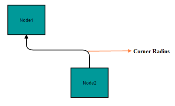

## Padding

Padding is used to leave space between the Connector's end point and the object to where it is connected.

The `SourcePadding` and `TargetPadding` properties of connector define the space to be left between the connection end points and the source and target nodes of connector. The following code example illustrates how to leave space between the connection end points and source, target nodes.



        <%--   Initializes Diagram--%>
        <ej:Diagram ID="Diagram" runat="server" Height="600px" Width="900px">
            <%--    Add the node to the nodes collection --%>
            <Nodes>
                <%--Defines nodes--%>
                <ej:BasicShape Name="task1" OffsetX="100" OffsetY="100" Height="50" Width="100" FillColor="darkCyan" BorderColor="black">
                    <labels>
                    <ej:DiagramLabel Name="task1" Text="Task 1" FontColor="White"></ej:DiagramLabel>
                </labels>
                </ej:BasicShape>
                <ej:BasicShape Name="task2" OffsetX="300" OffsetY="100" Height="50" Width="100" FillColor="darkCyan" BorderColor="black">
                    <labels>
                    <ej:DiagramLabel Name="task2" Text="Task 2" FontColor="White" ></ej:DiagramLabel>
                </labels>
                </ej:BasicShape>
            </Nodes>
            <Connectors>
                <ej:DiagramConnector Name="flow1" SourceNode="task1" TargetNode="task2" SourcePadding="10" TargetPadding="10"></ej:DiagramConnector>
            </Connectors>

        </ej:Diagram>


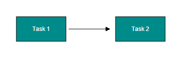

The `ConnectorPadding` property of node defines the space to be left between the node bounds and its edges. The following code example illustrates how to leave the space between a node and its connections.


//Create nodes
Node task1 = new Node() { Name = "task1", OffsetX = 200, OffsetY = 200 };
task1.Labels.Add(new Label() { Text = "Task 1" });
//Space between the node and its edges
task1.ConnectorPadding = 5;

Node task2 = new Node() { Name = "task2", OffsetX = 400, OffsetY = 200 };
task2.Labels.Add(new Label() { Text = "Task 2" });

//Sets nodes collection to the Diagram model
Diagram.Model.Nodes.Add(task1);
Diagram.Model.Nodes.Add(task2);

//Create a connector
Connector connector = new Connector() { Name = "flow1", SourceNode = "task1", TargetNode = "task2" };
Diagram.Model.Connectors.Add(connector);


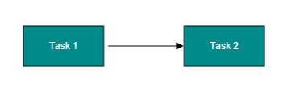

The `ConnectorPadding` property of port defines the space between the ports and its in/out edges. The following code example illustrates how to leave the space between ports and its connections.


//Create nodes
Node task1 = new Node() { Name = "task1", OffsetX = 200, OffsetY = 200 };
task1.Labels.Add(new Label() { Text = "Task 1" });

Node task2 = new Node() { Name = "task2", OffsetX = 400, OffsetY = 200 };
task2.Labels.Add(new Label() { Text = "Task 2" });
task2.Ports.Add(new Port()
{
	Name = "port",
	Offset = new DiagramPoint(0f, 0.5f),
	Shape = PortShapes.Circle,
	Visibility = PortVisibility.Visible,
	FillColor = "black",
	ConnectorPadding = 5
});

//Sets nodes collection to the Diagram model
Diagram.Model.Nodes.Add(task1);
Diagram.Model.Nodes.Add(task2);

//Create a connector
Connector connector = new Connector() {
	Name = "flow1", SourceNode = "task1",
	TargetNode = "task2", TargetPort = "port"
};
Diagram.Model.Connectors.Add(connector);


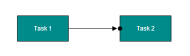

## Bridging

Line Bridging creates a bridge for lines to smartly cross over other lines, at points of intersection. When two line connectors meet each other, the line with the higher z-order (upper one) draws an arc over the underlying connector.
Bridging can be enabled/disabled either with the `Connector.Constraints` or `Diagram.Constraints`. The following code example illustrates how to enable line bridging.


//Enables bridging for a single connector
Connector connector = new Connector()
{
	Name = "connector1",
	SourcePoint = new DiagramPoint(100f, 100f),
	TargetPoint = new DiagramPoint(200f, 200f),
	//Removes inherit bridging or else bridging is enabled/disabled based on the Diagram constraints
	//And includes bridging
	Constraints = ConnectorConstraints.Default & ~ConnectorConstraints.InheritBridging | ConnectorConstraints.Bridging
};

//Enables bridging for every connector added in the model
Diagram.Model.Constraints = DiagramConstraints.Default | DiagramConstraints.Bridging;


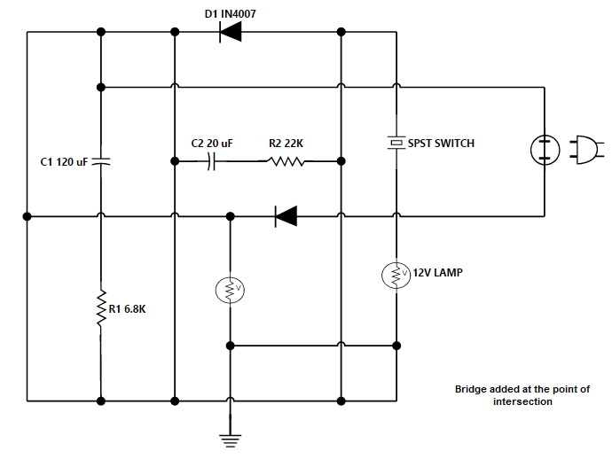

The direction of the bridge can be customized with the property `BridgeDirection`. BridgeDirection defines the intersecting segment where the bridge has to be inserted. By default, the bridge direction points to the top.

To explore the bridge directions, refer to [Bridge Directions](https://help.syncfusion.com/cr/aspnet/Syncfusion.JavaScript.DataVisualization.Models.DiagramProperties.html#Syncfusion_JavaScript_DataVisualization_Models_DiagramProperties_BridgeDirection "Bridge Directions").

The following code example illustrates how to draw the bridge at the bottom direction.



//Sets the bridge direction
Diagram.Model.BridgeDirection = BridgeDirection.Bottom;

//Enables bridging for every connector added in the model
Diagram.Model.Constraints = DiagramConstraints.Default | DiagramConstraints.Bridging;



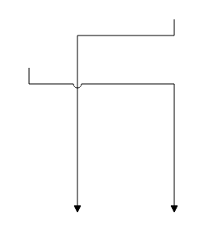

**Limitation**: Bezier segments do not support bridging.

## Corner radius

Corner radius allows to create connectors with rounded corners. The radius of the rounded corner is set with `CornerRadius` property.


<ej:Diagram ClientIDMode="Static" ID="Diagram" runat="server" Height="600px" Width="100%" >
	<%--Create Nodes--%>
	<Nodes>
		<ej:BasicShape Name="task1" OffsetX="350" OffsetY="300" Width ="100" Height ="50">
			<Labels>
				<ej:DiagramLabel Text="Task 1"></ej:DiagramLabel>
			</Labels>
		</ej:BasicShape>
		<ej:BasicShape Name="task2" OffsetX="200" OffsetY="250" Width ="100" Height ="50">
			<Labels>
				<ej:DiagramLabel Text="Task 2"></ej:DiagramLabel>
			</Labels>
		</ej:BasicShape>
	</Nodes>
	<%--Create Connectors--%>
	<Connectors>
		<%--Sets the radius for the rounded corner--%>
		<ej:DiagramConnector Name="flow1" SourceNode="task1" TargetNode="task2" CornerRadius="10">
			<Segments>
				<ej:DiagramSegment Type="Orthogonal"></ej:DiagramSegment>
			</Segments>
		</ej:DiagramConnector>
	</Connectors>
</ej:Diagram>


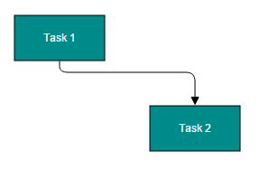

## Appearance

Stroke width, stroke color, and style of the lines and decorators can be customized with a set of defined properties.

### Segment Appearance

The following code example illustrates how to customize the segment appearance.


<ej:Diagram ClientIDMode="Static" ID="Diagram" runat="server" Height="600px" Width="100%" >
	<%--Create Connectors--%>
	<Connectors>
		<%--Customizes the appearance of the connector--%>
		<ej:DiagramConnector Name="connector1" LineWidth="2" LineColor="green" LineDashArray="2,2" Opacity="0.8">
			<%--Sets source and target points--%>
			<sourcepoint x="100" y="100"></sourcepoint>
			<targetPoint x="200" y="200"></targetPoint>
		</ej:DiagramConnector>
	</Connectors>
</ej:Diagram>


### Decorator Appearance

The following code example illustrates how to customize the appearance of the decorator.


<ej:Diagram ClientIDMode="Static" ID="Diagram" runat="server" Height="600px" Width="100%" >
	<%--Create Connectors--%>
	<Connectors>
		<%--Customizes the appearance of the connector--%>
		<ej:DiagramConnector Name="connector1" LineWidth="2" LineColor="green" LineDashArray="2,2" Opacity="0.8">
			<%--Sets source and target points--%>
			<sourcepoint x="100" y="100"></sourcepoint>
			<targetPoint x="200" y="200"></targetPoint>
			<%--Customizes the appearance of the Decorator--%>
			<TargetDecorator Shape="Arrow" FillColor="red" BorderColor="green" BorderWidth="2" Width="10" Height="10" />
		</ej:DiagramConnector>
	</Connectors>
</ej:Diagram>


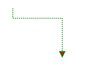

## Interaction
Diagram allows to edit the connectors at runtime. To edit the connector segments at runtime, refer to [Connection Editing](/aspnet/Diagram/Interaction#connection-editing "Connection Editing").

## Constraints
The `Constraints` property of connector allows to enable/disable certain features of connectors. For more information about constraints, refer to [Connector Constraints](/aspnet/Diagram/Constraints#connectorconstraints "Connector Constraints").