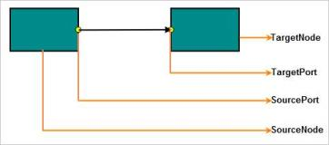
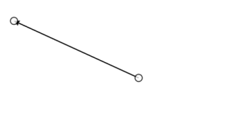
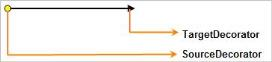

# Connector

Connectors are objects used to create a link between two nodes. A connector is a line that has connection points at the end of the line and stays connected to the elements that you attach it to.

 

_Connector_

## Create Connector

Connector is created and added to the Diagram model by using Diagram Model’s Connectors property. The connector’s name must be unique. 

By default, the connector type is “straight”.

The following code illustrates how to create a Connector and add it to Diagram.



//Creates a connector

Connector connector = new Connector();

connector.Name = "Connector";

connector.SourcePoint = new DiagramPoint(300,40);

connector.TargetPoint = new DiagramPoint(400, 250);

connector.LineWidth=2;

Diagram1.Connectors.Add(connector);



 

_Connector_

## Segments

The connector has three types of segments.

* Orthogonal Segments
* Straight Segments
* Bezier Segments

Orthogonal Segments

Orthogonal segments are visually represented based on the specified length and direction values. 

The following code example illustrates how to add a Connector with an OrthogonalSegment.



//Creates a connector with an orthogonal line segment

Connector connector = new Connector();

connector.Name = "Connector";

connector.Segments = new Collection();

//Creates orthogonal segment 

Segment segment = new Segment();

segment.Type= Segments. Orthogonal;

//Adds segments 

connector.Segments.Add(segment);

connector.SourcePoint = new DiagramPoint(300,40);

connector.TargetPoint = new DiagramPoint(400, 250);
Diagram1.Connectors.Add(connector);



 

_Orthogonal Segment_

The following code illustrates how to customize the Orthogonal Segment.



//Creates a connector with an orthogonal line segment

Connector connector = new Connector();

connector.Name = "Connector";

connector.Segments = new Collection();

//Creates orthogonal segment 

Segment segment = new Segment();

segment.Type= Segments. Orthogonal;

//Length and Direction for segments

segment.Length = 90;

segment.Direction = "bottom";

//Adds segments 

connector.Segments.Add(segment);

connector.SourcePoint = new DiagramPoint(300,40);

connector.TargetPoint = new DiagramPoint(400, 250);
Diagram1.Connectors.Add(connector);



   

_Orthogonal Segment_

Straight Segment

The straight segments can be added by specifying points as to where the line has to be drawn. The segment end point links the SourcePoint and TargetPoint of the connector. 

The following code example illustrates how to add straight segment through code.



//Creates a connector with control points

Connector connector = new Connector();

connector.Name = "Connector";

//Creates straight segment 

connector.Segments = new Collection();

Segment segment1 = new Segment();

segment1.Type= Segments. Straight;

//Adds Points for segments

segment1.Point = new DiagramPoint(400,150);

Segment segment2 = new Segment();

segment2.Type= Segments. Straight;

segment2.Point = new DiagramPoint(300,10);

//Adds segments 

connector.Segments.Add(segment1);

connector.Segments.Add(segment2);

connector.SourcePoint = new DiagramPoint(350,200);

connector.TargetPoint = new DiagramPoint(200, 50);
Diagram1.Connectors.Add(connector);



    

_Polyline_

  

_Single Line_

The control points can be added or deleted at runtime with shortcut key combination ctrl + shift +click on the control point.

Bezier Segment

Bezier segments can be added through points or vector.

* Points (point1, point2) are absolute and specified based on the origin of page.
* Vectors (vector1, vector2) are relative and specified based on the length and angle between the end points and control points.

The following code example illustrates how to add Bezier segments.



//Creates a connector with bezier line segment

Connector connector = new Connector();

connector.Name = "Connector";

//Creates Bezier segment 

connector.Segments = new Collection();

Segment segment1 = new Segment();

segment1.Type= Segments.Bezier;

//Adds control points for segments

segment1.Point1 = new DiagramPoint(40,80);

segment1.Point2 = new DiagramPoint(40,72);

//Adds segments 

connector.Segments.Add(segment1);

connector.SourcePoint = new DiagramPoint(350,200);

connector.TargetPoint = new DiagramPoint(200, 50);

Diagram1.Connectors.Add(connector);



  

_Bezier Segments_

The following code example illustrates how to add vector point for Bezier segments.



//Creates a connector with bezier line segment

Connector connector = new Connector();

connector.Name = "Connector";

//Creates bezier segment 

connector.Segments = new Collection();

Segment segment1 = new Segment();

segment1.Type= Segments.Bezier;

//Adds Vector Points for segments

segment1.Vector1 = new DiagramPoint(180,120);

segment1.Vector2 = new DiagramPoint(10, 140);

//Adds segments 

connector.Segments.Add(segment1);

connector.SourcePoint = new DiagramPoint(310,180);

connector.TargetPoint = new DiagramPoint(190,40);

DiagramContent.Connectors.Add(connector);



_Bezier segment with vectors_

Editing Segments

The segments can be edited during runtime by dragging control thumbs. Segments can be updated when neighboring segments are adjusted.

_Segment Editing_ 

## Connector Padding

Connector Padding allows you to adjust the space between the connector’s end point and the object where it is connected (Node, Group, or Port). 

Endpoint adjustment specific to connector ends

Padding distance between source or target end with its connected end (Node, Group, or Port) can be adjusted by using SourcePadding and TargetPadding, respectively.

The following code examples illustrate how to adjust the distance by using padding property.



Connector connector = new Connector();

connector.SourcePadding = 15;

connector.TargetPadding = 20;



  

Endpoint adjustment specific to nodes

ConnectorPadding property of a node specifies the amount of space needed in pixels between a node and all its connected edges.

The following code example illustrates how to pad edges connected to a node.



Node node = new Node();

node.ConnectorPadding = 20;



Endpoint adjustment specific to ports

ConnectorPadding property of a port specifies the amount of space needed in pixels between a port and all its connected edges.

The following code examples illustrate how to pad edges connected to a port.



//Sets Padding for a port.

Port port = new Port();

port.ConnectorPadding = 20;



## Line Bridging

Line Bridging creates a bridge for lines to smartly cross over other lines, at points of intersection. When two line connectors meet each other, the line with the higher z-order draws an arc over the line with lower z-order.

Only straight and orthogonal connectors support line bridging.

Line bridging is disabled, by default. You can enable it by adding the ConnectorConstraints.Bridging in constraints.

The following code illustrates how to enable line bridging.



        <ej:Diagram ID="DiagramContent" runat="server" Height="100%" Width="100%">

        </ej:Diagram>





//Enables Line Bridging for a single connector

Connector connector = new Connector();

connector.Constraints = ConnectorConstraints.Default | ConnectorConstraints.Bridging;

//Enables Line Bridging for all the connectors added to diagram model

DiagramContent.Constraints = DiagramConstraints.Default | DiagramConstraints.Bridging;



 

_Line Bridging_

When the connector constraint is set as ConnectorConstraints.InheritBridging, bridging is based on DiagramConstraints.

Line Bridging Direction

Direction of the Line Bridge can be customized by using the BridgeDirection property. This property decides the intersecting segment that shows a bridge based on your preferred direction. 

The default value for the Diagram model’s BridgeDirection property is BridgeDirection.Top.

_BridgeDirection Property_

<table>
<tr>
<th>
 Properties</th><th>
Description</th><th>
Value</th></tr>
<tr>
<td>
BridgeDirection</td><td>
Gets or sets the BridgeDirection for horizontal and vertical lines.</td><td>
EnumBridgeDirection.LeftBridgeDirection.RightBridgeDirection.TopBridgeDirection.Bottom</td></tr>
</table>

The following code example is used to set Bridge Direction.

Example 1: Bridge for Horizontal Connector with BridgeDirection as Top.



//Sets the Bridge Direction

DiagramContent.Model.BridgeDirection = BridgeDirection.Top;



{{ '  ' | markdownify }}

_BridgeDirection.Top_

Example 2: Bridge for Vertical Connector with BridgeDirection as Left.



//Sets the Bridge Direction

DiagramContent.Model.BridgeDirection = BridgeDirection.Left;



  

_BridgeDirection.Left_

The following API method is used to change the BridgeDirection at runtime.



var diagram = $("#diagram").ejDiagram("instance");

//Updates the Bridge Direction at runtime.

diagram.update({ bridgeDirection: ej.datavisualization.Diagram.BridgeDirection.Top });



## Corner Radius

CornerRadius support enables you to create connectors with rounded corners. 

The following code example illustrates how to set corner radius for connectors.



//For node creation refer to the link Node Creation

//For Creating connection refer to the link Connecting nodes

//Adds corner radius for connector

Connector connector = new Connector();

Connector.CornerRadius=20;



 

_Corner Radius_

## Connecting Nodes

Connector is connected to the bounds of the node at a specific point on the node .You are required to assign the source node’s name to connector’s SourceNode property and target node’s name to the connector’s TargetNode property, in order to establish the connection. The port to port connection between specific points on node is established by assigning the name of the node’s port to connector’s TargetPort /SourcePort. At runtime, you can change the point of connection while dragging or rotating node.



  //for node creation refer to the link [Node creation](http://help.syncfusion.com/ug/js/documents/createyourfirstdiagr.htm)

//Creates a connection between headNode/tailNode by using connector

Connector connector = new Connector();

connector.SourceNode = "headNode"; //Sets name of sourceNode

connector.TargetNode = "tailnode"; //Sets name of targetNode



   

_Node to Node Connection_

The point of connection is changed optimally at runtime while performing operations such as Rotating and Dragging on Source/Target Node of Connector. In case of static or specific point connection at runtime, the Port assists to maintain specific point connection between Nodes.

## Connecting Ports

The Port establishes the connection with nodes at a specific point.

For creating specific port connection, refer to the link [Port to Port Connection.](http://help.syncfusion.com/ug/js/default.htm)

## Appearance

You can customize the appearance of the connector by setting a desired value to the appropriate appearance properties. The following code illustrates how to customize the appearance of connector.

_Appearance_

<table>
<tr>
<th>
Properties</th><th>
Data Type</th><th>
Description</th></tr>
<tr>
<td>
LineWidth</td><td>
Int</td><td>
Gets or sets the width of the line</td></tr>
<tr>
<td>
LineDashArray</td><td>
String</td><td>
Gets or sets the pattern of dashes and gaps used to stroke connector border.</td></tr>
<tr>
<td>
LineColor</td><td>
String</td><td>
Gets or sets the line color of the connector</td></tr>
<tr>
<td>
Opacity</td><td>
Int</td><td>
Gets or sets the opacity of the connector</td></tr>
</table>



//Sets various appearance properties to connector

Connector connector = new Connector();

connector.Name = "Connector";

connector.LineWidth = 2;

connector.LineColor = "green";

connector.LineDashArray = "4 4";

connector.Segment = new Segment(Segments.Orthogonal);

connector.SourcePoint = new DiagramPoint(10, 10);

connector.TargetPoint = new DiagramPoint(70, 40);



## Decorator

You can decorate the source point and target point of the connector by using decorator shape. The SourceDecorator and TargetDecorator properties are used to add decorators to connector.The following code illustrates how decorator is created and added at connector’s target point.



//Sets TargetDecorator and SourceDecorator

Connector connector = new Connector();

connector.TargetDecorator = new Decorator();

connector.TargetDecorator.Shape = DecoratorShapes.Arrow;

connector.TargetDecorator.Width = 10;

connector.TargetDecorator.Height = 10;

connector.SourceDecorator.Shape = DecoratorShapes.Circle;

connector.SourceDecorator.Width = 10;

connector.SourceDecorator.Height = 10;



Decorator Appearance

Decorator appearance is customized by setting the desired value to the appropriate appearance properties.

_Decorator Appearance_

<table>
<tr>
<th>
Properties</th><th>
Data Type</th><th>
Description</th></tr>
<tr>
<td>
 Width</td><td>
 Int</td><td>
Gets or sets the width of the decorator.</td></tr>
<tr>
<td>
 Height</td><td>
 Int</td><td>
Gets or sets the height of the decorator.</td></tr>
<tr>
<td>
 BorderColor</td><td>
 String</td><td>
Gets or sets the border color of the decorator.</td></tr>
<tr>
<td>
 FillColor</td><td>
 String</td><td>
Gets or sets the fill color of the decorator.</td></tr>
<tr>
<td>
 Shape</td><td>
 DecoratorShapes</td><td>
Gets or sets the shape of the decorator.</td></tr>
<tr>
<td>
 PathData</td><td>
 String</td><td>
Gets or sets the path data of the decorator.</td></tr>
</table>

The following code illustrates how to customize Decorator Shape.



//Sets various appearance properties to decorator

Connector connector = new Connector();

connector.TargetDecorator.Shape = DecoratorShapes.Arrow;

connector.TargetDecorator.Width = 8;

connector.TargetDecorator.Height = 8;

connector.TargetDecorator.BorderColor = "black";

connector.SourceDecorator.Shape = DecoratorShapes.Circle;

connector.SourceDecorator.Width = 8;

connector.SourceDecorator.Height = 8;

connector.SourceDecorator.FillColor = "yellow";



    

_Decorator Shape_

## Constraints

Connector Constraints

You can enable or disable certain behaviors of the Connectors by using the constraints property.

_Constraints_

<table>
<tr>
<th>
Constraints</th><th>
Description</th></tr>
<tr>
<td>
None</td><td>
Disables all the constraints.</td></tr>
<tr>
<td>
Select</td><td>
Enables or disables selection.</td></tr>
<tr>
<td>
Delete</td><td>
Enables or disables deletion.</td></tr>
<tr>
<td>
Drag</td><td>
Enables or disables dragging.</td></tr>
<tr>
<td>
DragSourceEnd</td><td>
Enables or disables the source end to be dragged.</td></tr>
<tr>
<td>
DragTargetEnd</td><td>
Enables or disables the target end to be dragged.</td></tr>
<tr>
<td>
DragsegmentThumbs</td><td>
Enables or disables control point and end point of every segment in a connector for editing.</td></tr>
<tr>
<td>
Bridging</td><td>
Enables or disables bridging to the connector.</td></tr>
<tr>
<td>
DragLabel</td><td>
Enables or disables label of node to be dragged.</td></tr>
<tr>
<td>
InheritBridging</td><td>
Enables or disables bridging based on the diagram constraints.</td></tr>
<tr>
<td>
Default</td><td>
Enables all constraints.</td></tr>
</table>

The default value for the connector constraints property is ConnectorConstraints.Default.

Example

The following code illustrates how to disable select constraints of the connector. Disabling select constraints does not allow you to select the connector.



//Disables select constraint

connector.Constraints = connector.Constraints &~(ConnectorConstraints.Select);



_Note: Connector’s constraints property is manipulated by using bitwise operations. For more information about bitwise operations, see_ [Bitwise Operations](http://help.syncfusion.com/ug/js/documents/bitwiseoperations.htm)_._ 

