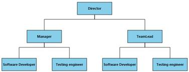
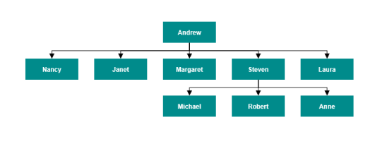
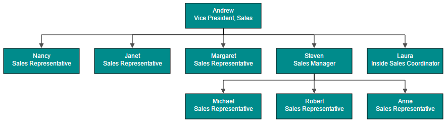

# Data Binding

* Diagram can be populated with the nodes and connectors based on the information provided from an external data source.
* Diagram exposes its specific data-related properties allowing you to specify the data source fields from where the node information has to be retrieved from.

To explore those properties, see [Data source settings](http://help.syncfusion.com/cr/aspnet/Syncfusion.JavaScript.DataVisualization.Models.Diagram.DataSourceSettings.html "Data source settings")

* Diagram supports three different kinds of Data binding.
	* Local Data
	* Remote Data
	* HTML Table Data

## Local Data

Diagram can be populated based on the user defined JSON data (**Local Data**) by mapping the relevant data source fields.

To map the user defined JSON data with Diagram, you have to configure the fields of `DataSourceSettings`. The following code example illustrates how to bind local data with the Diagram.



<ej:Diagram ClientIDMode="Static" ID="Diagram" runat="server" NodeTemplate="nodeTemplate" Height="600px" Width="100%" EnableContextMenu="false" Tool="ZoomPan">
	<%--Uses layout to auto-arrange nodes on the Diagram page--%>
	<Layout Type="HierarchicalTree" HorizontalSpacing="30" VerticalSpacing="30" />
	
	<%--Configures data source for Diagram--%>
    <DataSourceSettings Id ="Id" Parent ="ReportingPerson" />
</ej:Diagram>




protected void Page_Load(object sender, EventArgs e)
{
	if (!IsPostBack)
	{
		//Sets the default properties for nodes and connectors
		Label label = new Label() { Name = "label1", FontColor = "white", Bold = true };
		Diagram.Model.DefaultSettings.Node = new Node() { Width = 100, Height = 40, FillColor = "darkcyan" };
		Diagram.Model.DefaultSettings.Node.Labels.Add(label);
		Diagram.Model.DefaultSettings.Connector = new Connector()
		{
			Segments = new Collection() { new Segment(Segments.Orthogonal) },
			TargetDecorator = new Decorator() { Shape = DecoratorShapes.None },
		};

		//Configures data source for Diagram
		//Sets the local data source to the diagram.
		Diagram.Model.DataSourceSettings.DataSource = GetData();
	}
}

//returns datasource
public Array GetData()
{
	String allText = System.IO.File.ReadAllText(Server.MapPath("~/App_Data/Data.json"));
	Dictionary<string, object> requestArgs = (Dictionary<string, object>)new JavaScriptSerializer().DeserializeObject(allText);
	requestArgs = (Dictionary<string, object>)requestArgs["root"];
	return (Array)requestArgs.Values.ElementAt(0);
}



{root: {data: [ 
	{ "Name": "Director" },
	{ "Name": "Manager", "ReportingPerson": "Director" },
	{ "Name": "TeamLead", "ReportingPerson": "Director" },
	{ "Name": "Software Developer", "ReportingPerson": "TeamLead" },
	{ "Name": "Testing engineer", "ReportingPerson": "TeamLead" },
	{ "Name": "Software Developer", "ReportingPerson": "Manager" },
	{ "Name": "Testing engineer", "ReportingPerson": "Manager" }
]}}



## Remote Data

You can bind the Diagram with Remote Data by using dataManager.

* DataManager supports the following types of data-binding: JSON, Web Services, oData.
* It uses two different classes: ej.DataManager for processing and ej.Query for serving data. ej.DataManager communicates with data source and ej.Query generates data queries that are read by the dataManager.
* To learn more, refer to [Data Manager](/aspnet/DataManager/Getting-Started "Data Manager").

To bind remote data to the Diagram, you have to configure the fields of `DataSourceSettings`. The following code illustrates how to bind remote data to the Diagram.



<ej:Diagram ClientIDMode="Static" ID="Diagram" runat="server" NodeTemplate="nodeTemplate" Height="660px" Width="100%">
	<%--Uses layout to auto-arrange nodes on the Diagram page--%>
	<Layout Type="HierarchicalTree" HorizontalSpacing="30" VerticalSpacing="30" />
	
	<DataManager URL="http://mvc.syncfusion.com/Services/Northwnd.svc/" />
	<DataSourceSettings Query="ej.Query().from('Employees').select('EmployeeID,ReportsTo,FirstName')" Id="EmployeeID" Parent="ReportsTo" TableName="Employees" />
	
</ej:Diagram>




protected void Page_Load(object sender, EventArgs e)
{
	if (!IsPostBack)
	{
		//Sets the default properties for nodes and connectors
		Label label = new Label() { Name = "label1", FontColor = "white", Bold = true };
		Diagram.Model.DefaultSettings.Node = new Node() { Width = 100, Height = 40, FillColor = "darkcyan" };
		Diagram.Model.DefaultSettings.Node.Labels.Add(label);
		Diagram.Model.DefaultSettings.Connector = new Connector()
		{
			Segments = new Collection() { new Segment(Segments.Orthogonal) },
			TargetDecorator = new Decorator() { Shape = DecoratorShapes.None },
		};
	}
}



## HTML Table Data

The Diagram provides support to populate the Diagram from the **HTML table**. It is flexible to convert HTML table to Diagram by using **Data Manager**.

The following code illustrates how to convert HTML table to the Diagram.



<ej:Diagram ClientIDMode="Static" ID="Diagram" runat="server" NodeTemplate="nodeTemplate" Height="600px" Width="100%" EnableContextMenu="false" Tool="ZoomPan">
	<DataManager Table="#htmlbinding"></DataManager>
	<PageSettings ScrollLimit="Diagram" />
	<Layout Type="HierarchicalTree" HorizontalSpacing="30" VerticalSpacing="40" />
	<SnapSettings SnapConstraints="None" />	
	
    <%--Configures data source for Diagram--%>
    <DataSourceSettings Id ="Id" Parent ="ReportingPerson" />
</ej:Diagram>

<!-- HTML Table -->




protected void Page_Load(object sender, EventArgs e)
{
	if (!IsPostBack)
	{
		//Sets the default properties for nodes and connectors
		Label label = new Label() { Name = "label1", FontColor = "#ffffff" };
		Diagram.Model.DefaultSettings.Node = new Node() { Width = 120, Height = 40, BorderColor = "transparent" };
		Diagram.Model.DefaultSettings.Node.Labels.Add(label);
		Diagram.Model.DefaultSettings.Connector = new Connector()
		{
			Segments = new Collection() { new Segment(Segments.Orthogonal) },
			TargetDecorator = new Decorator() { FillColor = "#4F4F4F", BorderColor = "#4F4F4F" },
		};
	}
}



## SQL data for ASP.NET

The SqlDataSource control enables you to use a web server control to access data that is located in a relational database. It can work with any database that contains an associated ADO.NET provider including Microsoft SQL Server, Oracle, ODBC, or OLE DB databases such as Microsoft Access.

To retrieve data from a database by using the SqlDataSource control, set the following properties:

1. ProviderName - Set the name of the ADO.NET provider that represents the database you are working with. When you are working with Microsoft SQL Server, set the ProviderName property to System.Data.SqlClient; when you are working with an Oracle database, set the ProviderName property to System.Data.OracleClient; and so on.
2. ConnectionString - Set to a connection string that works for your database. 
3. SelectCommand - Set to an SQL query or stored procedure that returns data from the database.

The following code example illustrates how to create SQL binding.



<ej:Diagram ClientIDMode="Static" ID="Diagram" runat="server" Height="500px" NodeTemplate="nodeTemplate" Width="100%" DataSourceID="SqlDataSource1">
	<DataSourceSettings Id="EmployeeID" Parent="ReportsTo" />
	<Layout Type="HierarchicalTree" HorizontalSpacing="30" VerticalSpacing="40" />
	<SnapSettings SnapConstraints="None" />
</ej:Diagram>

<asp:SqlDataSource ID="SqlDataSource1" runat="server" ConnectionString="<%$ ConnectionStrings:SQLConnectionString %>"
	SelectCommand="SELECT * FROM [Employees] "></asp:SqlDataSource>




protected void Page_Load(object sender, EventArgs e)
{
	if (!IsPostBack)
	{
		//Sets the default properties for nodes and connectors
		Label label1 = new Label() { Name = "label1", FontColor = "white", Offset = new DiagramPoint(0.5f, 0.3f) };
		Label label2 = new Label() { Name = "label2", FontColor = "white", Offset = new DiagramPoint(0.5f, 0.6f) };
		Diagram.Model.DefaultSettings.Node = new Node() { Width = 150, Height = 50, FillColor= "darkCyan" };
		Diagram.Model.DefaultSettings.Node.Labels.Add(label1);
		Diagram.Model.DefaultSettings.Node.Labels.Add(label2);
		Diagram.Model.DefaultSettings.Connector = new Connector()
		{
			Segments = new Collection() { new Segment(Segments.Orthogonal) },
			TargetDecorator = new Decorator() { FillColor = "#4F4F4F", BorderColor = "#4F4F4F" },
		};
	}
}



 

## CRUD

* This feature allows the user to read the DataSource and perform add/edit/delete the data in datasource at runtime.

### Read DataSource

* This feature allows you to define nodes and connectors collection in the DataSource and ConnectionDataSource respectively.
* We can set the data collection in the model’s DataSourceSettings DataSource property. The nodes will be generated based on the data specified in the DataSource. 
* We can set the connector collection in the model’s DataSourceSettings ConnectionDataSource property.
* If we have a data (data will be set in the DataSource property) with parent relationship in the database and also defined the connector in the ConnectionDataSource simultaneously, then the connectors set in the ConnectionDataSource will be considered as a priority to render the connector.



 
          DiagramContent.DataSourceSettings = new DataSourceSettings()
            {
               //set the data collection
                DataSource = DiagramContext.HierarchicalData.ToList(),
                //bind the column name to the Id property which generates the unique name for the object
                Id = "Name",
                //Specify the custom property/columns which is available in the DataSource.
                CustomFields = new List<string>() 
                {
                    "Description",
                    "Color"
                },
                ConnectionDataSource = new ConnectionDataSourceSettings()
                {
                    //set the connector collection
                    DataSource = DiagramContext.HierarchicalDetails.ToList(),
                  //bind the column name to the Id property which generates the unique name for the object 
                    Id = "Name",
                    SourceNode = "SourceNode",
                    TargetNode = "TargetNode",

                //Specify the custom property/columns which is available in the ConnectionDataSource.
                 CustomFields = new List<string>() 
                    {
                    "Description",
                    "Color"
                     },
                }
            };
            



### How to perform Editing at runtime

We need to specify the URL for create/update/destroy of nodes and connectors.

### InsertData

* The following code example illustrates how to send the newly added/inserted data from client to server side.




var diagram = $("#diagram").ejDiagram("instance");
//Sends the newly added nodes/connectors from client side to the server side through the URL which is specified in server side.
diagram.insertData();




 
            DiagramContent.DataSourceSettings = new DataSourceSettings()
            {
                CrudAction = new CRUDAction()
                {
                   //Specify the method name which is used to get the newly added data from client side to the server side 
                    Create = "/Diagram/InsertShape",                
                },
                ConnectionDataSource = new ConnectionDataSourceSettings()
                {
 
                    CrudAction = new CRUDAction()
                    {
                    //Specify the method name which is used to get the newly added data from client side to the server side                         
                     Create = "/Diagram/InsertConnector",
                    }
                }
            };

        [WebMethod]
        public static void InsertShape(List<HierarchicalData> data)
        {
            foreach (HierarchicalData hdata in data)
            {
                DiagramContext.HierarchicalData.InsertOnSubmit(hdata);
                DiagramContext.SubmitChanges();
            }
        }

        [WebMethod]
        public static void InsertConnector(List<HierarchicalDetail> data)
        {
            foreach (HierarchicalDetail hdata in data)
            {
                DiagramContext.HierarchicalDetails.InsertOnSubmit(hdata);
                DiagramContext.SubmitChanges();
            }
        }




### UpdateData

* The following code example illustrates how to send the updated data from client to the server side.




var diagram = $("#diagram").ejDiagram("instance");
//Sends the updated nodes/connectors from client side to the server side through the URL which is specified in server side.
diagram.updateData();




 
        DiagramContent.DataSourceSettings = new DataSourceSettings()
            {
                CrudAction = new CRUDAction()
                {
                 //Specify the method name which is used to get the updated data from client side to the server side                         
                    Create = "/Diagram/UpdateShape",                
                },
                ConnectionDataSource = new ConnectionDataSourceSettings()
                {
                    CrudAction = new CRUDAction()
                    {
                        //Specify the method name which is used to get the updated data from client side to the server side                        
                        Create = "/Diagram/UpdateConnector",
                    }
                }
            };
        [WebMethod]
        public static void UpdateShape(List<HierarchicalData> data)
        {
            foreach (HierarchicalData hdata in data)
            {
                HierarchicalData originalData = DiagramContext.HierarchicalData.Single(h => h.Name == hdata.Name);
                originalData.Description = hdata.Description;
                originalData.Color = hdata.Color;
                DiagramContext.SubmitChanges();
            }
            
        }
        [WebMethod]
        public static void UpdateConnector(List<HierarchicalDetail> data)
        {
            foreach (HierarchicalDetail hdata in data)
            {
                HierarchicalDetail originalData = DiagramContext.HierarchicalDetails.Single(h => h.Name == hdata.Name);
                originalData.SourceNode = hdata.SourceNode;
                originalData.TargetNode = hdata.TargetNode;
                DiagramContext.SubmitChanges();
            }
        }




### DeleteData

The following code example illustrates how to send the deleted data from client to the server side.




var diagram = $("#diagram").ejDiagram("instance");
//Sends the deleted nodes/connectors from client side to the server side through the URL which is specified in server side.
diagram.removeData();




 
       DiagramContent.DataSourceSettings = new DataSourceSettings()
            {
                CrudAction = new CRUDAction()
                {
                    
                     //Specify the method name which is used to get the deleted data from client side to the server side                                            
                      Create = "/Diagram/DeleteShape",                
                },
                ConnectionDataSource = new ConnectionDataSourceSettings()
                {
                    CrudAction = new CRUDAction()
                    {
                      //Specify the method name which is used to get the updated data from client side to the server side                        
                        Create = "/Diagram/DeleteConnector",
                    }
                }
            };
        [WebMethod]
        public static void DeleteShape(List<HierarchicalData> data)
        {
            foreach (HierarchicalData hdata in data)
            {
                HierarchicalData originalData = DiagramContext.HierarchicalData.Single(h => h.Name == hdata.Name);
                DiagramContext.HierarchicalData.DeleteOnSubmit(originalData);
                DiagramContext.SubmitChanges();
            }
        }
        [WebMethod]
        public static void DeleteConnector(List<HierarchicalDetail> data)
        {
            foreach (HierarchicalDetail hdata in data)
            {
                HierarchicalDetail originalData = DiagramContext.HierarchicalDetails.Single(h => h.Name == hdata.Name);
                DiagramContext.HierarchicalDetails.DeleteOnSubmit(originalData);
                DiagramContext.SubmitChanges();
            }
        }


