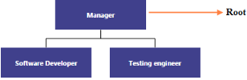

# Data Binding

Diagram can be populated with the node and connector based on information from an external data source by using data binding. Diagram supports binding data sources containing hierarchical data and also supports both local data and remote data for retrieving data from a specified data source. Diagram exposes its specific data-related properties allowing you to specify the data source fields from where the node information has to be retrieved.

You can populate Diagram elements by using data binding support such as JSON and OData services.

## DataSource Settings

The DataSourceSettings property of Diagram includes the required data source fields and it can be set with appropriate values as follows.

_Field properties_

<table>
<tr>
<th>Name</th><th>Type</th><th>Default</th><th>Description</th></tr>
<tr>
<td>
DataSource</td><td>
Object</td><td>
Null</td><td>
DataSource receives  Essential DataManager object and JSON object.</td></tr>
<tr>
<td>
Query</td><td>
Object</td><td>
Null</td><td>
It receives query to retrieve data from the table (query is same as SQL).Example:  ej.Query().from("Categories").select("CategoryID,CategoryName").take(3);take(3);</td></tr>
<tr>
<td>
TableName</td><td>
String</td><td>
Null</td><td>
It receives table name to execute query on the corresponding table.</td></tr>
<tr>
<td>
Id</td><td>
String</td><td>
Null</td><td>
Specifies the ID to Diagram node items list.</td></tr>
<tr>
<td>
Parent</td><td>
String</td><td>
Null</td><td>
Specifies the parent ID of the table.</td></tr>
</table>

## Local Data

To bind the Local Data to the Diagram control, map the user-defined JSON data names with its appropriate data source field. You can bind data to the Diagram by mapping fields such as DataSource, ID, and Parent.

The following code example illustrates how to bind local data to the Diagram.



// Node template.

function nodeTemplate(diagram, node) {

            node.labels[0].text = node.Name;

        }

//Initializes the node template

$(window).load(function () {

           $("#Diagram").ejDiagram({ nodeTemplate: nodeTemplate });

        });





Diagram.Model.Layout.Type  = LayoutTypes.HierarchicalTree;

//Configures data source for diagram

Diagram.Model.DataSourceSettings.DataSource =  GetData();

Diagram.Model.DataSourceSettings.Parent = "ReportingPerson";

Diagram.Model.DataSourceSettings.Id = "Id";

//Sets the default properties of the nodes.

Diagram.Model.DefaultSettings.Node = new Node() { 

            Width = 140,

            Height = 50,

            Labels = new Collection() { 

                new Label() { Name = "label, Bold = true }

         }

};

//Sets the default properties of the connectors.

Diagram.Model.DefaultSettings.Connector = new Connector() {

  Segments = new Collection() { 

       new Segment(Segments.Orthogonal) },

  TargetDecorator = 

       new Decorator() { Shape = DecoratorShapes.None }  };   

  }

 public Array GetData(){

// Returns datasource

   }



  

_Local Data binding_

## Remote Data

You can bind the Diagram to Remote Data by using dataManager and the query in fields is used to retrieve the data. dataManager supports the following types of data-binding: JSON, Web Services, oData. It uses two different classes; ej.DataManager for processing, and ej.Query for serving data. ej.DataManager communicates with data source and ej.Query generates data queries that are read by the dataManager. The following link explains in detail the way to create dataManager.

[http://help.syncfusion.com/ug/js/default.htm#!Documents/createyourdatamanage.htm](http://help.syncfusion.com/ug/js/default.htm)

The following code illustrates how to bind remote data to the Diagram.


//Initializes Automatic Layout

DiagramWebControl1.Model.Layout.Type = LayoutTypes.HierarchicalTree;   

//Configures data source

DiagramWebControl1.Model.DataSourceSettings.Parent = "ReportsTo";

DiagramWebControl1.Model.DataSourceSettings.Id = "EmployeeID";

//Initializes Default node properties

DiagramWebControl1.Model.DefaultSettings.Node = new Node()

        {

          Width = 100, Height = 40,FillColor = "DarkCyan",

          BorderColor = "transparent",

          Labels = new Collection() { 

          new Label() { Name = "label", FontColor = "white" }            

         } };

//Initialize Default connector properties

DiagramWebControl1.Model.DefaultSettings.Connector = new Connector() {

             Segments = new Collection() { new Segment(Segments.Orthogonal) } };

DiagramWebControl1.Model.NodeTemplate = "nodeTemplate";





//Customizes node before rendering

function nodeTemplate(diagram, node) {

     node.labels[0].text = node.FirstName;

}

var dataManager = ej.DataManager({

url: [http://mvc.syncfusion.com/Services/Northwnd.svc/](http://mvc.syncfusion.com/Services/Northwnd.svc/) });

//Initializes remote data binding

$(window).load(function () {

 var diagram = $("#DiagramWebControl1").ejDiagram("instance");

 $("#DiagramWebControl1").ejDiagram({

        dataSourceSettings: {

           dataSource: dataManager, 

           tableName: "Employees", 

           parent: "ReportsTo", id: "EmployeeID",

           query:  ej.Query().from("Employees").select("EmployeeID,ReportsTo,FirstName"),}

            });

        });    



  

_Remote data binding_

### Root

During automatic layout, node without parent is treated as root of the layout. You can specify this root by using the data source settings.

The following code example illustrates how to specify the root object for the Diagram.



//Configures data source for diagram

Diagram.Model.DataSourceSettings.Parent = "ReportingPerson";

Diagram.Model.DataSourceSettings.Id = "Id";

 //Specifies the root

 Diagram.Model.DataSourceSettings.Root = "Manager";



 

_DataSource with Root_

## SQL data for ASP.NET

The SqlDataSource control enables you to use a web server control to access data that is located in a relational database. It can work with any database that contains an associated ADO.NET provider including Microsoft SQL Server, Oracle, ODBC, or OLE DB databases such as Microsoft Access.

To retrieve data from a database by using the SqlDataSource control, set the following properties:

1. ProviderName - Set the name of the ADO.NET provider that represents the database you are working with. When you are working with Microsoft SQL Server, set the ProviderName property to System.Data.SqlClient; when you are working with an Oracle database, set the ProviderName property to System.Data.OracleClient; and so on.
2. ConnectionString - Set to a connection string that works for your database. 
3. SelectCommand - Set to an SQL query or stored procedure that returns data from the database.

The following code example illustrates how to create SQL binding.



// Specifies Connection String 

<ej:Diagram ClientIDMode="Static" ID="DiagramWebControl1" runat="server" Height="500px" Width="800px" DataSourceID="SqlDataSource1">

    <DataSourceSettings Id="EmployeeID" Parent="ReportsTo" />

    <PageSettings ScrollLimit="Diagram" />

</ej:Diagram>

<asp:SqlDataSource ID="SqlDataSource1" runat="server" ConnectionString="<%$ ConnectionStrings:SQLConnectionString %>"

 SelectCommand="SELECT * FROM [Employees] "></asp:SqlDataSource>

 // Layout type 

 var layoutDetails = {

     type: "hierarchicaltree"            

 };



The following screenshot illustrates the SQL binding.

  

_SQL Binding_

## HTML Binding

The Diagram provides support to form diagram from the HTML table. It is easy to convert HTML table to Diagram by using Data Manager.

The following code example illustrates how to convert HTML table to Diagram.



<ej:Diagram ID="HTMLBinding" runat="server" Height="490px" Width="950px">

// Specifies table name

   <DataManager Table="#Table1"></DataManager> 

</ej:Diagram>  





//Configures data source for diagram

Diagram.Model.DataSourceSettings.Parent = "ReportingPerson";

Diagram.Model.DataSourceSettings.Id = "Id"; 



 

_HTML Data Binding_
