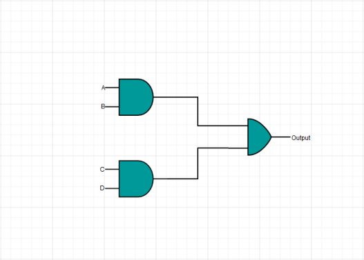
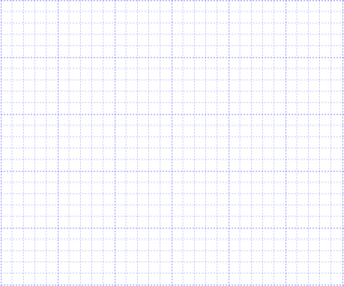

# Gridlines

Gridlines are horizontal and vertical lines behind the Diagram elements. They provide visual guidance when dragging or arranging objects on the Diagram surface.

 

## SnapConstraints

The Diagram model’s SnapSettings.SnapContraints property is used to control snap to grid behavior and visibility of gridlines. 

_SnapConstraints_

<table>
<tr>
<td>
{{ '**Constraints**' | markdownify }}</td><td>
{{ '**Description**' | markdownify }}</td></tr>
<tr>
<td>
SnapToHorizontalLines</td><td>
Enables snapping to horizontal Grid lines</td></tr>
<tr>
<td>
SnapToVerticalLines</td><td>
Enables snapping to vertical gridlines</td></tr>
<tr>
<td>
SnapToLines</td><td>
Enables snapping to gridlines</td></tr>
<tr>
<td>
ShowHorizontalLines</td><td>
Shows or hides horizontal gridlines</td></tr>
<tr>
<td>
ShowVerticalLines</td><td>
Shows or hides vertical gridlines</td></tr>
<tr>
<td>
ShowLines</td><td>
Shows or hide all gridlines</td></tr>
<tr>
<td>
All</td><td>
Enables all the constraints</td></tr>
<tr>
<td>
None</td><td>
Disables all the constraints</td></tr>
</table>

The following code illustrates how to show or hide gridlines using constraints



//Shows horizontal gridlines

Diagram1.SnapSettings.SnapConstraints = SnapConstraints.ShowHorizontalLines;

//Shows vertical gridlines

Diagram1.SnapSettings.SnapConstraints = SnapConstraints.ShowVerticalLines;

//Shows both horizontal and vertical gridlines

Diagram1.SnapSettings.SnapConstraints = SnapConstraints.ShowLines;

//Hides both horizontal and vertical gridlines

Diagram1.SnapSettings.SnapConstraints = SnapConstraints.None;



## Appearance

You can customize the Appearance of the gridlines by using following properties.

_Appearance_

<table>
<tr>
<td>
{{ '**Properties**' | markdownify }}</td><td>
{{ '**Data Type**' | markdownify }}</td><td>
{{ '**Description**' | markdownify }}</td></tr>
<tr>
<td>
LineInterval</td><td>
Array</td><td>
Gets or sets the line interval of gridlines</td></tr>
<tr>
<td>
SnapInterval</td><td>
Array</td><td>
Gets or sets the snap interval of gridlines</td></tr>
<tr>
<td>
LineDashArray</td><td>
String</td><td>
Gets or sets the pattern of dashes and gaps used to stroke gridlines border.</td></tr>
<tr>
<td>
LineColor</td><td>
String</td><td>
Gets or sets the line color of the gridlines</td></tr>
</table>

The following code illustrates how to customize the Gridlineappearance.



 // Sets various appearance properties to gridlines

List<decimal> intervals = new List<decimal>();

intervals.Add(1.25m);

intervals.Add(14);

intervals.Add(0.25m);

intervals.Add(15);

intervals.Add(0.25m);

intervals.Add(15);

intervals.Add(0.25m);

intervals.Add(15);

intervals.Add(0.25m);

intervals.Add(15);

diagram.Model.SnapSettings.HorizontalGridlines = new GridLines();

diagram.Model.SnapSettings.HorizontalGridlines.LinesInterval = intervals;

diagram.Model.SnapSettings.HorizontalGridlines.Strokes.Stroke = "blue";

diagram.Model.SnapSettings.HorizontalGridlines.Strokes.LineDashArray = "2 2";



 

