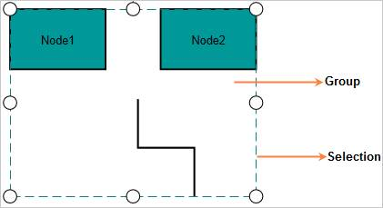
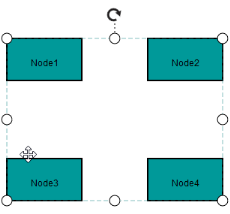
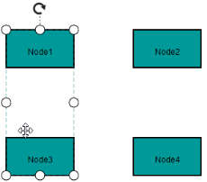
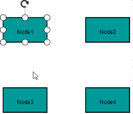
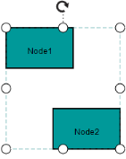
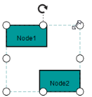
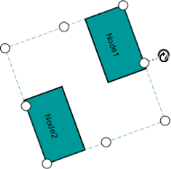

# Group

Diagram provides support to Group and Ungroup nodes. Group is a composite node that has a set of child nodes/connector and it is a container for its children. All the operations performed on a Group also affect an individual child in that particular Group. You can edit any node/connector in the group individually. On Ungrouping, the children in the group is an individual node/connector of the Diagram model. 

## Create Group

You can create Group like node and add it to the Diagram model by using diagram model’s Nodes property. You can set IsGroup property as true to differentiate the group from node.You can set the array of children (nodes/connectors) names to Children property. The group’s children nodes/connectors are added to the node array before adding the group to nodes array. 

The following code illustrates how a group node is created and added in the nodes array.



//Creates a group node

Node node1 = new Node();

node1.Name = "node1";

node1.Parent = "group";

Node node2 = new Node();

node2.Name = "node2";

node2.Parent = "group";

Group group = new Group();

group.Name = "group";

group.Children.Add("node1");

group.Children.Add("node2");

Diagram1.Model.Nodes.Add(node1);

Diagram1.Model.Nodes.Add(node2);

Diagram1.Model.Nodes.Add(group);



 

## Select a Group

You can select a group by clicking on any one of its child node. Consecutive clicks on a child object select the parent groups in the order of their creation. In a similar manner, consecutive clicks on a child object lead to the selection of inner groups and eventually the object itself and this cycle continues.

The following steps illustrate how to select an object that has two groups.

 

1. Click the Node1 to select the outer group.
2. Click again to select the inner group where it belongs.

    

3. Click again to select the child node after all groups have been traversed.

    

## Edit a Group

To edit a group, select the corresponding group. You can apply the following features on Group for editing.

For example, resizing a group, automatically resizes its child objects to fit the selection area.

_Editing a Group_

<table>
<tr>
<td>
{{ '**Editing Options**' | markdownify }}</td><td>
{{ '**Before**' | markdownify }}</td><td>
{{ '**After**' | markdownify }}</td></tr>
<tr>
<td>
Resize</td><td>
{{ '' | markdownify }}
</td><td>
{{ '' | markdownify }}
</td></tr>
<tr>
<td>
Rotate</td><td>
{{ '' | markdownify }}
</td><td>
{{ '' | markdownify }}
</td></tr>
</table>

