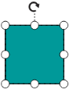
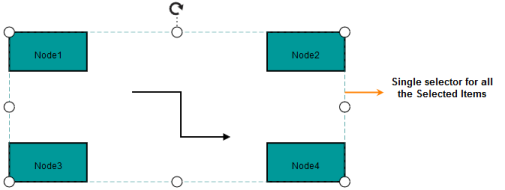
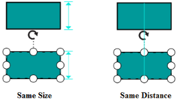

# Interaction

## Tool

There are many interactive features on Diagram surface. A collection of predefined tools are available in Diagram.

_Tool_

<table>
<tr>
<th>
Tool name</th><th>
Description</th></tr>
<tr>
<td>
panTool </td><td>
Allows you to pan the Diagram</td></tr>
<tr>
<td>
move </td><td>
Allows you to move the selected Node/Connector.</td></tr>
<tr>
<td>
select</td><td>
Allows you to select the diagram node/connector objects.</td></tr>
<tr>
<td>
textTool</td><td>
Allows you to add new text or edit an existing text</td></tr>
<tr>
<td>
endPointTool</td><td>
Allows you to drag connector’s end point </td></tr>
<tr>
<td>
resizeTool</td><td>
Allows you to resize the nodes </td></tr>
<tr>
<td>
rotateTool</td><td>
Allows you to rotate nodes</td></tr>
</table>

The following code illustrates how to activate and deactivate the desired tool



//Activates pan tool

var diagram = $("#Diagram").ejDiagram("instance");

diagram.activateTool("panTool");

//Deactivates current tool

diagram.deactivateTool();



## Selection

Selection feature allows you to select single or multiple Nodes/Connectors.

* Single selection
* Multiple selection

Single selection

The Nodes/Connectors on the Diagram surface is selected when the Select constraint is enabled. Selection is done through the following two ways. 

* Mouse Click
* addSelection method.

Mouse Click

The node/connector is selected by clicking a desired node/connector.

addSelection method

Diagram provides public API addSelection for adding node/connector to the selection.
The following code illustrates how to add node/connector to selection.



var node = diagram.model.nodes[0];

//Adds node to selection

diagram.addSelection(node);



 

Multiple Selections

Multiple selections are done by using rubber band selection, Ctrl + Click and Ctrl + A.  During Multipleselections, the selector binds all the selected items.

Rubber band Selection

Rubber band selection is done by clicking and dragging mouse pointer on the Diagram canvas and rectangle helper appears during Rubber band selection. The Diagram Nodes/Connectors that intersect in the selection rectangle bounds are added to the selection list.

  

## User Handle

Diagram has an option to create additional selection handles around the selector called User handles. You can create additional handles and assign their command/tool to the desired handles.

The following is the list of User handle properties.

_User Handle_

<table>
<tr>
<th>
Properties</th><th>
Data Type</th><th>
Description</th></tr>
<tr>
<td>
Name</td><td>
String</td><td>
Gets or sets the name of the User handle</td></tr>
<tr>
<td>
PathData</td><td>
String</td><td>
Gets or sets the path data of the User handle</td></tr>
<tr>
<td>
BorderColor</td><td>
String</td><td>
Gets or sets the border color of the User handle</td></tr>
<tr>
<td>
BorderWidth</td><td>
Int</td><td>
Gets or sets the border width of the User handle</td></tr>
<tr>
<td>
BackgroundColor</td><td>
String</td><td>
Gets or sets the background color of the User handle</td></tr>
<tr>
<td>
Position</td><td>
UserHandlePositions</td><td>
Gets or sets the position of  User handle </td></tr>
<tr>
<td>
PathColor</td><td>
String</td><td>
Gets or sets the path color of the User handle</td></tr>
<tr>
<td>
Tool</td><td>
String</td><td>
Gets or sets the tool that is associated with User handle</td></tr>
<tr>
<td>
Size</td><td>
Int</td><td>
Gets or sets the size of the User handle</td></tr>
<tr>
<td>
Visible</td><td>
Boolean</td><td>
Gets or sets the visibility of the User handle</td></tr>
<tr>
<td>
EnableMultipleSelection</td><td>
Boolean</td><td>
Gets or sets whether the User handle is enabled for  multiple selection </td></tr>
</table>

The following example describes how to create delete user handle in diagram

* Create handle
* Create tool for handle
* Add handle in diagram

Create Delete Userhandle

The following code illustrates how to create Delete User handle



//Creates handle

var userHandles = [];

var deleteHandle = { name: "deleteHandle", position: ej.datavisualization.Diagram.UserHandlePositions.BottomRight, showOnMultipleSelection: false, size:30, backgoundColor: "#4D4D4D", pathData: “M33.977998,27.684L33.977998,58.102997 “ +“41.373998,58.102997 41.373998,27.684z M14.841999,27.684L14.841999,58.102997 22.237998,58.102997 “+”22.237998,27.684z M4.0319996,22.433001L52.183,22.433001 52.183,63.999001 4.0319996,63.999001z “+”M15.974,0L40.195001,0 40.195001,7.7260003 56.167001,7.7260003 56.167001,16.000999 0,16.000999 “+”0,7.7260003 15.974,7.7260003z” };

deletHandle.tool = new DeleteTool(deleteHandle.name);

userHandles.push(deletHandle);



Create tool for Delete Userhandle

The following code illustrates how to create tool for Delete User handle.



//Creates tool for delete handle

var DeleteTool = (function (base) {

ej.datavisualization.Diagram.extends(DeleteTool, base);

function DeleteTool(name) {

base.call(this, name);

this.singleAction = true;

}

//mouse down for delete tool

DeleteTool.prototype.mousedown = function (evt) {

base.prototype.mousedown.call(this, evt);

this.inAction = true;

this.selectedObject = this.diagram.selectionList[0];

};

//mouse move for delete tool

DeleteTool.prototype.mousemove = function (evt) { 

base.prototype.mousemove.call(this, evt);

};

//mouse up for delete tool

DeleteTool.prototype.mouseup = function (evt) {

var diagram = $(“#diagram”).ejDiagram(“instance”);

if (this.inAction) 
 {

   this.inAction = false;

   diagram.remove(this.selectedObject);
 }

 base.prototype.mouseup.call(this, evt);

};

return DeleteTool;

})



Adding delete handle in Diagram

The following code illustrates how to add Delete handle in Diagram.



//Adds user handles to diagram

$(“#Diagram”).ejDiagram({ userHandles: userHandles });



  

## Zoom 

The Diagram is zoomed in and out. Zooming is achieved in the following two ways.

* By using the zoom commands.
* By using the mouse wheel.

MouseWheel

Press the CTRL key and roll the mouse wheel up to zoom in or down to zoom out.

Zoom Factor

Diagram allows you to set the ZoomFactor where you can zoom in or out. This factor can be specified by using the ZoomFactor property. The default value is 0.2.



diagram.Model.ZoomFactor = 0.2; 



ZoomCommands

Refer to the link ZoomCommand.

## Keyboard

Diagram has several keyboard functions support and they are listed as follows.

_Keyboard_

<table>
<tr>
<th>
Shortcut Keys</th><th>
Description</th></tr>
<tr>
<td>
Ctrl + A</td><td>
Selects all nodes/connectors in Diagram.</td></tr>
<tr>
<td>
Ctrl + C</td><td>
Copies the diagram selected elements.</td></tr>
<tr>
<td>
Ctrl + V</td><td>
Pastes the copied elements.</td></tr>
<tr>
<td>
Ctrl + X</td><td>
Cuts the selected elements.</td></tr>
<tr>
<td>
Ctrl + Z</td><td>
Undo(Reverse the last editing action performed on diagram)</td></tr>
<tr>
<td>
Ctrl + Y</td><td>
Redo(Restores the last editing action when no other actions have occurred since the last undo on the Diagram).</td></tr>
<tr>
<td>
Delete</td><td>
Deletes the selected elements. </td></tr>
<tr>
<td>
Ctrl /Shift+ Click on object</td><td>
Multiple selections (Selector binds all selected nodes/connectors).</td></tr>
<tr>
<td>
Up Arrow</td><td>
nudgeUp (move the selected elements towards up by one pixel).</td></tr>
<tr>
<td>
Down Arrow</td><td>
nudgeDown (move the selected elements towards down by one pixel).</td></tr>
<tr>
<td>
Left Arrow</td><td>
nudgeLeft (move the selected elements towards left by one pixel).</td></tr>
<tr>
<td>
Right Arrow</td><td>
nudgeRight (move the selected elements towards right by one pixel).</td></tr>
<tr>
<td>
Ctrl+MouseScroll</td><td>
Zoom(Zoom in/Zoom out the diagram).</td></tr>
</table>

## Touch

Touch support for Diagram view has the following features:

* Drag and Drop from the SymbolPalette.
* Dragging the Node and Line Connector on drawing area.
* Panning.
* Multiple selection.
* Contextmenu (touch and hold).
* Text Editing (double tap).

## Snapping

Snapping feature handles snapping operation with gridlines and Nodes/Connectors.

* snapToGrid
* snapToObject

### SnapToGrid

The snap-to-grid feature allows diagram objects to snap the nearest intersection of gridlines when being dragged or resized. This feature enables easier alignment during layout or design. 

The SnapToGrid feature is enabled by using a snapSetting’s SnapConstraints property.

_SnapToGrid_

<table>
<tr>
<th>
Properties</th><th>
Data Type</th><th>
Descriptions</th></tr>
<tr>
<td>
HorizontalGridLines</td><td>
Object</td><td>
Gets or sets the horizontal gridlines </td></tr>
<tr>
<td>
VerticalGridLines</td><td>
Object</td><td>
Gets or sets the vertical gridlines</td></tr>
<tr>
<td>
EnableSnapToObject</td><td>
Boolean</td><td>
Gets or sets whether snapping to object is enabled or not</td></tr>
<tr>
<td>
SnapAngle</td><td>
Int</td><td>
Gets or sets the snap angle</td></tr>
<tr>
<td>
SnapConstraints</td><td>
SnapConstraints</td><td>
Gets or sets whether snapping to gridlines option is enabled or not</td></tr>
</table>
Enable snapping 

Snapping to gridlines is enabled or disabled by changing the value of snap Setting’s SnapConstraints as SnapConstraints.



//Enables snap to horizontal gridlines constraint

Diagram1.SnapSettings.SnapConstraints = SnapConstraints.SnapToHorizontalLines;

//Enables snap to vertical gridlines constraint

Diagram1.SnapSettings.SnapConstraints = SnapConstraints.SnapToVerticalLines;

//Enables snap to both horizontal and vertical gridlines constraint

Diagram1.SnapSettings.SnapConstraints = SnapConstraints.SnapToLines;



SnapInterval

You can customize the position where a Diagram object snaps by changing the value of the SnapInterval property of grid lines.

SnapInterval is a double collection that determines the space between patterns of gridlines.



//Sets snap interval

List<decimal> interval = new List<decimal>();

interval.Add(20);

Diagram1.SnapSettings.HorizontalGridlines.SnapInterval = interval;



### SnapToObject

The snap-to-object feature provides visual cues to assist with aligning and spacing diagram nodes. You can snap a node with its neighboring objects based on its size and position. Such alignments are visually represented as guidelines.

Enabling and Disabling snapping to objects

SnapSettings.EnableSnapToObject determines whether nodes are snapped to object.



//Enables snap to object behavior

Diagram1.SnapSettings.EnableSnapToObject = true;



SnapAngle

You can rotate the Node with multiples of SnapAngle.



//Sets snap angle

Diagram1.SnapSettings.SnapAngle = 5;



