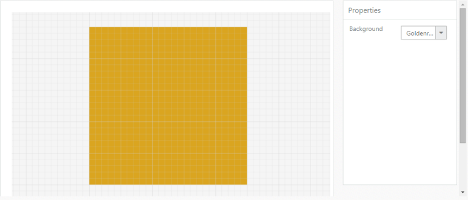

# Knockout Binding

KnockoutBinding allows you to bind HTML elements against any data model. It uses a Model-View-ViewModel (MVVM) design pattern, where the Model is your stored data, View is the visual representation of that data (UI), and ViewModel acts as the intermediary between the Model and the View. For more information about the Knockoutbinding, refer to the online documentation: [http://help.syncfusion.com/ug/js/default.htm#!documents/knockoutjs.htm](http://help.syncfusion.com/ug/js/default.htm)

When using KO, the view page is simply a HTML document with declarative bindings that you can link to the ViewModel. ViewModel is nothing, but an object holding a list of items for creating the TreeView control by using Knockout binding. When you call ko.applyBindings with a specific element, it binds everything under that element.

The following code example illustrates how to bind data to the Diagram through Knockout Support.



//References to be added for knockout support.

//Initializes diagram.

//Renders a dropdown box.

<input id="Text1" data-bind="ejDropDownList:{ dataSource: pageColor, value: pageBackgroundColor, width: '100px'}">

//Initializes source for page background color.

var pageColor = [{ text: "Black" },{ text: "White" } ];

window.viewModel = { pageBackgroundColor: ko.observable("White")                 };

//Applies knockout binding.

$(function () {

            ko.applyBindings(viewModel);

        });

</script>



 

