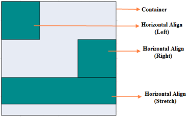

# Layout Panel

The Container property of Group can be set to any of the available layout panel. It is used to control the size and position of the Group’s children.

There are two types of layout panels.

* Canvas panel 
* Stack panel

The following properties are used to align the child element on the Group. This property is applicable to all panels.

_Group properties_

<table>
<tr>
<td>
{{ '**Property**' | markdownify }}</td><td>
{{ '**Data type**' | markdownify }}</td><td>
{{ '**Description**' | markdownify }}</td></tr>
<tr>
<td>
MarginLeft</td><td>
Int</td><td>
Gets or sets the left margin value of the elements.</td></tr>
<tr>
<td>
MarginRight</td><td>
Int</td><td>
Gets or sets the right margin value of the elements.</td></tr>
<tr>
<td>
MarginBottom</td><td>
Int</td><td>
Gets or sets the bottom margin value of the elements.</td></tr>
<tr>
<td>
MarginTop</td><td>
Int</td><td>
Gets or sets the top margin value of the elements.</td></tr>
<tr>
<td>
HorizontalAlignment</td><td>
String</td><td>
Gets or sets the horizontal alignment of the elements.</td></tr>
<tr>
<td>
VerticalAlignment</td><td>
String</td><td>
Gets or sets the vertical alignment of the elements.</td></tr>
<tr>
<td>
PaddingTop</td><td>
Int</td><td>
Gets or sets the top padding value of the group.</td></tr>
<tr>
<td>
PaddingBottom</td><td>
Int</td><td>
Gets or sets the bottom padding value of the group.</td></tr>
<tr>
<td>
PaddingLeft</td><td>
Int</td><td>
Gets or sets the left padding value of the group.</td></tr>
<tr>
<td>
PaddingRight</td><td>
Int</td><td>
Gets or sets the right padding value of the group.</td></tr>
</table>

## Canvas Panel

The Canvas panel supports absolute positioning and provides the least layout functionality to its contained diagram elements. Canvas allows you to position contained elements at an offset and also elements can be arranged either horizontally or vertically.



private void GenerateNodes(DiagramProperties diagram)

{

   Node node1 = CreateNode("snode1", 0, 0, "darkCyan");

   Node node2 = CreateNode("snode2", 30, 30, "white");

   Node node3 = CreateNode("snode3", 60, 60, "darkCyan");

   Node node4 = CreateNode("snode4", 90, 90, "white");

   Group canvas = new Group();

   canvas.Name = "canvas";

   canvas.Container.Type = ContainerType.Canvas;

   canvas.Children.Add(node1);

   canvas.Children.Add(node2);

   canvas.Children.Add(node3);

   canvas.Children.Add(node4);

   canvas.OffsetX = 400;

   canvas.OffsetY = 400;

   canvas.MinHeight = 400;

   canvas.MinWidth = 400;

   canvas.FillColor = "#E7EBF4";

   canvas.BorderColor = "black";

   canvas.PaddingBottom = 30;

   canvas.PaddingTop = 30;

   canvas.PaddingRight = 30;

   canvas.Type = "group";

   canvas.PaddingLeft = 30;

   diagram.Model.Nodes.Add(node1);

   diagram.Model.Nodes.Add(node2);

   diagram.Model.Nodes.Add(node3);

   diagram.Model.Nodes.Add(node4);

   diagram.Model.Nodes.Add(canvas);

}

private Node CreateNode(string name, int marginTop, int marginLeft, string color)

{

    Node node = new Node();

    node.Name = name;

    node.Width = 70;

    node.Height = 70;

    node.MarginTop = marginTop;

    node.MarginLeft = marginLeft;

    node.Parent = "canvas";

    node.FillColor = color;

    return node;

}



  

## Stack panel

Stack panel is used to arrange its children in a single line or stack order, either vertically or horizontally. It controls spacing by setting Margin properties of child and Padding properties of a group. By default, a Stack Panel’s orientation is vertical.

The following code illustrates how to add stack panel.



private void GenerateNodes(DiagramProperties diagram)

{

   Node node1 = CreateNode("node1", "darkCyan", HorizontalAlignment.Left);

   Node node2 = CreateNode("node2", "darkCyan", HorizontalAlignment.Right);

   Node node3 = CreateNode("node3", "darkCyan", HorizontalAlignment.Stretch);

   Group stack = new Group();

   stack.Name = "Stack ";

   stack.Container.Type = ContainerType. Stack;

   stack.Children.Add(node1);

   stack.Children.Add(node2);

   stack.Children.Add(node3);

   stack.OffsetX = 200;

   stack.OffsetY = 400;

   stack.MinHeight = 300;

   stack.MinWidth = 300;

   stack.FillColor = "#E7EBF4";

   stack.BorderColor = "black";

   stack.Type = "group";

   diagram.Model.Nodes.Add(node1);

   diagram.Model.Nodes.Add(node2);

   diagram.Model.Nodes.Add(node3);

   diagram.Model.Nodes.Add(node4);

   diagram.Model.Nodes.Add(stack);

}

private Node CreateNode(string name, string color, HorizontalAlignment alignment)

{

    Node node = new Node();

    node.Name = name;

    node.Width = 100;

    node.Height = 100;

    node.HorizontalAlign = alignment;

    node.Parent = "Stack";

    node.FillColor = color;

    return node;

}



 

